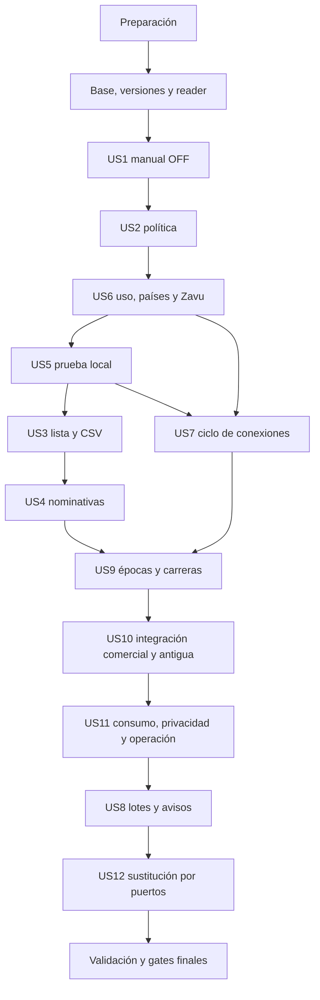

---

description: "Tareas de implementación de admisiones a academias y mensajería por tribu"
---

# Tareas: Academy Admissions and Tenant Messaging

**Feature**: `001-academy-admissions` — `academy-admissions` para TuTribu. **Rama Git**: `feature/academy-admissions-spec`. **Generación**: 2026-10-05, revisión I1/U1 sobre HEAD `980e5b2130552072e81f8b96a3586891f2d92175` con diseño I1/U1 verificado en ese commit.

**Entrada**: [spec.md](spec.md), [plan.md](plan.md), [research.md](research.md), [data-model.md](data-model.md), [contracts/http-api.md](contracts/http-api.md), [contracts/auth-evidence.md](contracts/auth-evidence.md), [contracts/messaging-provider.md](contracts/messaging-provider.md), [contracts/errors-and-recovery.md](contracts/errors-and-recovery.md), [contracts/ui-flows.md](contracts/ui-flows.md), [quickstart.md](quickstart.md), [technical-contract.md](technical-contract.md), [handoff.md](handoff.md), [traceability.md](traceability.md) y [checklist temática](checklists/admission-review.md).

**Prerrequisitos**: constitución 1.0.0, AGENTS, rule canónica de payloads, arquitectura propietaria y plantilla activa `.specify/templates/tasks-template.md`, resuelta por `setup-tasks.ps1 -Json`. No reinicializar Spec Kit ni crear otra feature.

**Estado de ejecución**: implementación iniciada sobre `7198047f126bcde6b0a5f0cdb60abf4191903e10`; se marcan únicamente tareas con evidencia comprobada. Preparación y gates en [operational-gates.md](validation/operational-gates.md). Las rutas futuras siguen pendientes hasta su implementación; los documentos normativos y sus checklists conservan su contenido. El usuario autorizó commit y push de avances con `--no-verify`.

**Pruebas**: obligatorias por la constitución IV, AGENTS, FR-141 y TC-026. Cada bloque empieza por casos de comportamiento en rojo, sigue con código mínimo y refactor, y termina en verde. SDK/Better Auth/Zod/beez-ui/Web Crypto reales; dobles solo en puertos o transporte propios. SQL contra los artefactos versionados reales en rama efímera Neon, runtime y rol no-bypass. Sin tests de strings de fuentes/SQL, imports aislados, configuración artificial o mocks de plataforma.

**Organización**: 212 tareas, 15 fases, 12 historias intactas. P1 precede a P2; dentro de P1, US6 precede a US5 y US5 a US3/US4 para tener transporte y formulario local completos antes de los recorridos ON. `[US1]` corresponde a `US-01`, y así hasta `[US12]`; no se renumeran requisitos o escenarios. La entrega funcional es única y requiere todas las historias.

## Formato: `[ID] [P?] [Story] Descripción`

- Cada tarea usa `- [ ] Tnnn`, identificador secuencial y archivos exactos. Los bloques de historia agregan `[USn]`; preparación/base/cierre no lo usan.
- `[P]` identifica 64 tareas que pueden compartir un lote cuando sus prerrequisitos están completos y modifican archivos distintos. Las dependencias explícitas de cada línea y las de fase siguen siendo obligatorias.
- Las tareas de prueba crean/ejercen el comportamiento indicado antes de su código; las de validación ejecutan esas suites y registran resultados reales. Un ensayo operativo pendiente no se marca por un test local.
- Cada ID normativo tiene tareas de construcción y casos concretos en [traceability.md](traceability.md). Las precondiciones/resultados son los completos del spec/TC y sus matrices; V-01 a V-12 ayudan a organizar, sin sustituirlos.

## Convenciones de rutas y ejecución

- Owners: `src/modules/academy-admissions`, `messaging`, `auth`, `tribes`, `notifications`, `subscriptions` y `product-access`; capas domain/application/infrastructure, roots locales y `src/modules/setup.ts`.
- Tests fuera de `app`: `tests/unit/modules`, `tests/unit/pages`, `tests/unit/components`, `tests/unit/hooks`, `tests/e2e` y `tests/performance`. La configuración instalada incluye `tests/**/*.test.{ts,tsx}`; carga/SQL usan entorno Node, no el jsdom de UI.
- Componentes propios: `components/<scope>/<component>/{index.tsx,styles.module.scss}`, beez-ui/SCSS/BEM, Link compartido, copy español, feedback accesible y sin cards nuevas. Cada leaf nuevo tiene loading/Suspense propios; layouts no await params.
- `database/migrations/20261005*.sql` son nombres de archivos futuros, no migraciones aplicadas. Revalidar orden/colisiones contra HEAD en T001 antes de crearlos, actualizar referencias si cambia el nombre y probar solo la rama efímera propia.
- Consultar las guías instaladas de Next antes de escribir sus entrypoints y aplicar las skills correspondientes al código/tests/manuales durante implementación. Reutilizar helpers/catálogos existentes; una ruta propuesta no autoriza duplicar un owner ya existente.
- Los procesos SQL paralelos usan ramas/fixtures aislados y cleanup propio; no comparten contadores o datos de prueba. Limitar concurrencia a la capacidad del pool y no reintentar saturación de adquisición.
- `specs/001-academy-admissions/validation/*.md` son informes futuros de evidencia sanitizada. Ningún secreto, token, código de producción o destinatario completo se escribe allí.

## Países y versiones en esta revisión

`MessagingUsagePolicy.allowedCountries=[]` es la única lista editable; `AdmissionPolicy` usa `MessagingUsagePolicyReader` y hechos propios. Configuración/backend/formulario de países se completan en US6 antes de diagnóstico SMS/WhatsApp, sin exigir conexión ni AdmissionPolicy. El owner revalida países/cupos/version de uso antes de reserva/marker; retiro antes del marker suprime un nuevo despacho y después no cancela accepted/unknown ni invalida por sí solo código vigente. [Contrato de países](data-model.md#country-policy).

`AllowlistEntry`, `PersonalInvitation` y `MessagingUsagePolicy` tienen version positiva inicial 1; recurso existente requiere expectedVersion/CAS. Cambio efectivo incrementa una vez, no-op vigente/replay no incrementan. Autorización/intent preceden al replay confirmado y este al CAS nuevo; resultado histórico no pisa vista actual. [Versionado completo](data-model.md#resource-versioning). Las constraints citadas abajo pertenecen a ese modelo actualizado.

Las 207 tareas anteriores se conservan por identidad de trabajo y se recalculan sus IDs; se agregan cinco tareas de contratos/puerto/configuración temprana. [traceability.md](traceability.md) conserva la equivalencia anterior→actual, todos los casos normativos y referencias nuevas; ninguna casilla está marcada.

## Fase 1: Preparación e infraestructura compartida

**Propósito**: Revalidar el punto de partida existente y preparar dependencias y bordes de prueba. No reinicializar la aplicación ni Spec Kit.

**Dependencias de fase**: Ninguna.

### Preparación

- [X] T001 Revalidar el inventario R-02 sobre HEAD, pins, helpers, manuales y gates OG-01 a OG-06; registrar cualquier cambio real respecto del diseño sin alterar decisiones cerradas ni habilitar capacidades. Archivos: `specs/001-academy-admissions/research.md`, `specs/001-academy-admissions/plan.md`. Trazabilidad: `TC-026`.

### Implementación

- [X] T002 Alinear el runtime con `.nvmrc` y pnpm 12.6.0; incorporar el SDK oficial `@zavudev/sdk@0.57.0` coordinando manifest/lockfile, edad mínima y `pnpm install --frozen-lockfile`, sin actualizar dependencias ajenas. Archivos: `package.json`, `pnpm-lock.yaml`. Dependencias: `T001`. Trazabilidad: `FR-141`, `TC-026`.

- [X] T003 Preparar el borde de pruebas SQL con `pg` real y helpers protegidos: rama Neon propia, metadata de rol runtime/no-bypass, fixtures sintéticos y cleanup en finally; no usar default/producción ni registrar conexiones o filas personales. Archivos: `tests/support/academy-admission-database.ts`. Dependencias: `T001`. Trazabilidad: `FR-141`, `D-24`, `TC-026`.

- [X] T004 Construir fixtures deterministas de cuentas A/B, líder/guardián/tribemate, active/muted, causas comerciales/conducta, snapshots desconocidos, políticas/lista/invitaciones y reloj; compartirlos solo en el borde propio y conservar mocks existentes de protección runtime. Archivos: `tests/support/academy-admission-fixtures.ts`. Dependencias: `T003`. Trazabilidad: `FR-141`, `D-24`, `TC-026`.

- [X] T005 [P] Preparar un transporte HTTP/JWKS controlado propio para ejercer Better Auth, SDK Zavu y Web Crypto reales; registrar efectos/request metadata seguros, simular pérdida de respuesta/crash y denegar cualquier salida real de esta suite. Archivos: `tests/support/admission-provider-transport.ts`. Dependencias: `T002`. Trazabilidad: `FR-071`, `FR-141`, `D-24`, `TC-026`.

### Preparación

- [X] T006 [P] Registrar disponibilidad y evidencia requerida de cada gate, autorización del pagador/recursos, keyrings externos, claims Google y scheduler; distinguir preparación de prueba aprobada y permitir el desarrollo local con capacidades externas cerradas. Archivos: `specs/001-academy-admissions/validation/operational-gates.md`. Dependencias: `T001`. Trazabilidad: `TC-026`.

**Punto de control**: confirmar el bloque con evidencia real y conservar pendientes las condiciones no ejecutadas.

---

## Fase 2: Base obligatoria

**Propósito**: Construir autoridad, persistencia y primitivas compartidas antes de implementar historias. Cada tarea de código sigue testing → code → refactor → green; no activar academias ni canales durante este bloque.

**Dependencias de fase**: Fase 1.

**Bloqueante**: completar base/contratos de versiones/reader antes de historias. Los gates externos de activación siguen pendientes y no bloquean código/pruebas locales que no dependan de ellos.

### Pruebas primero

- [ ] T007 [P] Escribir primero casos SQL de FK de misma tribu, una pendiente, vínculo no reasignable, canje/prueba únicos, decisión+efecto+evento indivisibles y ledger; ejecutar contra el baseline para observar fallos y luego contra las migraciones reales. Archivos: `tests/unit/modules/academy-admissions/infrastructure/admission-persistence.test.ts`. Trazabilidad: `FR-094`–`FR-095`, `FR-141`, `D-12`, `D-24`, `TC-019`, `TC-026`.

- [ ] T008 [P] Ejercer todas las filas de configuración/evidencia/admisión/revisión/permisos y valores iniciales con reloj/hechos propios; correo sin colapsar puntos/etiquetas, teléfono inequívoco y lectura sin efectos; no testear texto de fuentes ni valores aislados. Archivos: `tests/unit/modules/academy-admissions/domain/admission-policy.test.ts`, `tests/unit/modules/academy-admissions/domain/admission-contact.test.ts`. Trazabilidad: `FR-003`–`FR-009`, `FR-013`, `FR-020`–`FR-021`, `US-02-AC-03`, `US-02-AC-06`, `EC-04`–`EC-05`, `SC-001`, `D-01`, `D-03`, `D-07`–`D-08`, `D-21`.

- [ ] T009 [P] Reproducir escrituras directas antiguas y runtime con bypass, policy borrada/flag apagado, snapshot muted comercial y fundamento básico; cubrir bootstrap y pago membership legítimos sin confiar en `paid=true` o settings públicos. Archivos: `tests/unit/modules/tribes/infrastructure/academy-admission-cutover.test.ts`. Trazabilidad: `FR-001`, `FR-012`, `FR-122`–`FR-126`, `FR-129`, `FR-138`–`FR-140`, `US-10-AC-01`–`US-10-AC-06`, `EC-40`, `SC-019`, `D-11`, `D-23`, `TC-006`, `TC-025`, `RG-01`, `RG-04`, `OG-06`.

- [ ] T010 [P] Cubrir tokens Google firmados, RS256/issuer/audience/exp/sub, Gmail/Workspace/external/hd ausente, email/cuenta cambiados y callbacks A/B; login válido sin autoridad de contacto, sin confiar en booleano/JWT decodificado. Archivos: `tests/unit/modules/auth/infrastructure/google-identity-evidence.test.ts`. Trazabilidad: `FR-014`–`FR-015`, `FR-017`–`FR-018`, `FR-020`–`FR-021`, `US-02-AC-01`, `EC-02`–`EC-03`, `SC-003`, `D-06`, `D-09`, `TC-008`, `RG-05`, `OG-01`.

- [ ] T011 [P] Cubrir `auth_time` diez minutos, nonce/intento repetido/cruzado/expirado, sesión renovada/revocada, cuenta distinta y líder que pierde rol; SDK false sin causa inventada, state/PKCE conservados y ningún BYOK global. Archivos: `tests/unit/modules/auth/application/recent-authentication.test.ts`, `tests/e2e/admission-reauthentication.spec.ts`, `tests/unit/components/admission-reauthentication.test.tsx`. Trazabilidad: `FR-032`, `TC-013`, `RG-05`, `OG-01`.

- [ ] T012 [P] Cubrir AES-GCM/HMAC reales, AAD/keyId/época cruzados, nonce/IV, códigos uniformes y comparación segura, separación de keyrings y material temporal; rotación de huellas no reinicia consumo. Archivos: `tests/unit/modules/messaging/infrastructure/messaging-crypto.test.ts`. Trazabilidad: `FR-043`–`FR-045`, `D-20`, `TC-010`, `TC-012`, `OG-02`.

- [ ] T013 [P] Reproducir último cupo con cien competidores, SKIP LOCKED/lease/CAS, marker antes de RPC, crash antes/después del marker, respuesta tardía y unknown sin otro POST ni liberación de cupo. Ampliar country vacío/prohibido/reducción en cola, policy version vigente al reservar/marker, accepted/unknown conservados y no invalidez de código por cambiar solo países. Archivos: `tests/unit/modules/messaging/infrastructure/delivery-attempts-and-usage.test.ts`. Trazabilidad: `FR-063`, `FR-065`–`FR-067`, `FR-070`, `FR-116`–`FR-119`, `US-11-AC-01`–`US-11-AC-02`, `EC-27`, `EC-35`–`EC-36`, `SC-011`–`SC-012`, `D-24`, `TC-020`–`TC-022`, `RG-06`.

- [ ] T014 [P] Ejercer Zod y guards públicos reales, props/respuestas/browser, status sobre mensaje, unknown/null/string, ausencia de secrets/causes y recurso/cuenta/tribu cruzados antes de SecretStore; no revalidar schemas de SDK o filas Postgres. Archivos: `tests/unit/modules/academy-admissions/infrastructure/admission-http-boundaries.test.ts`. Trazabilidad: `FR-046`–`FR-047`, `FR-062`, `FR-120`, `FR-130`, `EC-32`, `D-15`, `TC-002`.

- [ ] T015 [P] Cubrir desafío actual por cuenta/contacto/tribu/propósito, TTL/uso/fallos, separación diagnóstico/admisión y proof aplicada una vez; validar localmente pese a caída/cuota y aportar a pendiente sin reiniciar plazo. Archivos: `tests/unit/modules/academy-admissions/domain/verification-challenge.test.ts`. Trazabilidad: `FR-057`–`FR-059`, `TC-009`–`TC-010`.

- [ ] T016 [P] Ejercer validators/DTO propios reales de version positiva/creación 1 y ausencia sin versión ficticia, SQL defaults/CHECK de lista/invitación/uso y ledger de replay previo a CAS; current actor/intent/expectedVersion cambiado, resultado histórico frente a recurso posterior y sin URL secreta recuperada. Los CAS específicos se completan en las pruebas de cada historia. Archivos: `tests/unit/modules/academy-admissions/infrastructure/mutable-resource-version-contracts.test.ts`, `tests/unit/modules/academy-admissions/infrastructure/admission-operation-replay.test.ts`. Trazabilidad: `FR-009`, `FR-066`, `FR-070`, `FR-072`, `FR-086`, `FR-089`, `FR-095`, `FR-098`, `FR-100`, `FR-131`, `FR-141`, `EC-10`–`EC-11`, `EC-17`, `EC-28`, `EC-35`–`EC-36`, `SC-005`, `SC-011`, `SC-017`, `TC-019`, `TC-021`–`TC-022`, `TC-026`.

### Implementación

- [ ] T017 Definir puertos pequeños, commands/queries/results y contextos autorizados de cuenta/tribu/recurso/propósito/conexión/versión/entorno/correlación; separar auth, admisión, mensajería, pertenencia, producto y avisos, sin SDK ni dependencias outward. Definir MessagingUsagePolicyReader en dominio de admisión con hechos propios tribeId/version/allowedCountries y restricciones comprobadas; application lo consume sin importar DTOs/application de mensajería. Archivos: `src/modules/academy-admissions/domain/repositories/admission-repositories.ts`, `src/modules/messaging/domain/repositories/messaging-repositories.ts`, `src/modules/auth/application/results/authenticated-account-result.ts`, `src/modules/academy-admissions/domain/repositories/messaging-usage-policy-reader.ts`. Dependencias: `T014`. Trazabilidad: `FR-030`, `FR-135`–`FR-137`, `D-13`, `TC-001`–`TC-002`.

- [ ] T018 Modelar evidencia global, intención y recencia con mínimo server-only y origen acreditado; aplicar exactamente las restricciones del modelo: «Campos privados: `id`, `user_id`, `account_id`, `provider_id`, `provider_subject`, `normalized_email`, `email_verified_claim`, `hosted_domain`, clasificación `gmail/workspace/insufficient`, issuer/audience verificados, `token_issued_at`, `token_expires_at`, `verified_at`, `version`, `invalidated_at/reason`. Relación con cuenta/usuario Google actualmente vinculados; una captura vigente por account/provider.»; «No almacena otro JWT, access/refresh token ni respuesta completa. El adapter verifica criptográficamente el mismo token del callback antes de derivar estos campos. Cuentas antiguas sin captura acreditada son insuficientes; no se hace backfill desde un booleano o token vencido. Antes de usarla se comprueban cuenta/sujeto/correo actuales e invalidación. La expiración del token se evalúa al verificarlo; una evidencia histórica válida no se convierte en una sesión de una hora ni exige OAuth en cada render.»; «`id`, hash de nonce fijado al comenzar autorización, `user_id`, referencia de sesión original, account/sujeto esperado, operación/recurso/tribu permitidos, retorno same-origin allowlisted, `created_at`, `expires_at`, `consumed_at`, estado. Antes de autorizar el hash puede estar ausente; estado/versión impiden consumir un intento sin nonce emitido. La autorización global conserva OAuth/state/PKCE; `additionalData` solo transporta el id opaco. El intento es de un uso y se revalida contra sesión/rol/recurso, no una marca confiable del browser.»; «`id`, intención, usuario/account/sujeto, sesión efectiva tras callback, `authenticated_at`, `verified_at`, `valid_until`, scope de operación/recurso, `invalidated_at`. Ventana de diez minutos desde autenticación acreditada, no desde verificación, renovación o keep-alive. Las operaciones sensibles hacen comprobación vigente antes de leer secretos. Captura request-scoped; no estado mutable global. Los intents/evidencias vencidos se minimizan y purgan, conservando auditoría sin claims/tokens.» Archivos: `src/modules/auth/domain/entities/global-identity-evidence.ts`, `src/modules/auth/domain/entities/global-reauthentication-intent.ts`, `src/modules/auth/domain/entities/recent-authentication-evidence.ts`. Dependencias: `T010`, `T011`, `T017`. Trazabilidad: `FR-014`–`FR-015`.

- [ ] T019 Crear SQL versionado y reflejo Drizzle de evidencia/intenciones/recencia con grants/RLS simple y unicidad de captura; no backfill de booleanos ni tokens vencidos, no almacenar nuevos JWT. Ejecutar el artefacto real solo en la rama efímera de validación. Archivos: `database/migrations/20261005090000_create_admission_identity_evidence.sql`, `src/modules/shared/infrastructure/database/schema.ts`. Dependencias: `T018`, `T007`. Trazabilidad: `FR-014`.

- [ ] T020 Implementar `AdmissionPolicy`, normalización de contacto, valores/estados/límites nombrados del owner y policy pura según las cuatro matrices; email sin alias heurísticos y teléfono E.164 inequívoco. Restricciones: «Una fila por tribu: `mode`, `contact_type`, `is_open`, `allow_common_exceptions`, `requires_additional_verification`, canal telefónico principal, SMS alternativo permitido, referencias autorizadas de conexión/capacidad, `verification_epoch`, `version`, `activated_at`, timestamps/actor del cambio. El marcador monotónico `tribes.admissions_control_activated_at` está separado de esta fila y se escribe en el mismo commit de primera activación. Admisión, conexión y correo de notificaciones siguen siendo configuraciones independientes.»; «`AdmissionPolicy` no almacena otra lista editable de países. Application obtiene la política de uso actual mediante el puerto propio `MessagingUsagePolicyReader`, definido en el dominio de admisión con una proyección interna mínima: `tribeId`, `version`, `allowedCountries` y restricciones de plataforma comprobadas necesarias para decidir. El dominio recibe hechos propios; no importa application/infrastructure de mensajería ni DTOs Zavu. La proyección se resuelve por tribu autorizada y no se usa como permiso aportado por el cliente. [Países y despacho](#country-policy).»; «- Defaults y combinaciones son exactamente la matriz del spec. Teléfono/lista/OFF es inválido; manual/teléfono/OFF admite enlace común con advertencia, sin nuevas invitaciones telefónicas. - `contact_type` queda fijado al activar. Cambios restantes usan expected version y CAS. OFF→ON incrementa época; ON→OFF invalida desafíos/pruebas no aplicadas y no aprueba pendientes. - Activar requiere confirmación e inventario; ON necesita capacidad preparada/probada y cuota positiva. Una política ausente/inválida en control activado no significa ingreso abierto. - El marcador de la tribu no se elimina por flag/rollback ni por borrar la policy. Si faltan policy/settings después de activación, nuevas altas/recuperaciones quedan cerradas; no inferir `legacy` desde una ausencia accidental. Una salida legítima de modo tiene transición/auditoría del owner y cancela el ámbito pendiente. Restore requiere recovery lock externo y reconfirmación del estado, nunca selección del writer abierto.» Archivos: `src/modules/academy-admissions/domain/entities/admission-policy.ts`, `src/modules/academy-admissions/domain/value-objects/admission-contact.ts`, `src/modules/academy-admissions/domain/policies/admission-eligibility.ts`, `src/modules/academy-admissions/constants/admission-limits.ts`. Dependencias: `T017`, `T007`, `T008`. Trazabilidad: `FR-003`–`FR-009`, `FR-013`, `FR-020`–`FR-021`, `EC-04`–`EC-05`, `SC-001`, `D-01`, `D-03`, `D-07`–`D-08`, `D-21`.

- [ ] T021 Crear tablas/constraints/índices/FK tenant y grants/RLS de política, lista/vínculo, invitación, request/decisión/operación, desafío/proof, importación y audit; respetar nullable/estados/índices parciales y orden diferido decisión-membership del modelo B–E/H. SQL fuente de verdad, sin validar texto de migración. Lista/invitación incorporan version entera positiva no nullable DEFAULT 1; en la misma transacción se aplica CAS de cambio efectivo, sin volver reimport/binding una edición oculta. Archivos: `database/migrations/20261005091000_create_academy_admission_core.sql`, `src/modules/shared/infrastructure/database/schema.ts`. Dependencias: `T020`, `T019`, `T007`. Trazabilidad: `SC-013`.

- [ ] T022 Crear persistencia privada de conexiones/versiones/capacidades/diagnósticos/envelopes, deliveries/attempts/leases, cuotas/reservas/fingerprints; FKs compuestas y una seleccionada/candidata incluso suspended/degraded, sin acceso a secretos desde reads ordinarios. La política de uso tiene allowedCountries persistida como allowed_countries DEFAULT [], única lista editable por tribu, version positiva no nullable DEFAULT 1; queued_usage_policy_version y authorized_usage_policy_version registran versiones informativa/efectiva. Archivos: `database/migrations/20261005092000_create_tenant_messaging.sql`, `src/modules/shared/infrastructure/database/schema.ts`. Dependencias: `T021`, `T013`, `T012`. Trazabilidad: `FR-044`.

- [ ] T023 Agregar marcador monotónico, snapshot nullable `active/muted` y fundamento básico consumible; cerrar policies/funciones históricas de academia protegida y guardar procedencia en todas las altas/recuperaciones. Históricos NULL siguen desconocidos; flags/settings/policy ausentes no reabren. Restricciones exactas de campos del modelo: «- `tribes.admissions_control_activated_at`: marcador monotónico independiente de policy/settings; perder esas filas no abre una academia previamente protegida. El liderazgo canónico se obtiene de `tribe_members.role=leader`, no del creador histórico.»; «- `tribe_members.commercial_recovery_status`: nullable `active/muted`, propiedad de `tribes`. Se captura bajo lock antes de ocultar un estado legible por causa comercial y no se sobrescribe desde un estado comercial. Backfill solo de estado observado/evidencia acreditada; `NULL` histórico es desconocido, no un permiso para inventar active/muted. El preflight bloquea recuperación automática de esos casos hasta resolución autorizada/auditada; no se presenta una UI general inexistente.»; «- Recuperación gratuita solo para `role=tribemate`, causa comercial exacta y snapshot conocido; conserva rol/fecha y restaura el estado legible. Fila comercial `guardian/leader` no se degrada ni reactiva automáticamente. Fuente paga legítima se evalúa por su propio owner y preserva moderación.»; «- `tribe_members` conserva referencia a un fundamento básico vigente derivado de la decisión, asociado a cuenta/tribu/instancia de pertenencia, con aplicación/revocación y consumo único. No es una concesión comercial. Reconciliar una suscripción antigua inactiva no revoca ese fundamento. Salida o remoción no comercial lo extingue; una decisión antigua no autoriza otro reingreso.»; «- FK/unique y orden diferido resuelven el ciclo decisión/membresía. Una nueva alta/recuperación protegida requiere procedencia distinta de una admisión previa. La guarda estructural comprueba relación/consumo del efecto, no reemplaza la máquina de decisión de application.» Archivos: `database/migrations/20261005093000_guard_academy_membership_sources.sql`, `src/modules/shared/infrastructure/database/schema.ts`. Dependencias: `T022`, `T009`. Trazabilidad: `FR-001`, `FR-138`–`FR-140`, `US-10-AC-06`, `TC-006`, `RG-04`, `OG-06`.

- [ ] T024 Extender tipos/obligaciones de avisos con dedupe transaccional y visibilidad por destinatario/recurso propio para preadmisión; conservar autorización comunitaria de los demás tipos y rol reviewer actual. Archivos: `database/migrations/20261005094000_extend_admission_notifications.sql`, `src/modules/shared/infrastructure/database/schema.ts`. Dependencias: `T023`. Trazabilidad: `FR-112`.

- [ ] T025 Adaptar writer de pertenencia a consumir decisión/procedencia válida atómicamente: active/muted primero; alta tribemate; recuperación solo blocked/payment_blocked o removed/subscription_inactive con snapshot conocido y rol tribemate; conservar fecha/rol/moderación y derechos separados. Archivos: `src/modules/tribes/infrastructure/repositories/postgres-tribe-academy-admission-repository.ts`, `src/modules/tribes/domain/value-objects/academy-membership-eligibility.ts`. Dependencias: `T023`, `T009`. Trazabilidad: `FR-012`, `FR-122`–`FR-126`, `FR-129`, `US-10-AC-01`–`US-10-AC-05`, `EC-40`, `SC-019`, `D-11`, `D-23`, `TC-001`, `RG-01`, `RG-03`, `OG-06`.

- [ ] T026 Corregir `updateMembershipAccessForProviderSubscription`, `reconcileProviderSubscriberStatuses` y `reconcileTribeProviderSubscriberStatuses`: filtrar producto membership, capturar snapshot bajo lock, no borrar muted/conducta/roles ni fundamento básico vigente por suscripción vieja inactiva; paid source propia, no flag cliente. Archivos: `src/modules/subscriptions/infrastructure/repositories/postgres-tribe-member-subscription-repository.ts`, `src/modules/subscriptions/infrastructure/repositories/postgres-tribe-subscription-price-repository.ts`. Dependencias: `T025`. Trazabilidad: `FR-012`, `FR-122`–`FR-126`, `FR-129`, `US-10-AC-01`–`US-10-AC-05`, `EC-40`, `SC-019`, `D-11`, `D-23`, `TC-025`, `RG-01`–`RG-02`, `OG-06`.

- [ ] T027 Cerrar la recuperación gratuita histórica indiscriminada, el checkout open-join directo en academia y las escrituras de invitación viejas sin procedencia protegida; conservar legacy, bootstrap y pago legítimo, usando mode/product guards aun bajo runtime bypass. Archivos: `src/modules/tribes/infrastructure/repositories/postgres-tribe-free-join-repository.ts`, `src/modules/tribes/infrastructure/repositories/postgres-tribe-invitation-repository.ts`, `src/modules/subscriptions/application/use-cases/manage-tribe-member-subscription-use-cases.ts`, `app/api/tribes/[slug]/subscriptions/start/route.ts`. Dependencias: `T026`. Trazabilidad: `FR-001`, `FR-138`–`FR-140`, `TC-025`.

- [ ] T028 Resolver account/leader/reviewer/sensitiveLeader/maintenance y recursos propios antes de conexión o secretos; revalidar rol/estado canónico, sesión y recurso en writer/dispatch, sin `tribes.created_by` ni membership pending para superar permisos. Archivos: `src/modules/academy-admissions/application/use-cases/resolve-admission-context-use-case.ts`, `src/modules/messaging/application/use-cases/resolve-messaging-context-use-case.ts`. Dependencias: `T017`, `T025`, `T014`. Trazabilidad: `FR-002`, `FR-032`, `FR-046`–`FR-047`, `FR-064`, `FR-120`–`FR-121`, `FR-130`, `US-07-AC-05`, `US-08-AC-05`, `US-11-AC-05`, `EC-31`–`EC-32`, `SC-004`, `SC-007`, `D-02`, `D-15`, `TC-004`–`TC-006`, `RG-05`.

- [ ] T029 Decorar Google en Better Auth 1.6.11 con verificador nativo real, pin mínimo RS256 antes de verificar y evidencia del mismo token; conservar state/PKCE y references estáticas. Clasificar external/sin señales como insuficiente sin romper login ni modificar node_modules. Archivos: `src/modules/auth/infrastructure/better-auth/google-identity-evidence-plugin.ts`, `src/modules/auth/infrastructure/better-auth/google-id-token-evidence-verifier.ts`. Dependencias: `T019`, `T010`. Trazabilidad: `FR-014`–`FR-015`, `EC-03`, `TC-008`, `OG-01`.

- [ ] T030 Envolver handler auth con AsyncLocalStorage `run/getStore` y persistir captura mínima tras user/account/session correctos; comprobar nonce firmado frente al hash del intento, sin `enterWith/disable`, globals mutables o fallback. Reutilizar contexto/guards de DB, no OAuth en cada render. Archivos: `src/modules/auth/infrastructure/better-auth/auth.ts`, `src/modules/auth/infrastructure/better-auth/auth-evidence-context.ts`, `src/modules/auth/infrastructure/repositories/postgres-global-identity-evidence-repository.ts`, `app/api/auth/[...all]/route.ts`. Dependencias: `T029`, `T018`. Trazabilidad: `FR-014`–`FR-015`, `TC-008`, `RG-05`, `OG-01`.

- [ ] T031 Implementar intención one-use/return allowlisted, nonce server-side, consumo atómico y evidencia de `auth_time` firmado <10 min ligada a sesión/operación/recurso; missing/stale cierra solo acción sensible. No inventar `prompt/max_age`, `google.claims`, nuevo factor ni recencia desde iat/consent/refresh. Archivos: `src/modules/auth/application/use-cases/recent-authentication-use-cases.ts`, `src/modules/auth/infrastructure/repositories/postgres-recent-authentication-repository.ts`, `app/api/auth/reauthentication/intents/route.ts`, `app/api/auth/reauthentication/intents/[intentId]/route.ts`. Dependencias: `T030`, `T011`, `T028`. Trazabilidad: `FR-032`, `TC-013`, `RG-05`, `OG-01`.

- [ ] T032 Crear recorrido global de reautenticación con sesión existente/intención/retorno seguros, estados reales y feedback español; SSR determinista, loading propio y container/presenter. El éxito de browser no acredita recencia. Archivos: `app/auth/reauthenticate/page.tsx`, `app/auth/reauthenticate/loading.tsx`, `app/auth/reauthenticate/reauthentication-container.tsx`, `components/auth/reauthentication-status/index.tsx`, `components/auth/reauthentication-status/styles.module.scss`. Dependencias: `T031`. Trazabilidad: `FR-032`.

- [ ] T033 Entregar snapshot interno de cuenta actual/evidencia/recencia sin JWT/claims ni tokens; invalidar por cambios de usuario/account/sub/email y no reutilizar `AuthenticatedMemberResult` como autoridad de rol o evidencia. Archivos: `src/modules/auth/infrastructure/authenticated-account-provider.ts`, `src/modules/auth/setup.ts`. Dependencias: `T030`, `T031`. Trazabilidad: `FR-014`–`FR-015`, `FR-017`–`FR-018`, `FR-020`–`FR-021`, `US-02-AC-01`, `EC-02`–`EC-03`, `SC-003`, `D-06`, `D-09`, `TC-008`.

- [ ] T034 Implementar Web Crypto AES-256-GCM (IV 96 bits/tag 128), AAD inequívoco y keyrings separados server-only para credential/OTP/HMAC/token/fingerprints/payload MAC, más MESSAGING_SECURITY_EPOCH y recovery lock externos; clave desconocida/retirada/contexto distinto cierra. Archivos: `src/modules/messaging/infrastructure/encryption/messaging-secret-cipher.ts`, `src/modules/messaging/infrastructure/config/messaging-security-config.ts`. Dependencias: `T012`, `T028`, `T022`. Trazabilidad: `FR-043`–`FR-045`, `D-20`, `TC-010`, `TC-012`, `OG-02`.

- [ ] T035 Implementar SecretStore privado con autorización/retirada previa a decrypt y context/keyId/AAD; mantener referencia/máscara, nunca salida de secreto, ciphertext o keyring. Restricciones: «`secret_ref`, tribu/conexión/versión/entorno/época/propósito, formato, `key_id`, IV, ciphertext/tag, estado de retiro y fechas de purga. Sin acceso de solicitantes, guardianes o consulta normal de líder. Envelopes AAD ligan contexto y keyId; clave desconocida, retirada o época incorrecta cierra antes de descifrar.»; «Keyrings server-only externos a la base; no son `vars`, DTOs, fixtures reales ni `AUTH_SECRET`. Rotar clave de cifrado no es reemplazar BYOK. Copia operativa retirada se elimina en veinticuatro horas; borrador/candidata expira a siete días sin actividad y purga posterior dentro de veinticuatro horas. La revocación externa de Zavu es otra acción; no se ejecuta automáticamente.»; «`MESSAGING_SECURITY_EPOCH` externo y recovery lock de despachos/admisiones forman el protocolo de restauración de [research.md](research.md). Una fila antigua no puede autorizarse por el solo hecho de restaurar su tombstone/ciphertext. La apertura tras restore requiere nueva configuración/pruebas y validación de políticas protegidas; no se promete borrado retroactivo del proveedor ni cancelación de un mensaje aceptado.» Archivos: `src/modules/messaging/infrastructure/repositories/postgres-encrypted-secret-store.ts`. Dependencias: `T034`, `T022`. Trazabilidad: `FR-043`–`FR-047`, `US-11-AC-04`, `EC-32`, `SC-008`, `D-15`, `D-20`, `TC-012`, `OG-02`.

- [ ] T036 Implementar desafío/proof y engine común por propósito con uso/fallos/época y reloj autoritativos; diagnóstico no produce proof de admisión. Restricciones: «`id`, cuenta, tribu, tipo/contacto normalizado, propósito `admission/connection_diagnostic`, época de política cuando aplica, conexión/versión, época de seguridad externa, canal, estado, `created_at/expires_at`, `failed_attempts`, `verified_at/invalidated_at`, MAC y `mac_key_id`, referencia de envelope transitorio y entrega. El contexto del MAC es inequívoco y versionado. No es una sesión ni modifica `user.emailVerified`, phone global, OAuth linking o recuperación.»; «Un desafío actual por cuenta/contacto/tribu/propósito; nuevo resend invalida el anterior en la misma transición y preserva contadores. Código de seis dígitos impredecibles, diez minutos y cinco fallos; acumulados exactos del spec en el limiter. La validación toma locks, comprueba reloj autoritativo/estado/contexto y consume una vez. `subtle.verify` usa clave independiente. Prueba de diagnóstico solo puede actualizar el diagnóstico de conexión.»; «`id`, desafío verificado, usuario/tribu/contacto, época, conexión/versión/época externa, `verified_at`, `apply_before`, estado disponible/aplicada/inválida, `applied_request_id/applied_at`, causa de invalidación. Una prueba se aplica a una sola presentación dentro de quince minutos; FK/unique impiden reutilización.»; «Tras aplicar puede sostener la pendiente hasta sus treinta días, sin renovar código en cada lectura. Rotación ordinaria no invalida evidencia ya adjuntada; compromiso o nueva época puede exigir recomprobación. Apagar el check no revive una prueba revocada. Adjuntar prueba no aprueba ni cambia `submitted_at`; contacto fijado no se sustituye. Si faltaba, se adjunta por primera vez con prueba y auditoría.» Archivos: `src/modules/academy-admissions/domain/entities/contact-verification-challenge.ts`, `src/modules/academy-admissions/domain/entities/admission-verification-proof.ts`, `src/modules/academy-admissions/domain/policies/verification-challenge-policy.ts`. Dependencias: `T015`, `T020`. Trazabilidad: `FR-019`, `FR-025`–`FR-028`, `FR-057`–`FR-059`, `US-11-AC-05`, `SC-006`, `D-05`, `D-19`, `TC-007`, `TC-009`.

- [ ] T037 Generar seis dígitos con selección criptográfica uniforme y HMAC de contexto completo vía subtle.verify; guardar envelope OTP separado como máximo diez minutos y purgar al dejar de necesitarse, sin hash rápido sin clave ni cuerpos en auditoría. Archivos: `src/modules/academy-admissions/infrastructure/verification/web-crypto-code-generator.ts`, `src/modules/academy-admissions/infrastructure/verification/verification-code-mac.ts`, `src/modules/messaging/infrastructure/encryption/verification-code-envelope.ts`. Dependencias: `T034`, `T036`, `T012`. Trazabilidad: `FR-057`–`FR-059`, `TC-010`.

- [ ] T038 Persistir desafío actual, resend invalidante, fallos acumulados/proof/consumo único bajo locks/CAS; reloj tras lock, scope completo y fechas originales. Proveer primitivas compartidas de admisión/diagnóstico sin endpoint global OTP. Archivos: `src/modules/academy-admissions/infrastructure/repositories/postgres-contact-verification-repository.ts`. Dependencias: `T037`, `T021`. Trazabilidad: `FR-057`–`FR-059`, `EC-19`, `TC-009`–`TC-011`.

- [ ] T039 Implementar claim/huella/resultado de operación y recuperación antes de repetir cualquier mutación o commit perdido. Restricciones: «Identidad opaca de cliente validada, actor/tribu/tipo, huella protegida del intent, claim/lease/version, estado iniciado/finalizado y resultado público mínimo. Unique `(actor,tribe,type,idempotency_key)`. El claim durable precede al trabajo; finalización y efecto de negocio son atómicos. La misma clave con otro intent es conflicto. Una pérdida de commit/HTTP se reconcilia antes de repetir; bloquear/consultar la fila impide competir por un efecto ya confirmado.»; «Lotes contienen máximo cincuenta IDs explícitos con versiones y motivos pertinentes. Se ordenan locks; cada fila tiene outcome de negocio. En una transacción DB-only pueden confirmarse éxitos junto con conflictos previstos. Una falla inesperada de persistencia revierte esa transacción: no publicar éxitos no confirmados. Resultado perdido se recupera por operación; repetir no duplica decisiones/avisos. No se agrega un framework de jobs para decidir cada solicitud.» Resolver autorización actual → identidad/huella → replay confirmado → CAS para intent nuevo; recuperar versión del commit sin fingir estado actual, no repetir ni cambiar expectedVersion con la misma identidad. Creation de nominativa conserva solo metadata recuperable. Archivos: `src/modules/academy-admissions/domain/entities/admission-operation.ts`, `src/modules/academy-admissions/infrastructure/repositories/postgres-admission-operation-repository.ts`, `src/modules/academy-admissions/application/use-cases/resolve-admission-operation-use-case.ts`. Dependencias: `T021`, `T007`, `T016`. Trazabilidad: `FR-009`, `FR-066`, `FR-072`, `FR-086`, `FR-089`, `FR-094`–`FR-095`, `FR-098`, `US-09-AC-01`, `EC-10`, `D-12`, `TC-019`.

- [ ] T040 Implementar identidades propias de entrega/intento y cuota/reserva, con datos mínimos congelados/keyId para continuidad; accepted/delivered no verifican contacto. Restricciones: «Entrega: evento/desafío/diagnóstico autorizado, tribu, conexión/versión y época fijadas, `queued_usage_policy_version`, canal, destinatario por referencia privada, identidad lógica/idempotency key, huella del payload con `payload_mac_key_id`, datos mínimos congelados para el mismo intent, estado, due/deadline, `lease_token/lease_until/version` y último outcome. Intento: `attempt_id`, secuencia única, reserva, `send_authorized_at`, `authorized_usage_policy_version`, país telefónico normalizado cuando aplica y estado `in_flight` persistidos antes de RPC, fin, correlation id, provider message id cuando existe y razón técnica sanitizada. Un proceso muerto después del marcador es posible envío aunque haya muerto antes de llamar; nunca se interpreta como ausencia demostrada de despacho.»; «`queued/accepted/delivered/failed/unknown/suppressed/cancelled` conservan la semántica del spec. `sent/read` del proveedor solo informa transporte; jamás crea prueba ni membresía. Unique de evento/destinatario/propósito evita obligaciones duplicadas; ID del proveedor se correlaciona solo dentro de su conexión/tribu.»; «Claim `SKIP LOCKED`, transacción corta y CAS sobre lease. Revalidar permiso/preferencia/capacidad/época/desafío/cuota antes de cada intento. RPC fuera de locks. Lease vencida sin intento puede volver a cola; con inicio externo es `unknown`, no otra llamada. `accepted` no es `delivered`; respuesta tardía actualiza el mismo intento sin pisar uno nuevo. Incierto conserva cupo. Sin ventana dedup comprobada, no rePOST; consultar solo IDs propios.»; «El envelope OTP permanece separado, solo durante necesidad de despacho/reconciliación permitida y como máximo hasta diez minutos. Se elimina al no necesitarse o perder vigencia; MAC/contexto y contadores no contienen código recuperable. Retry técnico autorizado conserva desafío/identidad/payload; resend explícito crea desafío nuevo e invalida anterior. Notificaciones pueden recuperarse con otra conexión de la misma tribu solo por acción auditada, generando una entrega explícita y sin garantizar ausencia de duplicados externos.»; «Política por tribu: cupos separados de verificaciones/notificaciones, `allowedCountries` —campo persistido `allowed_countries`, única lista editable de países por tribu, inicialmente `[]`—, máximos de plataforma y `version` entero positivo no nullable con valor inicial `1`. Reservas/contadores por desafío, actor, fingerprint de contacto con `fingerprint_key_id`, tribu, propósito y ventana, con unique por intento externo. Ventanas horarias móviles y día UTC; agregado entre tribus para cuenta/contacto. Puentes de keyring mantienen comparación/consumo durante rotación. No hay consulta pública que revele dónde se consumió el límite.»; «Todas las cifras/defaults son las del spec. Diagnósticos/SMS alternativo comparten cuota de verificación; validación de credencial tiene su propio límite sin enviar. Reservar consistentemente el último cupo; revalidar reducción antes de despacho. Solo liberar con evidencia de ausencia de despacho. Clave/canal/versión no reinicia contadores. Rotación de la clave de índices debe conservar puentes/contadores durante todas las ventanas; si no se puede mantener continuidad, cerrar nuevos envíos hasta reconciliar o vencer esas ventanas, no empezar presupuesto desde cero.»; «El owner `messaging` crea la política de uso con los defaults del spec y `version=1` durante una acción explícita de inicio de configuración; no requiere conexión ni `AdmissionPolicy`. La inicialización concurrente usa unicidad por tribu: si ya existe devuelve la política vigente, sin reemplazar defaults/países/cupos ni reiniciar versión/consumo. GET solo consulta: si aún no existe, retorna ausencia y defaults de presentación separados, sin persistir ni fingir una versión de recurso existente. La posterior elección de países se guarda con `expectedVersion`; el asistente ofrece este paso antes del primer diagnóstico SMS/WhatsApp y antes de activar teléfono.»; «`allowedCountries` es un conjunto normalizado de códigos de país inequívocos del normalizador adoptado, sin duplicados ni orden significativo. El teléfono se normaliza a E.164 y su país se comprueba coherente; el servidor no usa un país arbitrario del body para eludir una restricción. Comparar el conjunto normalizado permite distinguir cambios efectivos de reordenamientos/no-op.»; «Todo envío SMS/WhatsApp de `admission` o `connection_diagnostic`, incluido SMS alternativo, debe pertenecer a ese conjunto y cumplir restricciones de plataforma/cuenta/canal efectivamente comprobadas. No se inventa un endpoint/catálogo Zavu de países ni se infiere alcance por el país del sender, el prefijo de una key o una única entrega exitosa. Ausencia de una lista publicada no habilita envíos mundiales: la lista propia sigue siendo obligatoria y los requisitos de recurso/capacidad se comprueban según el contrato.»; «`[]` impide nuevos despachos telefónicos y la primera activación de verificación por teléfono. No impide correo preparado ni enlace común manual/teléfono/OFF con contacto declarado opcional; no vuelve canjeable una nominativa telefónica OFF ni dispensa otra condición.»; «Cada nuevo intento lee la política de uso vigente bajo el límite transaccional que autoriza reserva/marker, antes de SecretStore/RPC. La entrega conserva `queued_usage_policy_version` como dato de auditoría; el intento registra `authorized_usage_policy_version` vigente y país normalizado. Una copia en cola o enviada por cliente no autoriza el despacho. Si se retiró el país antes del marker, la entrega pendiente queda `suppressed` con razón segura, sin RPC ni presupuesto de intento externo consumido; los contadores de solicitud/abuso ya aplicados conservan su vigencia. Un intento iniciado/aceptado/`unknown` conserva su identidad/estado y cupo; no se promete cancelarlo ni se rePOSTea.»; «Cambiar países incrementa solo la versión de configuración de uso cuando cambia el conjunto. No modifica `verification_epoch` ni `connectionVersion`, no reinicia consumo y no invalida por sí solo un código vigente/prueba aplicada/solicitud/membresía. La validación local mantiene contexto/TTL/época y controles existentes; un nuevo envío/reenvío vuelve a comprobar la restricción actual.» Archivos: `src/modules/messaging/domain/entities/message-delivery.ts`, `src/modules/messaging/domain/entities/message-delivery-attempt.ts`, `src/modules/messaging/domain/entities/messaging-usage-policy.ts`, `src/modules/messaging/domain/entities/messaging-usage-reservation.ts`. Dependencias: `T013`, `T017`. Trazabilidad: `FR-116`.

- [ ] T041 Implementar reservas/contadores de todos los límites del spec con ventanas móviles/día UTC, contacto protegido keyId y agregado entre tribus; diagnósticos/alternativa SMS comparten verificación, validaciones credenciales cupo propio. Reservar y revalidar reducción, unknown consume y key/canal/dispositivo no resetea. Leer/revalidar también el país telefónico y versión de uso actuales dentro del límite transaccional de reserva/marker; cambios de países/cupos no incrementan connectionVersion/verificationEpoch ni invalidan por sí solos pruebas vigentes. Archivos: `src/modules/messaging/infrastructure/repositories/postgres-messaging-usage-repository.ts`, `src/modules/messaging/application/use-cases/reserve-messaging-usage-use-case.ts`, `src/modules/messaging/constants/messaging-limits.ts`. Dependencias: `T040`, `T022`, `T038`. Trazabilidad: `FR-065`–`FR-067`, `FR-070`, `EC-26`, `EC-35`–`EC-36`, `SC-011`, `D-24`, `TC-022`.

- [ ] T042 Implementar outbox/leases SKIP LOCKED, marker durable attemptId/sendAuthorizedAt/in_flight antes de RPC y finalización CAS; reclaim solo sin marker, unknown con cupo, payload/version constantes, ninguna RPC en locks ni retry por saturación del pool. País retirado antes de marker: suppressed/recipient_not_allowed sin RPC ni consumo de intento externo; request/abuse counters se conservan. Guardar versión de uso efectiva y país; iniciados/accepted/unknown mantienen tratamiento/cupo sin cancelación prometida. Archivos: `src/modules/messaging/infrastructure/repositories/postgres-message-delivery-repository.ts`. Dependencias: `T041`, `T040`, `T013`. Trazabilidad: `FR-063`, `EC-27`, `EC-35`, `SC-012`, `TC-021`, `RG-06`, `OG-04`.

- [ ] T043 Implementar dispatcher portable bounded con fairness por tribu, timeout 15 s/lease 90 s/concurrencia 2/budget 45 s configurables y medibles; revalidar contexto/permiso/época/capacidad/TTL/cuota antes de recuperar secreto y usar el sender inyectado; no rePOST ambiguo sin OG-04. Obtener país/uso actuales antes de reserva/marker; queuedUsagePolicyVersion es auditoría, authorizedUsagePolicyVersion la decisión efectiva. Retiro posterior a inicio/accepted/unknown no cambia identidad/cupo ni autoriza rePOST. Archivos: `src/modules/messaging/application/use-cases/dispatch-message-deliveries-use-case.ts`, `src/modules/messaging/infrastructure/config/messaging-dispatch-config.ts`. Dependencias: `T042`, `T035`, `T028`. Trazabilidad: `FR-046`–`FR-047`, `FR-055`, `FR-063`, `FR-065`–`FR-068`, `FR-070`, `FR-116`–`FR-119`, `US-07-AC-05`, `EC-24`, `EC-33`, `SC-007`, `D-15`, `D-22`, `D-24`, `TC-005`, `TC-020`, `RG-06`.

- [ ] T044 Definir schemas discriminados propios de params/query/body y DTOs response/props/browser con límites/allowlist y audiences; validar input una vez, DTO propio antes del consumidor, narrowing mínimo proveedor/Postgres sin revalidarlos. Añadir AllowlistEntryDto, PersonalInvitationDto, MessagingUsagePolicyDto/StateDto y version positiva inicial 1 en recurso existente; not_configured devuelve policy null/defaults separados. expectedVersion es input de mutación existente, no version editable ni sentinel 0. Versiones de commit recuperado se distinguen de snapshot actual; target de JSON sigue siendo DTO propio, no schema de proveedor/filas SQL. Archivos: `src/modules/academy-admissions/infrastructure/api/admission-request-schemas.ts`, `src/modules/academy-admissions/application/results/admission-public-result-schemas.ts`, `src/modules/messaging/application/results/messaging-public-result-schemas.ts`. Dependencias: `T014`, `T017`, `T016`. Trazabilidad: `FR-120`, `FR-130`, `US-11-AC-03`.

- [ ] T045 Definir códigos semánticos/resultados y mapping español seguro por owner/HTTP, status antes de texto, cause solo real/privada, conflicto vs fallo upstream vs unknown y progreso realmente confirmado; reutilizar correlación/logger y no jerarquía global ni payload raw. Incorporar allowlist_conflict/invitation_conflict/usage_policy_conflict 409 y recipient_not_allowed 422/suppressed según etapa, con versiones/outcomes mínimos solo a audiencia autorizada. Archivos: `src/modules/academy-admissions/application/results/admission-errors.ts`, `src/modules/academy-admissions/infrastructure/api/admission-route-http.ts`, `src/modules/messaging/application/results/messaging-errors.ts`, `src/modules/messaging/infrastructure/api/messaging-route-http.ts`. Dependencias: `T044`, `T014`. Trazabilidad: `FR-062`.

- [ ] T046 Implementar proyección vigente por el puerto propio MessagingUsagePolicyReader, compartiendo el contexto/orden de locks protegido con mensajería: no guardar otra lista de países en AdmissionPolicy, no SDK en lectura, no confiar en snapshot de cola/client ni filtrar políticas de otra tribu. Admisión decide compatibilidad y mensajería autoriza países antes del marker con versión efectiva. Archivos: `src/modules/academy-admissions/infrastructure/verification/messaging-usage-policy-reader.ts`, `src/modules/messaging/infrastructure/repositories/postgres-messaging-usage-repository.ts`. Dependencias: `T017`, `T041`, `T014`, `T008`. Trazabilidad: `FR-065`–`FR-067`, `FR-070`, `FR-120`, `FR-137`, `US-05-AC-01`, `US-05-AC-05`, `US-06-AC-01`, `US-06-AC-03`–`US-06-AC-04`, `US-11-AC-01`–`US-11-AC-02`, `EC-05`, `EC-26`, `EC-35`–`EC-36`, `TC-002`, `TC-004`, `TC-006`, `TC-019`, `TC-022`, `TC-027`.

- [ ] T047 Componer factories explícitas, colaboradores de transacción y puertos por request/trabajo desde roots vigentes; no clientes/key mutables, DTOs externos en application, src/features o src/server. Habilitar únicamente componentes implementados; el transporte productivo se agrega en US6. Archivos: `src/modules/academy-admissions/setup.ts`, `src/modules/messaging/setup.ts`, `src/modules/setup.ts`. Dependencias: `T033`, `T038`, `T039`, `T043`, `T045`, `T024`, `T027`, `T046`. Trazabilidad: `FR-030`, `FR-135`–`FR-137`, `EC-45`, `D-13`, `TC-001`–`TC-002`.

### Validación

- [ ] T048 Ejecutar suites de base y migraciones reales en rama propia con ambos roles, rollback/constraints/abandono/último cupo y escritores enumerados; registrar snapshot histórico desconocido sin inventarlo, cerrar rollout mientras falte cobertura y borrar la rama efímera al terminar. Archivos: `tests/unit/modules/academy-admissions/infrastructure/admission-persistence.test.ts`, `tests/unit/modules/tribes/infrastructure/academy-admission-cutover.test.ts`, `tests/unit/modules/messaging/infrastructure/delivery-attempts-and-usage.test.ts`, `specs/001-academy-admissions/validation/persistence-baseline.md`. Dependencias: `T047`. Trazabilidad: `FR-001`, `TC-026`, `OG-06`.

**Punto de control**: confirmar el bloque con evidencia real y conservar pendientes las condiciones no ejecutadas.

---

## Fase 3: US1 — Solicitar admisión manual sin contratar mensajería (prioridad: P1)

**Objetivo**: Completar solicitud, consulta propia, revisión individual y avisos internos en manual/OFF, sin ninguna llamada a mensajería.

**Prueba independiente**: Con academia manual/OFF y sin conexión, cuenta autenticada presenta una sola pendiente; contacto declarado no crea vínculo; líder/guardián activo aprueba solo base; estado/aviso propios visibles y acceso privado denegado. Repetir doble clic/respuesta perdida sin efectos nuevos. Casos US-01-AC-01 a US-01-AC-05; fixture válido y cerrado a vías antiguas.

**Dependencias de fase**: Fase 2.

### Pruebas primero

- [ ] T049 [P] [US1] Cubrir los cinco AC de US1 con dobles solo de puertos propios: manual OFF sin sender/API key, declared sin vínculo, estado existente, cancelación/reintento y aprobación sin cursos/pagos/rol privilegiado. Archivos: `tests/unit/modules/academy-admissions/application/manual-admission.test.ts`. Trazabilidad: `FR-016`, `FR-022`, `FR-094`–`FR-097`, `FR-101`–`FR-104`, `FR-112`, `US-01-AC-01`–`US-01-AC-05`, `US-08-AC-01`, `EC-06`, `EC-15`, `SC-002`, `D-04`, `D-12`, `D-16`.

- [ ] T050 [P] [US1] Ejercer SQL real de submit/approve/cancel con única pendiente, decisión-membership-evento indivisibles, cuenta ajena y commit/HTTP perdido recuperado por operation id. Archivos: `tests/unit/modules/academy-admissions/infrastructure/admission-decision-atomicity.test.ts`. Trazabilidad: `FR-094`–`FR-095`, `FR-098`–`FR-104`, `US-01-AC-01`–`US-01-AC-05`, `US-09-AC-02`, `EC-10`, `SC-002`, `D-09`, `D-12`, `TC-019`.

- [ ] T051 [P] [US1] Ejercer handlers reales, DTO público y preadmisión fuera de member layout: GET/login/preview sin efectos, own vs reviewer projections, rol actual/autoprohibición de aprobarse, stale/errores y cero refresh por mutación ordinaria. Archivos: `tests/unit/pages/academy-admission-routes.test.ts`. Trazabilidad: `FR-002`, `FR-010`–`FR-011`, `FR-109`–`FR-110`, `FR-121`, `US-01-AC-01`–`US-01-AC-05`, `US-08-AC-05`, `EC-01`, `SC-004`, `D-02`, `TC-004`.

- [ ] T052 [P] [US1] Cubrir formulario/estado/bandeja mínima con beez-ui real, feedback accesible, sesión/regreso, contacto declarado, resultados pending/admitted/already_member, double-click/abort/response perdida y navegación al contenido solo tras admisión. Archivos: `tests/unit/components/academy-admissions-manual.test.tsx`, `tests/e2e/academy-admissions-manual.spec.ts`. Trazabilidad: `FR-133`, `US-01-AC-01`–`US-01-AC-05`, `EC-42`, `SC-002`.

### Implementación

- [ ] T053 [US1] Modelar request/decisión por cuenta/tribu con estados y separación nota interna/mensaje externo; no miembro pending. Restricciones: «`id`, cuenta/tribu, fuente común/personal/histórica adaptada, contacto nullable cuando corresponde, procedencia declarada/base/local, prueba/evidencia aplicadas, vínculo, invitación y restricciones nominativas, snapshot mínimo de política original, mensaje del solicitante, `pending/approved/rejected/cancelled/expired`, `submitted_at/expires_at`, `version`, decisión y cancel reason. Único parcial para una pendiente por cuenta/tribu; índice de bandeja por tribu/estado/fecha ascendente.»; «No se escribe `tribe_members` al quedar pendiente. Contacto declarado no reclama vínculo. Cadencia, mensajes/motivos y plazos conservan todos los límites del spec. Expiración se decide autoritativamente tras obtener locks aunque mantenimiento no la haya materializado. Pausa impide presentar/aprobar, no consultar/rechazar/cancelar ni detiene el plazo. Cambios más permisivos/lista agregada nunca aprueban automáticamente una pendiente.»; «La elegibilidad combina política actual, época/evidencia, restricciones de invitación, lista, cuenta, rol/estado y plazo; se expone como razones calculadas. El solicitante ve exclusivamente lo propio y mensajes externos. Una membresía legítima por otra vía cancela por resolución externa, sin borrar canje. Salida de academia/eliminación/bloqueo no recuperable cancela y no resucita al volver.»; «`id`, solicitud/presentación, tribu/cuenta, resultado, actor usuario o sistema, regla/fundamento, versión/época de política evaluada, evidencia mínima, motivo interno, mensaje externo distinto, timestamp autoritativo y referencia de efecto de membresía. Única transición terminal por request/version. Aprobación automática también registra decisión; no genera tarea de revisión falsa.»; «El escritor confirma conjuntamente decisión, efecto básico, canje/vínculo cuando corresponda y obligación de notificar. Motivos internos no se exponen al solicitante. Aprobación sin lista por excepción exige motivo incluso en lote; una lista requerida por invitación nunca se dispensa desde Aprobar.» Archivos: `src/modules/academy-admissions/domain/entities/admission-request.ts`, `src/modules/academy-admissions/domain/entities/admission-decision.ts`. Dependencias: `T049`, `T050`. Trazabilidad: `FR-016`, `FR-022`, `FR-094`–`FR-097`, `D-04`, `D-12`.

- [ ] T054 [US1] Implementar submit/own overview/query con estado previo antes de efectos, confirmación/version/operation, cadencia 24 h y rechazo 7 días, manual común OFF sin prueba obligatoria ni contacto reclamado; resolver permisos/plazos/apertura en el writer. Archivos: `src/modules/academy-admissions/application/use-cases/submit-admission-use-case.ts`, `src/modules/academy-admissions/application/use-cases/get-own-admission-use-cases.ts`. Dependencias: `T053`. Trazabilidad: `FR-002`, `FR-010`–`FR-011`, `FR-016`, `FR-022`, `FR-094`–`FR-097`, `US-01-AC-01`–`US-01-AC-05`, `EC-06`, `EC-15`, `SC-002`, `D-02`, `D-04`, `D-12`.

- [ ] T055 [US1] Implementar aprobación/rechazo/cancelación individual, motivos internos obligatorios, mensaje externo separado, terminales inmutables y elegibilidad vigente; no autoaprobarse ni levantar bloqueos/privilegios. Adelanto de reintento solo líder con motivo. Archivos: `src/modules/academy-admissions/application/use-cases/decide-admission-request-use-case.ts`, `src/modules/academy-admissions/application/use-cases/cancel-admission-request-use-case.ts`, `src/modules/academy-admissions/application/use-cases/allow-admission-retry-use-case.ts`. Dependencias: `T054`. Trazabilidad: `FR-098`–`FR-104`, `US-01-AC-01`–`US-01-AC-05`, `US-09-AC-02`, `EC-11`, `SC-002`, `D-09`.

- [ ] T056 [US1] Implementar snapshot/locks en orden común, pending unique/operation ledger, decisión+consumo de efecto básico+events atómicos con helpers protegidos; reloj y rol tras espera. Sin llamadas upstream en la transacción ni resultados no confirmados. Archivos: `src/modules/academy-admissions/infrastructure/repositories/postgres-admission-request-repository.ts`. Dependencias: `T055`, `T050`. Trazabilidad: `FR-089`–`FR-095`, `FR-098`–`FR-100`, `US-01-AC-01`–`US-01-AC-05`, `US-09-AC-02`, `EC-10`–`EC-11`, `SC-005`, `SC-012`–`SC-013`, `D-09`–`D-10`, `D-12`, `TC-019`.

- [ ] T057 [US1] Insertar avisos de nueva pendiente y resultado/cancelación junto al hecho; ampliar reader/payload/copy con acceso por destinatario/request propio, sin `can_read_tribe_content` falso ni datos de otra tribu. Dedupe y audiencia reviewer actual. Archivos: `src/modules/notifications/infrastructure/repositories/postgres-notification-repository.ts`, `src/modules/notifications/application/results/notification-result.ts`, `src/modules/notifications/constants/notifications.ts`, `src/modules/notifications/application/results/notification-public-dto-schemas.ts`, `lib/notifications/notification-presentation.ts`. Dependencias: `T056`. Trazabilidad: `FR-112`, `FR-121`, `US-01-AC-01`–`US-01-AC-05`, `US-08-AC-01`, `SC-002`, `SC-004`, `D-16`, `TC-004`, `RG-08`.

- [ ] T058 [US1] Exponer overview/own-request/submission/operation/cancel/decision/retry-eligibility con schemas propios, confirmación/version e input una vez; revalidar sesión/rol/resource y emitir outcomes mínimos/errores safe. Nunca aceptar email/verified/paid como autoridad. Archivos: `app/api/tribes/[slug]/admissions/overview/route.ts`, `app/api/tribes/[slug]/admissions/own-request/route.ts`, `app/api/tribes/[slug]/admissions/submissions/route.ts`, `app/api/tribes/[slug]/admissions/operations/[operationId]/route.ts`, `app/api/tribes/[slug]/admissions/requests/[requestId]/cancel/route.ts`, `app/api/tribes/[slug]/admissions/requests/[requestId]/decision/route.ts`, `app/api/tribes/[slug]/admissions/requests/[requestId]/retry-eligibility/route.ts`. Dependencias: `T057`, `T051`. Trazabilidad: `FR-010`–`FR-011`, `FR-101`–`FR-104`, `US-08-AC-05`, `EC-01`.

- [ ] T059 [US1] Crear páginas públicas/propias fuera del layout de membership, cada leaf con loading/error/Suspense del segmento y loader único; sesiones/regreso seguros, fechas deterministas y no lectura server de params en layout. Archivos: `app/(admission)/admissions/[slug]/page.tsx`, `app/(admission)/admissions/[slug]/loading.tsx`, `app/(admission)/admissions/[slug]/error.tsx`, `app/(admission)/admissions/requests/[requestId]/page.tsx`, `app/(admission)/admissions/requests/[requestId]/loading.tsx`, `app/(admission)/admissions/requests/[requestId]/error.tsx`. Dependencias: `T058`. Trazabilidad: `FR-121`.

- [ ] T060 [US1] Crear adapter browser nombrado y container único con sesión/draft/operation id/AbortController y presenter/SCSS BEM: Solicitar ingreso, pending/plazo/cancel/retry, own messages; conservar datos ante fallo y reconciliar escritura abortada antes de repetir. Archivos: `lib/academy-admissions/admission-api-client.ts`, `app/(admission)/admissions/[slug]/admission-container.tsx`, `app/(admission)/admissions/requests/[requestId]/request-container.tsx`, `components/academy-admissions/admission-form/index.tsx`, `components/academy-admissions/admission-form/styles.module.scss`, `components/academy-admissions/request-status/index.tsx`, `components/academy-admissions/request-status/styles.module.scss`. Dependencias: `T059`, `T052`. Trazabilidad: `FR-133`, `US-01-AC-01`–`US-01-AC-05`, `SC-014`, `SC-018`.

- [ ] T061 [US1] Crear bandeja/detalle/revisión individual mínima por líder/guardián activo, más antiguas primero, distinguir evidencia/declarado y motivos; GET safe y presenter con callbacks. Container actualizado desde result mínimo y guardián sin configuración/lista/keys. Archivos: `src/modules/academy-admissions/application/use-cases/get-admission-review-use-cases.ts`, `app/api/tribes/[slug]/admissions/requests/route.ts`, `app/api/tribes/[slug]/admissions/requests/[requestId]/route.ts`, `app/(platform)/[slug]/academia/admissions/page.tsx`, `app/(platform)/[slug]/academia/admissions/loading.tsx`, `app/(platform)/[slug]/academia/admissions/admission-review-container.tsx`, `components/academy-admissions/admission-review/index.tsx`, `components/academy-admissions/admission-review/styles.module.scss`. Dependencias: `T060`, `T055`. Trazabilidad: `FR-109`–`FR-110`, `US-01-AC-01`–`US-01-AC-05`, `US-08-AC-01`.

- [ ] T062 [US1] Migrar joinTribeAcademyAdmission, `POST academy/join`, joinAcademy y AcademyHome al use case/result propio pending/admitted/already_member y entrada preadmisión; cliente viejo no obtiene éxito ficticio ni writer abierto. Composición en roots vigentes, no repositorio concreto en entrypoint. Archivos: `src/modules/tribes/application/use-cases/join-tribe-academy-admission-use-case.ts`, `app/api/tribes/[slug]/academy/join/route.ts`, `lib/academy/academy-api-client.ts`, `components/academy/academy-home/index.tsx`, `src/modules/academy-admissions/setup.ts`, `src/modules/setup.ts`. Dependencias: `T061`, `T051`. Trazabilidad: `FR-001`, `FR-139`.

### Documentación

- [ ] T063 [US1] Documentar el recorrido implementado manual/OFF, permisos propios/reviewer, evidencia declarada, estados/reintento y base sin grants; aplicar user-manual/formatos/source-trace/índices y CHANGELOG Unreleased en español, sin publicar. Archivos: `docs/architecture/academy-admissions.htm`, `docs/user-manual/academy-admissions.htm`, `user-guides/academy-admissions.html`, `user-guides/academy-mode.html`, `user-guides/joining-options.html`, `user-guides/index.html`, `user-guides/application-flows.html`, `CHANGELOG.md`. Dependencias: `T062`. Trazabilidad: `FR-001`–`FR-002`, `FR-010`–`FR-011`, `FR-016`, `FR-022`, `FR-089`–`FR-104`, `FR-109`–`FR-110`, `FR-112`, `FR-121`, `FR-133`, `FR-139`, `US-01-AC-01`–`US-01-AC-05`, `US-08-AC-01`, `US-08-AC-05`, `US-09-AC-02`, `EC-01`, `EC-06`, `EC-10`–`EC-11`, `EC-15`, `SC-002`, `SC-004`–`SC-005`, `SC-012`–`SC-014`, `SC-018`, `D-02`, `D-04`, `D-09`–`D-10`, `D-12`, `D-16`, `TC-004`, `TC-019`, `RG-08`.

### Validación

- [ ] T064 [US1] Ejecutar suites y E2E del hito manual con datos sintéticos, cero RPC de mensajería, solicitudes idempotentes y contenido/directorio/messages/files denegados; registrar caso/expected/observed/env/commit y conservar gates externos pendientes. Archivos: `tests/unit/modules/academy-admissions/application/manual-admission.test.ts`, `tests/unit/modules/academy-admissions/infrastructure/admission-decision-atomicity.test.ts`, `tests/unit/pages/academy-admission-routes.test.ts`, `tests/e2e/academy-admissions-manual.spec.ts`, `specs/001-academy-admissions/traceability.md`. Dependencias: `T063`. Trazabilidad: `FR-001`, `FR-141`, `US-01-AC-01`–`US-01-AC-05`.

**Punto de control**: validar la historia con sus casos completos y registrar evidencia; capacidades externas sin ensayo mantienen su gate pendiente.

---

## Fase 4: US2 — Elegir la política y la verificación adicional (prioridad: P1)

**Objetivo**: Configurar policy/check/apertura/excepciones por separado y activar explícitamente solo una configuración compatible.

**Prueba independiente**: Ejercer las ocho filas de configuración, seis de ingreso, once de revisión y toda la matriz de permisos. Base Google con OFF no llama Zavu; ON exige prueba incluso Gmail; phone/list/OFF denegado; stale edit no pisa versión. Casos US-02-AC-01 a US-02-AC-06.

**Dependencias de fase**: US1.

### Pruebas primero

- [ ] T065 [P] [US2] Cubrir defaults, configuración independiente, contacto fijado, confirmación/impacto/CAS/época, cuota positiva al primer ON y capacidad probada de versión; preflight incompleto y ausencia de policy tras marker siempre cerrados. Archivos: `tests/unit/modules/academy-admissions/application/admission-policy-configuration.test.ts`. Trazabilidad: `FR-003`–`FR-009`, `FR-013`, `FR-127`, `US-02-AC-01`–`US-02-AC-06`, `US-07-AC-03`, `EC-06`, `SC-001`, `D-01`, `D-03`, `D-07`–`D-08`, `D-21`.

- [ ] T066 [P] [US2] Cubrir GET/PUT/activate/pause bajo líder/sensitiveLeader actuales, reauth no browser, params/body/DTO propios, stale y guardián sin gestión; guardar borrador incompleto no activa/envía. Archivos: `tests/unit/pages/academy-admission-policy-routes.test.ts`. Trazabilidad: `FR-003`–`FR-009`, `FR-013`, `US-02-AC-03`, `US-02-AC-06`, `D-01`, `D-03`, `D-07`–`D-08`, `D-21`.

- [ ] T067 [P] [US2] Cubrir resumen de impacto, check OFF/ON independiente de avisos/conexión, manual phone OFF warning, contacto inmutable, conflicto visible y feature aún no protegida antes de activar. Archivos: `tests/unit/components/academy-admission-policy.test.tsx`. Trazabilidad: `FR-003`–`FR-009`, `FR-013`, `US-02-AC-03`, `US-02-AC-06`, `D-01`, `D-03`, `D-07`–`D-08`, `D-21`.

### Implementación

- [ ] T068 [US2] Implementar guardar/validar policy, apertura/pausa/activación explícitas con matrix y expectedVersion; estado operativo/marker y preflight autoritativos, sin depender de flag abierto ni activar check/correo al conectar. Resolver allowedCountries/version de uso por MessagingUsagePolicyReader; la única edición de países se realiza en uso, no en AdmissionPolicy, y la compatibilidad telefónica usa hechos vigentes. Archivos: `src/modules/academy-admissions/application/use-cases/manage-admission-policy-use-cases.ts`. Dependencias: `T065`. Trazabilidad: `FR-003`–`FR-009`, `FR-013`, `FR-127`, `US-02-AC-02`–`US-02-AC-06`, `US-07-AC-03`, `EC-06`, `EC-39`, `SC-001`, `D-01`, `D-03`, `D-07`–`D-08`, `D-21`.

- [ ] T069 [US2] Persistir policy/version/época y marker en la misma transacción, leader/recencia/clock vigentes; conservar tipo al activar, rollback cerrado e invalidar trabajo solo conforme a reglas de época/version. Archivos: `src/modules/academy-admissions/infrastructure/repositories/postgres-admission-policy-repository.ts`. Dependencias: `T068`. Trazabilidad: `FR-003`–`FR-009`, `FR-013`, `US-02-AC-03`, `US-02-AC-06`, `D-01`, `D-03`, `D-07`–`D-08`, `D-21`.

- [ ] T070 [US2] Implementar policy read/write/activate/pause con boundary validado/result público y schemas de campos; exponer razones/impacto safe y guardas de capacidad mediante puerto, no SDK/provider DTO. Proyectar resumen de países del owner de uso sin aceptar otra lista editable en PUT policy; el DTO propio permanece validado. Archivos: `app/api/tribes/[slug]/admissions/policy/route.ts`, `app/api/tribes/[slug]/admissions/policy/activate/route.ts`, `app/api/tribes/[slug]/admissions/policy/pause/route.ts`. Dependencias: `T069`, `T066`. Trazabilidad: `US-02-AC-03`, `US-02-AC-06`.

- [ ] T071 [US2] Crear settings SSR/container/presenter con formulario y confirmaciones accesibles, defaults correctos y controles por rol; loading propio, reauth segura y reconciliación incremental sin borrar draft por conflicto. Mostrar resumen derivado y acceso a la edición de uso temprana de US6, sin duplicar estado de países ni dar por habilitado un país no guardado. Archivos: `app/(platform)/[slug]/academia/admissions/settings/page.tsx`, `app/(platform)/[slug]/academia/admissions/settings/loading.tsx`, `app/(platform)/[slug]/academia/admissions/settings/policy-container.tsx`, `components/academy-admissions/admission-policy-form/index.tsx`, `components/academy-admissions/admission-policy-form/styles.module.scss`. Dependencias: `T070`, `T067`. Trazabilidad: `FR-003`–`FR-009`, `FR-013`, `FR-133`, `US-02-AC-03`, `US-02-AC-06`, `SC-018`, `D-01`, `D-03`, `D-07`–`D-08`, `D-21`.

### Documentación

- [ ] T072 [US2] Actualizar matrices operables, advertencias, activación/pausa, tipo fijado, cierre selectivo y capacidades pendientes en documentos/manuales propietarios e índices; no describir enlaces históricos protegidos antes del preflight. Archivos: `docs/architecture/academy-admissions.htm`, `user-guides/academy-admissions.html`, `user-guides/academy-mode.html`, `user-guides/index.html`, `user-guides/application-flows.html`, `CHANGELOG.md`. Dependencias: `T071`. Trazabilidad: `FR-003`–`FR-009`, `FR-013`, `FR-127`, `FR-133`, `US-02-AC-01`–`US-02-AC-06`, `US-07-AC-03`, `EC-06`, `EC-39`, `SC-001`, `SC-018`, `D-01`, `D-03`, `D-07`–`D-08`, `D-21`.

### Validación

- [ ] T073 [US2] Ejecutar todas las matrices y los seis AC con conexiones ausente/preparada/degradada mediante puertos propios; comprobar permisos/DTO reales y ausencia de mensajería en OFF, sin certificar canales reales por fixtures. Archivos: `tests/unit/modules/academy-admissions/domain/admission-policy.test.ts`, `tests/unit/modules/academy-admissions/application/admission-policy-configuration.test.ts`, `tests/unit/pages/academy-admission-policy-routes.test.ts`, `tests/unit/components/academy-admission-policy.test.tsx`, `specs/001-academy-admissions/traceability.md`. Dependencias: `T072`. Trazabilidad: `FR-141`, `US-02-AC-01`–`US-02-AC-06`.

**Punto de control**: validar la historia con sus casos completos y registrar evidencia; capacidades externas sin ensayo mantienen su gate pendiente.

---

## Fase 5: US6 — Conectar Zavu con credenciales propias (prioridad: P1)

**Objetivo**: Conectar/inspeccionar recursos y probar cada capacidad/version de Zavu con key del líder, sin activar policy o avisos por conectarse. Países/cupos se inicializan y configuran en este recorrido antes de diagnósticos telefónicos.

**Prueba independiente**: Con líder actual/recencia acreditada y cuentas A/B autorizadas, validar clave sin mensaje, paginar recursos seguros, seleccionar sender/canal/template/idioma y completar código de diagnóstico explícito. Key válida ≠ canal probado; sandbox/otra versión no activa producción. Casos US-06-AC-01 a US-06-AC-07. La configuración de países se completa en esta fase antes del primer diagnóstico telefónico, mediante política de uso disponible sin conexión; [] impide teléfono sin bloquear correo/manual OFF.

**Dependencias de fase**: US2.

### Pruebas primero

- [ ] T074 [P] [US6] Ejercer SDK real con fetch propio: clave/base/contexto explícitos, maxRetries 0/log off, `'Zavu-Sender'`, canal/fallbackEnabled:false e idempotencyKey body; Node/Workers compatibles mediante builds reales, sin librería mockeada o fallback ZAVUDEV_CUSTOM_HEADERS/API key global. Archivos: `tests/unit/modules/messaging/infrastructure/zavu-messaging-adapter.test.ts`. Trazabilidad: `FR-030`, `FR-033`, `FR-035`–`FR-037`, `FR-046`–`FR-047`, `FR-060`–`FR-063`, `FR-071`, `FR-135`–`FR-137`, `US-05-AC-06`, `US-06-AC-01`–`US-06-AC-06`, `US-07-AC-05`, `EC-20`, `EC-34`, `EC-45`, `SC-007`, `D-13`, `D-15`, `D-17`–`D-18`, `TC-005`, `TC-015`, `TC-018`, `TC-021`, `TC-023`.

- [ ] T075 [P] [US6] Cubrir me.retrieve/isTestMode vs key prefix, todos los cursores de senders/templates, acceso insuficiente/ID manual validado y shapes consumidos mínimos; ninguna webhook.secret/DTO raw/ID privado en salida pública. Archivos: `tests/unit/modules/messaging/infrastructure/zavu-connection-inspector.test.ts`. Trazabilidad: `FR-033`–`FR-037`, `FR-041`, `US-06-AC-01`–`US-06-AC-06`, `EC-22`–`EC-24`, `D-15`, `TC-016`–`TC-017`.

- [ ] T076 [P] [US6] Ejercer state/credential/canal/versión por separado, una seleccionada/candidata, consentimiento de prueba, ready/activate con diagnóstico ≤24 h, old leader/guardian sin secrets y ninguna mutación de policy/avisos por conectar. Incluir versión/política de uso vigente, país preparado antes de diagnóstico y sin dependencia circular de US11. Archivos: `tests/unit/modules/messaging/infrastructure/messaging-connections.test.ts`. Trazabilidad: `FR-031`–`FR-032`, `FR-034`, `FR-038`, `FR-041`–`FR-045`, `US-02-AC-05`, `US-06-AC-01`–`US-06-AC-07`, `EC-22`–`EC-23`, `EC-43`, `SC-008`–`SC-009`, `D-14`–`D-15`, `D-20`, `TC-012`.

- [ ] T077 [P] [US6] Cubrir code de diagnóstico por líder/tribu/version/canal/purpose, intentos/TTL/cuotas y resultado que no crea AdmissionVerificationProof/global auth; me/save/edit no factura y solo action explícita envía. Con []/país prohibido no se envía ni consume intento externo; código ya emitido sigue validable tras reducción conforme al contrato. Archivos: `tests/unit/modules/messaging/application/connection-diagnostics.test.ts`. Trazabilidad: `FR-031`, `FR-038`–`FR-040`, `FR-042`, `FR-057`–`FR-059`, `FR-064`, `US-06-AC-01`–`US-06-AC-06`, `EC-21`, `EC-43`, `SC-009`, `D-14`, `TC-009`, `TC-017`.

- [ ] T078 [P] [US6] Cubrir asistente con beez-ui real, campos por capacidades, key efímera vacía tras éxito/no storage, reauth/rol, sender/template/idioma, destinos/consumo y estado preparado/probado/producción distinto; errores recuperables sin keys. Archivos: `tests/unit/components/academy-admissions-messaging.test.tsx`, `tests/unit/pages/academy-messaging-routes.test.ts`. Trazabilidad: `FR-033`, `FR-035`–`FR-037`, `FR-039`–`FR-040`, `FR-069`, `US-06-AC-01`–`US-06-AC-06`, `EC-44`, `D-24`, `TC-013`, `TC-016`–`TC-017`.

- [ ] T079 [P] [US6] Escribir primero casos de GET not_configured sin versión/efectos, POST defaults []/1 inicialización concurrente sin reset y PUT CAS/no-op/stale/replay con DTOs/validators/SQL reales. Sin conexión o AdmissionPolicy, configurar países antes del diagnóstico SMS/WhatsApp; país vacío/prohibido/ambiguo o incoherente, restricciones comprobadas y correo/manual phone OFF independientes. Ningún catálogo Zavu de países inventado. Archivos: `tests/unit/modules/messaging/application/messaging-usage-policy-configuration.test.ts`, `tests/unit/pages/academy-messaging-usage-policy-routes.test.ts`. Trazabilidad: `FR-065`–`FR-067`, `FR-070`, `FR-120`, `FR-133`, `FR-137`, `FR-141`, `US-05-AC-01`, `US-05-AC-05`, `US-06-AC-01`, `US-06-AC-03`–`US-06-AC-04`, `US-11-AC-01`–`US-11-AC-02`, `EC-05`, `EC-26`, `EC-35`–`EC-36`, `SC-009`–`SC-011`, `D-24`, `TC-002`, `TC-004`, `TC-006`, `TC-019`, `TC-022`, `TC-027`, `OG-03`.

- [ ] T080 [P] [US6] Ejercer configuración temprana con beez-ui real: inicio explícito, defaults [], snapshot/version del servidor, país guardado antes de primer diagnóstico de candidata y activar teléfono, draft/error persistentes y 409 sin actualizar/reintentar token silenciosamente; un replay histórico no pisa vista más nueva. Sin key/conexión/AdmissionPolicy ni mensajes por lectura/guardar. Archivos: `tests/unit/components/academy-admissions-usage-configuration.test.tsx`. Trazabilidad: `FR-065`–`FR-067`, `FR-070`, `FR-120`, `FR-133`, `FR-137`, `FR-141`, `US-05-AC-01`, `US-05-AC-05`, `US-06-AC-01`, `US-06-AC-03`–`US-06-AC-04`, `US-11-AC-01`–`US-11-AC-02`, `SC-009`–`SC-011`, `D-24`, `TC-002`, `TC-004`, `TC-006`, `TC-019`, `TC-022`, `TC-027`, `OG-03`.

### Implementación

- [ ] T081 [US6] Implementar conexión/version y diagnóstico con estado/capacidad por canal y credential validation separadas. Restricciones: «Conexión: `id`, tribu, proveedor allowlisted `zavu`, propietario líder, versión seleccionada/candidata, `draft/ready/active/degraded/suspended/disconnected`, causa, época externa y timestamps. Versión inmutable: configuración no secreta, referencia de secreto, sender por canal, template/idioma, requisitos/capacidades/diagnósticos y retiro. Validación de credencial separada: `credential_validation_status`, `credential_validated_at`, `is_test_mode` y referencias privadas de proyecto/equipo/key obtenidas por `me.retrieve`; un prefijo no acredita entorno. Índices/unique permiten máximo una seleccionada y una candidata por tribu, incluso seleccionada suspendida/degradada.»; «Editar datos efectivos crea versión y exige nuevas pruebas; candidata no reemplaza por guardarse. Activación exige capacidades dependientes probadas para la versión en las últimas veinticuatro horas. Retiro normal requiere reemplazo/política compatible/pausa; suspensión inmediata siempre disponible. Liderazgo transferido suspende antes de recuperar secreto; nuevo líder aporta su clave. Cuotas/historial no se reinician.»; «Pertenece a `messaging`: actor líder, tribu, conexión/versión, canal/template/idioma exactos, desafío de propósito diagnóstico, fecha, resultado y `validated_at`. Destino protegido y únicamente metadata autorizada. Su resultado no es `AdmissionVerificationProof`. La política común de código se comparte mediante puertos/primitivas propios y composición, sin dependencias de application hacia otra infraestructura ni un plugin global OTP.» Archivos: `src/modules/messaging/domain/entities/tenant-messaging-connection.ts`, `src/modules/messaging/domain/entities/messaging-connection-version.ts`, `src/modules/messaging/domain/entities/connection-diagnostic.ts`. Dependencias: `T076`, `T077`. Trazabilidad: `FR-031`, `FR-038`, `FR-042`, `EC-43`, `D-14`.

- [ ] T082 [US6] Construir adapter oficial por contexto ya autorizado y key explícita de SecretStore, host/base de plataforma allowlisted `api.zavu.dev` conforme al SDK fijado, timeout 15 s, maxRetries 0/log off y fetch que controla headers/global defaults; ausencia de key falla, sin mutable singleton. Archivos: `src/modules/messaging/infrastructure/zavu/zavu-messaging-adapter.ts`, `src/modules/messaging/infrastructure/zavu/zavu-client-factory.ts`. Dependencias: `T074`, `T081`. Trazabilidad: `FR-046`–`FR-047`, `EC-45`, `SC-007`, `D-15`, `TC-005`, `TC-015`, `RG-05`, `OG-03`.

- [ ] T083 [US6] Implementar me y resources list/retrieve con continuation completo/limit seguro, acceso efectivo y selección de campos propios; alternativa manual debe comprobar detalle/diagnóstico real y queda incomplete si no se puede. Validar preparación real por canal sin aprovisionar ni inventar scopes. Archivos: `src/modules/messaging/infrastructure/zavu/zavu-connection-inspector.ts`, `src/modules/messaging/infrastructure/zavu/zavu-resource-mapper.ts`. Dependencias: `T082`, `T075`. Trazabilidad: `FR-033`–`FR-037`, `FR-041`, `US-06-AC-01`–`US-06-AC-06`, `EC-22`–`EC-24`, `D-15`, `TC-016`–`TC-017`, `OG-03`.

- [ ] T084 [P] [US6] Mapear email subject/text y origen sender, SMS E.164/text/país, WhatsApp auth templateId/templateVariables['1'] y `Template.language`; no from ni idioma de envío inventados/sms_oneway/fallback opaco. Entregas aceptadas/entregadas no validan código. Archivos: `src/modules/messaging/infrastructure/zavu/zavu-message-mapper.ts`, `src/modules/messaging/infrastructure/zavu/zavu-delivery-mapper.ts`. Dependencias: `T083`. Trazabilidad: `FR-033`, `FR-035`–`FR-036`, `FR-057`–`FR-061`, `US-05-AC-06`, `EC-20`, `EC-34`, `D-17`–`D-18`, `TC-015`, `TC-018`, `TC-023`.

- [ ] T085 [P] [US6] Mapear status/discriminadores mínimos antes de texto, invalid_credentials/permisos/capacidad/402/saldo/429/5xx/timeout/409 con correlación; unknown conservador y upstream no consumible safe. No schema completo, rawbody, causa inventada ni aceptación por cualquier409. Archivos: `src/modules/messaging/infrastructure/zavu/zavu-error-mapper.ts`. Dependencias: `T083`. Trazabilidad: `FR-062`, `US-07-AC-05`, `EC-20`, `TC-018`.

- [ ] T086 [US6] Implementar draft/candidata, validar key/resources/configuración y activación por confirmación/recencia y capacidades probadas versión≤24 h; config efectiva inmutable crea versión, default countries vacío y conectar no habilita códigos/correo. Archivos: `src/modules/messaging/application/use-cases/manage-messaging-connections-use-cases.ts`, `src/modules/messaging/infrastructure/repositories/postgres-messaging-connection-repository.ts`. Dependencias: `T084`, `T085`, `T081`. Trazabilidad: `FR-031`–`FR-032`, `FR-034`, `FR-038`, `FR-041`–`FR-042`, `US-02-AC-05`, `US-06-AC-01`–`US-06-AC-07`, `EC-22`–`EC-23`, `EC-43`, `SC-009`, `D-14`–`D-15`.

- [ ] T087 [US6] Implementar lectura/inicialización/edición de MessagingUsagePolicy sin conexión ni AdmissionPolicy: GET ausencia/defaults sin persistencia; POST explícito crea defaults []/version 1 o devuelve existente sin reset; PUT exige expectedVersion/CAS, no-op vigente conserva y cambio efectivo incrementa una vez. Único owner de allowedCountries, conjunto normalizado sin duplicados/orden significativo; verificación100/máx1000, avisos200/máx5000, reducción0 y límites reales de plataforma preservados. Exponer DTO propio versionado sin consumo ajeno; no SDK ni presupuesto reiniciado. Archivos: `src/modules/messaging/application/use-cases/manage-messaging-usage-use-cases.ts`, `src/modules/messaging/infrastructure/repositories/postgres-messaging-usage-repository.ts`, `app/api/tribes/[slug]/messaging/usage-policy/route.ts`. Dependencias: `T079`, `T046`, `T040`, `T044`, `T028`, `T039`. Trazabilidad: `FR-065`–`FR-067`, `FR-070`, `FR-120`, `FR-133`, `FR-137`, `FR-141`, `US-05-AC-01`, `US-05-AC-05`, `US-06-AC-01`, `US-06-AC-03`–`US-06-AC-04`, `US-11-AC-01`–`US-11-AC-02`, `EC-05`, `EC-26`, `EC-35`–`EC-36`, `SC-009`–`SC-011`, `D-24`, `TC-002`, `TC-004`, `TC-006`, `TC-019`, `TC-022`, `TC-027`, `OG-03`.

- [ ] T088 [US6] Crear presenter beez-ui/SCSS BEM de países/cupos/version en el mismo asistente, disponible sin key/conexión activa/AdmissionPolicy: inicializar uso solo por acción explícita, guardar allowedCountries vía usage-policy con expectedVersion y mostrar [] como bloqueo de diagnóstico telefónico. Aplicar CAS/no-op/replay, conservar draft y pedir nueva lectura/confirmación tras 409; correo sigue independiente. Container/loader único lo integran en la tarea de conexión, sin fetch dentro del presenter. Archivos: `components/academy-admissions/messaging-usage/index.tsx`, `components/academy-admissions/messaging-usage/styles.module.scss`. Dependencias: `T087`, `T080`. Trazabilidad: `FR-065`–`FR-067`, `FR-070`, `FR-120`, `FR-133`, `FR-137`, `FR-141`, `US-05-AC-01`, `US-05-AC-05`, `US-06-AC-01`, `US-06-AC-03`–`US-06-AC-04`, `US-11-AC-01`–`US-11-AC-02`, `SC-009`–`SC-011`, `D-24`, `TC-002`, `TC-004`, `TC-006`, `TC-019`, `TC-022`, `TC-027`, `OG-03`.

- [ ] T089 [US6] Implementar envío/verificación explícitos de diagnóstico con contexto propio/destino mostrado/consentimiento, cuotas y primitives compartidas; persistir outbox, iniciar dispatcher autorizado fuera de transacción y devolver estado real. Solo código recibido correcto prueba esa capacidad/version. Exigir países guardados antes del primer diagnóstico SMS/WhatsApp de candidata, comprobar país normalizado y política actual antes de autorizar intento y registrar authorizedUsagePolicyVersion; [] no bloquea diagnóstico email preparado. Archivos: `src/modules/messaging/application/use-cases/connection-diagnostic-use-cases.ts`, `src/modules/messaging/infrastructure/repositories/postgres-connection-diagnostic-repository.ts`. Dependencias: `T086`, `T077`, `T043`, `T087`, `T088`. Trazabilidad: `FR-031`, `FR-038`–`FR-040`, `FR-042`, `US-06-AC-01`–`US-06-AC-06`, `EC-21`, `EC-43`, `SC-009`, `D-14`, `TC-009`, `TC-017`, `OG-03`.

- [ ] T090 [US6] Registrar solamente descriptor/factory Zavu y capacidades reales, resolver por allowlist/canal en infraestructura y componer Inspector/Sender/SecretStore/context en roots; proveedor desconocido/capacidad ausente falla sin sustitución ni stubs productivos. Archivos: `src/modules/messaging/infrastructure/zavu/zavu-provider-descriptor.ts`, `src/modules/messaging/infrastructure/messaging-provider-registry.ts`, `src/modules/messaging/setup.ts`, `src/modules/setup.ts`. Dependencias: `T089`. Trazabilidad: `FR-030`, `FR-135`–`FR-137`, `US-12-AC-01`–`US-12-AC-04`, `SC-020`, `D-13`, `TC-003`, `TC-016`.

- [ ] T091 [US6] Exponer configuración, conexiones/create/validate, páginas senders/templates, configuración versionada, diagnostics/verify/activate y delivery propia; sensitiveLeader antes de SecretStore, schemas/DTO por audience, máscara sin proyecto/equipo/key privados y cero arbitrary send. Integrar GET/POST/PUT usage-policy independientes de conexión y DTOs versionados; no segunda edición de países en PUT admissions/policy. Archivos: `app/api/tribes/[slug]/messaging/configuration/route.ts`, `app/api/tribes/[slug]/messaging/connections/route.ts`, `app/api/tribes/[slug]/messaging/connections/[connectionId]/validate/route.ts`, `app/api/tribes/[slug]/messaging/connections/[connectionId]/senders/route.ts`, `app/api/tribes/[slug]/messaging/connections/[connectionId]/templates/route.ts`, `app/api/tribes/[slug]/messaging/connections/[connectionId]/configuration/route.ts`, `app/api/tribes/[slug]/messaging/connections/[connectionId]/diagnostics/route.ts`, `app/api/tribes/[slug]/messaging/connections/[connectionId]/diagnostics/[diagnosticId]/verify/route.ts`, `app/api/tribes/[slug]/messaging/connections/[connectionId]/activate/route.ts`, `app/api/tribes/[slug]/messaging/deliveries/[deliveryId]/route.ts`. Dependencias: `T090`, `T078`. Trazabilidad: `FR-032`, `FR-043`–`FR-045`, `FR-064`, `FR-120`, `FR-130`, `US-06-AC-01`–`US-06-AC-06`, `US-11-AC-03`, `EC-32`, `SC-008`, `D-20`, `TC-013`.

- [ ] T092 [US6] Crear settings de mensajería SSR/loading/container y adapter browser nombrado, presenters/BEM sin cards; key state efímero, clearing/logging/session replay protegidos, requisitos/preparación/pagador/consumo y alertas in-app que funcionan sin email. Componer messaging-usage antes del diagnóstico y activación telefónicos con una sola entrada de fetching; modelo actual viene del mismo owner, incluso sin conexión. No guardar países en AdmissionPolicy ni esconder su configuración hasta US11. Archivos: `app/(platform)/[slug]/academia/admissions/messaging/page.tsx`, `app/(platform)/[slug]/academia/admissions/messaging/loading.tsx`, `app/(platform)/[slug]/academia/admissions/messaging/messaging-container.tsx`, `lib/messaging/messaging-api-client.ts`, `components/academy-admissions/messaging-connection-form/index.tsx`, `components/academy-admissions/messaging-connection-form/styles.module.scss`. Dependencias: `T091`, `T088`, `T087`. Trazabilidad: `FR-033`, `FR-035`–`FR-037`, `FR-039`–`FR-040`, `FR-043`–`FR-045`, `FR-069`, `FR-133`, `US-06-AC-01`–`US-06-AC-06`, `EC-44`, `D-20`, `D-24`, `TC-013`, `TC-016`–`TC-017`, `TC-027`.

### Documentación

- [ ] T093 [US6] Documentar SDK/contexto, preparación externa, clave vs canal, pruebas/costos/sandbox y una seleccionada/candidata con estados reales; user-manual por owner/source-trace/índices, autenticación global reciente y CHANGELOG; sin URLs/recursos reales sensibles. Documentar owner único, defaults []/version 1, configuración temprana sin conexión y evolución CAS antes de las pruebas de cada canal. Archivos: `docs/architecture/tenant-messaging.htm`, `docs/architecture/member-sessions.htm`, `user-guides/tenant-messaging.html`, `user-guides/account-and-navigation.html`, `user-guides/internal-operations.html`, `user-guides/index.html`, `user-guides/application-flows.html`, `CHANGELOG.md`. Dependencias: `T092`. Trazabilidad: `FR-029`–`FR-047`, `FR-057`–`FR-062`, `FR-064`–`FR-067`, `FR-069`–`FR-070`, `FR-120`, `FR-130`, `FR-133`, `FR-135`–`FR-137`, `FR-141`, `US-02-AC-05`, `US-05-AC-01`, `US-05-AC-05`–`US-05-AC-06`, `US-06-AC-01`–`US-06-AC-07`, `US-07-AC-05`, `US-11-AC-01`–`US-11-AC-03`, `US-12-AC-01`–`US-12-AC-04`, `EC-05`, `EC-20`–`EC-24`, `EC-26`, `EC-32`, `EC-34`–`EC-36`, `EC-43`–`EC-45`, `SC-007`–`SC-011`, `SC-020`, `D-13`–`D-15`, `D-17`–`D-20`, `D-24`, `TC-002`–`TC-006`, `TC-009`, `TC-013`, `TC-015`–`TC-019`, `TC-022`–`TC-023`, `TC-027`, `RG-05`, `OG-03`.

### Validación

- [ ] T094 [US6] Ejecutar SDK/SQL/UI reales con transporte controlado propio y anotar OG-01/02/03 pendientes sin tratarlos como entregas reales; aplicar builds Node y OpenNext en entorno compatible cuando código esté listo, sin publicar. Ejercer inicio/países/version antes de diagnóstico en el recorrido real preparado, no por fixtures que salten el paso de configuración. Archivos: `tests/unit/modules/messaging/infrastructure/zavu-messaging-adapter.test.ts`, `tests/unit/modules/messaging/infrastructure/messaging-connections.test.ts`, `tests/unit/components/academy-admissions-messaging.test.tsx`, `specs/001-academy-admissions/validation/zavu-channels.md`. Dependencias: `T093`. Trazabilidad: `FR-141`, `US-06-AC-01`–`US-06-AC-07`.

**Punto de control**: validar la historia con sus casos completos y registrar evidencia; capacidades externas sin ensayo mantienen su gate pendiente.

---

## Fase 6: US5 — Comprobar un contacto dentro de la tribu (prioridad: P1)

**Objetivo**: Pedir/validar/resend/aplicar código local ON sin afectar login global, con canales y cuotas de la tribu.

**Prueba independiente**: Completar código por email/SMS/WhatsApp sobre capacidad autorizada; rechazar otra cuenta/tribu/purpose/época, vencido/cinco fallos y contacto ya ligado. Alternativa SMS explícita invalida anterior sin reset de cuota; aceptación/entrega no es proof. Casos US-05-AC-01 a US-05-AC-07.

**Dependencias de fase**: US1, US2, US6.

### Pruebas primero

- [ ] T095 [P] [US5] Cubrir los siete AC de US5 y límites completos: seis dígitos/10 min/5 fallos, global 10 h/20 día, envío 5 h/20 día por cuenta/contacto y espera60 s; ON incluso Gmail, OFF sin OTP oculto, diagnóstico no usable como admisión/global auth. Archivos: `tests/unit/modules/academy-admissions/application/contact-verification.test.ts`. Trazabilidad: `FR-002`, `FR-019`–`FR-021`, `FR-025`–`FR-026`, `FR-055`, `FR-057`–`FR-061`, `FR-068`, `US-02-AC-04`, `US-05-AC-01`–`US-05-AC-07`, `US-11-AC-05`, `EC-05`, `EC-19`–`EC-21`, `EC-25`–`EC-26`, `SC-006`, `D-02`, `D-05`, `D-17`–`D-19`, `D-22`, `TC-001`, `TC-007`, `TC-010`, `TC-018`.

- [ ] T096 [P] [US5] Ejercer SQL de desafío actual/resend/fallos/proof un uso/apply≤15 min y binding al presentar, cuenta cruzada y carreras con época/conexión; contacto ausente primera adjunción vs fijado que no cambia, plazo original preservado. Archivos: `tests/unit/modules/academy-admissions/infrastructure/contact-verification-persistence.test.ts`. Trazabilidad: `FR-019`, `FR-023`–`FR-028`, `FR-074`, `FR-105`–`FR-108`, `US-05-AC-01`–`US-05-AC-05`, `US-05-AC-07`, `EC-08`–`EC-09`, `EC-19`, `SC-006`, `D-05`, `D-12`, `D-19`, `TC-009`, `TC-011`.

- [ ] T097 [P] [US5] Ejercer challenges/verify/resend/request proof reales y guards de destination/sender/purpose/operation; prohibir cuerpo/texto/verified/llaves arbitrarias, sin exponer contactos ajenos ni cuota de otras tribus. Archivos: `tests/unit/pages/academy-contact-verification-routes.test.ts`. Trazabilidad: `FR-064`, `US-05-AC-01`–`US-05-AC-05`, `US-05-AC-07`, `US-11-AC-03`.

- [ ] T098 [P] [US5] Cubrir contacto/canal/destino enmascarado, envío explícito/espera, expiración/fallos/unknown/quota/provider down, código local validable y SMS alternativo al mismo número; feedback persistente, stale cleanup y attachment en misma pending. Archivos: `tests/unit/components/academy-admissions-verification.test.tsx`, `tests/e2e/academy-contact-verification.spec.ts`. Trazabilidad: `FR-029`, `FR-060`–`FR-062`, `US-05-AC-01`–`US-05-AC-05`, `US-05-AC-07`, `EC-19`, `EC-42`, `D-17`–`D-19`, `TC-018`.

### Implementación

- [ ] T099 [US5] Implementar challenge/verify/resend de propósito admission con correo actual server-side o teléfono inequívoco, política ON/canal preparado/país/quotas; nuevo resend invalida anterior sin reiniciar contadores y técnico conserva intent/código. Validación local independiente de envío/disponibilidad. Aplicar hechos de MessagingUsagePolicyReader y restricciones comprobadas para cada nuevo envío/resend/SMS alternativo; retirar país no invalida por sí solo código vigente ni prueba aplicada. Archivos: `src/modules/academy-admissions/application/use-cases/contact-verification-use-cases.ts`. Dependencias: `T095`, `T096`, `T089`. Trazabilidad: `FR-002`, `FR-010`–`FR-011`, `FR-019`–`FR-021`, `FR-025`–`FR-026`, `FR-055`, `FR-057`–`FR-061`, `FR-068`, `US-02-AC-04`, `US-05-AC-01`–`US-05-AC-07`, `US-11-AC-05`, `EC-05`, `EC-19`–`EC-20`, `EC-25`–`EC-26`, `SC-006`, `D-02`, `D-05`, `D-17`–`D-19`, `D-22`, `TC-007`, `TC-018`.

- [ ] T100 [US5] Integrar challenge+entrega/cupo/evento con primitives y dispatcher propios fuera de locks; preservar account/tribe/contact/purpose/epoch/version/security epoch, code HMAC y envelope≤10 min. No canje/binding ni global auth por pedir/verificar el código. Archivos: `src/modules/academy-admissions/infrastructure/verification/admission-verification-message-sender.ts`, `src/modules/academy-admissions/infrastructure/repositories/postgres-contact-verification-repository.ts`, `src/modules/setup.ts`. Dependencias: `T099`. Trazabilidad: `FR-019`, `FR-025`–`FR-026`, `US-05-AC-01`–`US-05-AC-05`, `US-05-AC-07`, `D-05`, `D-19`.

- [ ] T101 [US5] Aplicar prueba una vez a submit o misma pending, frescura≤15 min/current epoch, contacto fijo/primer ausente, clock/role/version bajo lock; mantener submittedAt y permitir revisión días después salvo invalidación. Resolver conflicto de binding sin revelar owner o recuperarlo por BYOK. Archivos: `src/modules/academy-admissions/application/use-cases/apply-admission-proof-use-case.ts`, `src/modules/academy-admissions/application/use-cases/submit-admission-use-case.ts`, `src/modules/academy-admissions/infrastructure/repositories/postgres-admission-request-repository.ts`. Dependencias: `T100`. Trazabilidad: `FR-023`–`FR-024`, `FR-027`–`FR-028`, `FR-074`, `FR-105`–`FR-108`, `US-05-AC-01`–`US-05-AC-05`, `US-05-AC-07`, `EC-07`–`EC-08`, `SC-006`, `D-12`, `TC-009`.

- [ ] T102 [US5] Exponer challenge/verify/resend/proof con schemas y DTO públicos propios, session/recurso autorizado y operation/version; proof opaco de admission, jamás booleano de browser ni payload/código/HMAC/envelope a administración. Archivos: `app/api/tribes/[slug]/admissions/challenges/route.ts`, `app/api/tribes/[slug]/admissions/challenges/[challengeId]/verify/route.ts`, `app/api/tribes/[slug]/admissions/challenges/[challengeId]/resend/route.ts`, `app/api/tribes/[slug]/admissions/requests/[requestId]/proof/route.ts`. Dependencias: `T101`, `T097`. Trazabilidad: `FR-064`, `FR-120`, `FR-130`, `US-11-AC-03`.

- [ ] T103 [US5] Crear container/form beez-ui/BEM accesible con una entrada de requests, AbortController/deadline render tras hidratación, estado transporte vs proof, cooldown/límites y alternativa SMS explícita; conservar draft, no éxito inventado ni route refresh ordinario. Archivos: `components/academy-admissions/contact-verification/index.tsx`, `components/academy-admissions/contact-verification/styles.module.scss`, `hooks/use-admission-contact-verification.ts`, `lib/academy-admissions/admission-api-client.ts`. Dependencias: `T102`, `T098`. Trazabilidad: `FR-029`, `FR-060`–`FR-062`, `FR-133`, `US-05-AC-01`–`US-05-AC-05`, `US-05-AC-07`, `EC-19`, `SC-014`, `SC-018`, `D-17`–`D-19`.

- [ ] T104 [US5] Integrar paso local en entrada común y pendiente que needsVerification; ON obligatorio aun Google, OFF evidencia base exclusiva para nuevas coincidencias, first-contact attachment auditado y cambio fijo exige cancelar/reintentar. La página nominativa integra este componente en US4. Archivos: `app/(admission)/admissions/[slug]/admission-container.tsx`, `app/(admission)/admissions/requests/[requestId]/request-container.tsx`. Dependencias: `T103`. Trazabilidad: `US-05-AC-01`–`US-05-AC-05`, `US-05-AC-07`.

### Documentación

- [ ] T105 [US5] Documentar alcance/canales/leader como límite de confianza, OTP vs sesión/evidencia base y transporte, límites/reenvío/alternativa/conflicto/caída y proof aplicada a pending; manual/source-trace/índices/CHANGELOG. Archivos: `docs/architecture/academy-admissions.htm`, `user-guides/academy-admissions.html`, `user-guides/tenant-messaging.html`, `user-guides/joining-options.html`, `user-guides/index.html`, `user-guides/application-flows.html`, `CHANGELOG.md`. Dependencias: `T104`. Trazabilidad: `FR-002`, `FR-010`–`FR-011`, `FR-019`–`FR-021`, `FR-023`–`FR-029`, `FR-055`, `FR-057`–`FR-062`, `FR-064`, `FR-068`, `FR-074`, `FR-105`–`FR-108`, `FR-120`, `FR-130`, `FR-133`, `US-02-AC-04`, `US-05-AC-01`–`US-05-AC-07`, `US-11-AC-03`, `US-11-AC-05`, `EC-05`, `EC-07`–`EC-08`, `EC-19`–`EC-20`, `EC-25`–`EC-26`, `EC-42`, `SC-006`, `SC-014`, `SC-018`, `D-02`, `D-05`, `D-12`, `D-17`–`D-19`, `D-22`, `TC-007`, `TC-009`, `TC-018`.

### Validación

- [ ] T106 [US5] Ejecutar contratos/SQL/UI y los siete AC por canal con transporte real controlado; registrar ensayos ON realmente autorizados separados y verificar cero cambios a login/recovery/linking/emailVerified global. Ejercer reducción de países antes/después del marker, code local vigente y ausencia de reset/dispensa, con versión efectiva del uso registrada. Archivos: `tests/unit/modules/academy-admissions/application/contact-verification.test.ts`, `tests/unit/modules/academy-admissions/infrastructure/contact-verification-persistence.test.ts`, `tests/e2e/academy-contact-verification.spec.ts`, `specs/001-academy-admissions/traceability.md`. Dependencias: `T105`. Trazabilidad: `FR-141`, `US-05-AC-01`–`US-05-AC-07`.

**Punto de control**: validar la historia con sus casos completos y registrar evidencia; capacidades externas sin ensayo mantienen su gate pendiente.

---

## Fase 7: US3 — Automatizar habilitados y revisar excepciones (prioridad: P1)

**Objetivo**: Gestionar lista/CSV sin reasignaciones y resolver coincidencias o excepciones deliberadas.

**Prueba independiente**: Con evidencia requerida válida, entrada enabled exacta admite; disabled/declarado/ajeno no. Excepción requiere motivo y check vigente, solo si se permite; agregar contacto no aprueba pendientes. Preview/reimport de 10.000 filas/5 MiB produce outcomes correctos y conserva lista. Casos US-03-AC-01 a US-03-AC-06; muestra SC-021 800/200.

**Dependencias de fase**: US1, US2, US5.

### Pruebas primero

- [ ] T107 [P] [US3] Cubrir los cinco primeros AC de US3, binding único que solo se fija al presentar, alias/países, excepción sin edición de lista y muestra sintética 1.000 contactos con 800 admisiones/200 revisiones; enlace reenviado no autoriza. Cubrir creación version 1, nombre/estado efectivos, no-op vigente, old version 409 y reenlace que no cambia version de entrada; no editar fila por reimport/excepción. Archivos: `tests/unit/modules/academy-admissions/application/allowlist-admission.test.ts`. Trazabilidad: `FR-016`–`FR-018`, `FR-022`–`FR-024`, `FR-072`–`FR-076`, `FR-096`–`FR-097`, `US-02-AC-01`–`US-02-AC-02`, `US-03-AC-01`–`US-03-AC-06`, `EC-02`, `EC-04`, `EC-16`, `SC-001`, `SC-003`, `SC-021`, `D-04`, `D-06`, `D-09`.

- [ ] T108 [P] [US3] Cubrir UTF-8/coma/header, 10.000 filas/5 MiB, nombre 100, formato global inválido, errores/duplicados/disabled, preview sin efectos, confirmación stale, chunk posterior fallido y resume solo pendientes; HTML/fórmulas como datos. Archivos: `tests/unit/modules/academy-admissions/application/allowlist-import.test.ts`. Trazabilidad: `FR-077`–`FR-080`, `US-03-AC-01`–`US-03-AC-06`, `EC-17`, `EC-41`, `SC-016`.

- [ ] T109 [P] [US3] Ejercer SQL real de uniqueness por contacto/tribu/owner, disabled que no libera vínculo, dos cuentas concurrentes, reimport/conflicto con edición reciente y resultados por fila realmente confirmados. Agregar dos writers CAS sobre misma version, replay confirmado antes de CAS tras commit perdido y cambios posteriores, identidad reutilizada con expectedVersion/payload distinto; input version no positivo rechazado en boundary real. Archivos: `tests/unit/modules/academy-admissions/infrastructure/allowlist-persistence.test.ts`. Trazabilidad: `FR-023`–`FR-024`, `FR-072`–`FR-080`, `US-03-AC-01`–`US-03-AC-06`, `EC-09`, `EC-17`, `SC-016`.

- [ ] T110 [P] [US3] Cubrir gestión exclusiva líder, filtros/paginación, disable con impacto, plantilla/preview/selección/reporte, mixed/incomplete/draft conservado, exportación sin fórmulas ejecutables y retries que no repiten éxitos. Archivos: `tests/unit/components/academy-admissions-allowlist.test.tsx`, `tests/unit/pages/academy-admissions-allowlist-routes.test.ts`. Trazabilidad: `FR-072`–`FR-073`, `FR-075`–`FR-080`, `US-03-AC-01`–`US-03-AC-06`, `EC-16`, `EC-41`.

### Implementación

- [ ] T111 [US3] Implementar entrada/vínculo y match exacto, datos declarados sin reserva y conflicto de owner sin divulgación. Restricciones: «`id`, `tribe_id`, tipo/contacto normalizado, fingerprint protegido, `display_name` opcional, `enabled/disabled`, `version` entero positivo no nullable con valor inicial `1`, origen, importación/actor y timestamps. Único por tribu/tipo/contacto canónico. Índices de búsqueda/estado dentro de la tribu; no se colapsan puntos, etiquetas o alias. Teléfono requiere país inequívoco y E.164 mediante el `libphonenumber-js` ya declarado.»; «Nombre orientativo no es identidad. Cambiar nombre o `enabled/disabled` usa `expectedVersion` y CAS; un cambio efectivo incrementa `version` una vez por comando, mientras un no-op con versión vigente conserva el valor. Importar una entrada nueva crea versión `1`; duplicados conservan `unchanged/conflict`, sin editar/reactivar automáticamente. El vínculo pertenece a otra entidad: su aplicación no incrementa esta versión si la entrada no cambia. [Regla común de versiones](#resource-versioning). Deshabilitar no libera vínculo ni expulsa miembros. El lector de lista es líder activo; el solicitante no recibe coincidencias ni identidades ajenas. La importación no sustituye toda la lista ni reactiva filas.»; «`id`, `tribe_id`, tipo/contacto o representación privada mínima, fingerprint, owner de cuenta estable, primera presentación/prueba que lo fijó, procedencia y timestamps. Unicidad de contacto por tribu con owner único; cancelar/rechazar/deshabilitar no reasigna. Escribir un dato o pedir un código no crea vínculo.»; «Un conflicto ofrece recuperación de la cuenta global original o asistencia autorizada; el código local no enlaza ni recupera identidades globales. V1 no ofrece una API de reasignación silenciosa ni finge una gestión de roles/recuperación general existente. Los conflictos sin autorización suficiente permanecen cerrados. Eliminación de cuenta/tribu exige minimización explícita y conservación de la referencia protegida mínima cuando todavía impida una reasignación ilegítima; no usar cascadas para liberar identidades sin evaluar su finalidad.» Archivos: `src/modules/academy-admissions/domain/entities/allowlist-entry.ts`, `src/modules/academy-admissions/domain/entities/admission-contact-binding.ts`. Dependencias: `T107`, `T109`. Trazabilidad: `FR-023`–`FR-024`, `FR-072`–`FR-076`, `EC-09`.

- [ ] T112 [US3] Implementar crear/buscar/filtrar/habilitar/deshabilitar y match por evidencia aplicable, leader y expectedVersion; nombre orientativo ≤100, disable sin expulsión/reasignación y agregar independiente de aprobar excepción. Lecturas/results exponen version positiva; PATCH exige expectedVersion, incremento único atómico por cambio efectivo y unchanged sin incremento con versión vigente. Replay confirmado se resuelve antes del CAS; nuevo intent stale da 409 incluso valor coincidente. Archivos: `src/modules/academy-admissions/application/use-cases/manage-allowlist-use-cases.ts`, `src/modules/academy-admissions/infrastructure/repositories/postgres-allowlist-repository.ts`. Dependencias: `T111`. Trazabilidad: `FR-072`–`FR-073`, `FR-075`–`FR-076`, `US-03-AC-01`–`US-03-AC-06`, `EC-04`, `EC-16`.

- [ ] T113 [US3] Extender submit/decision con matriz common/personal, ON/OFF, coincidencia confiable o excepción explícita con mensaje ≤500/motivo obligatorio; approved de sistema con fundamento, claim junto a presentación, sin revisar falsamente automáticos ni aprobar pendiente por nueva lista. Archivos: `src/modules/academy-admissions/application/use-cases/submit-admission-use-case.ts`, `src/modules/academy-admissions/application/use-cases/decide-admission-request-use-case.ts`, `src/modules/academy-admissions/infrastructure/repositories/postgres-admission-request-repository.ts`. Dependencias: `T112`. Trazabilidad: `FR-017`–`FR-018`, `FR-023`–`FR-024`, `FR-072`–`FR-076`, `FR-096`–`FR-097`, `US-02-AC-01`–`US-02-AC-02`, `US-03-AC-01`–`US-03-AC-06`, `EC-02`, `EC-09`, `SC-001`, `SC-003`, `SC-021`, `D-06`, `D-09`.

- [ ] T114 [US3] Modelar preview/filas/selección/outcomes y parser del input, conservando versión/contexto y datos parciales. Restricciones: «Vista previa temporal ligada a líder/tribu/tipo/versión, archivo/huella, selección explícita, vencimiento, validaciones y outcomes por fila. Máximo diez mil filas y cinco MiB, UTF-8/coma/header del spec. Vista previa sin mutar lista; confirmación revalida contra datos actuales. Unique por import/row y por entrada canónica.»; «Resultados `added/unchanged/skipped/conflict` preservados; reimport no borra, reactiva ni reasigna. HTML y fórmulas permanecen datos; neutralizar fórmulas al exportar reporte. Archivo/reporte transitorio se elimina en veinticuatro horas. El import puede procesar bloques pequeños con ledger y reanudar solo filas no confirmadas; los tamaños técnicos no modifican el límite de producto ni se presentan como otra feature.» Archivos: `src/modules/academy-admissions/domain/entities/allowlist-import.ts`, `src/modules/academy-admissions/infrastructure/api/allowlist-csv-parser.ts`. Dependencias: `T108`, `T111`. Trazabilidad: `FR-077`–`FR-080`, `EC-41`.

- [ ] T115 [US3] Implementar preview sin mutar lista, confirmación de filas válidas explícitas, revalidación y ledger por bloque/fila; added/unchanged/skipped/conflict, rollback de bloque fallido y progreso confirmado conservado; plantilla `identity,display_name` y reporte neutralizado. Archivos: `src/modules/academy-admissions/application/use-cases/import-allowlist-use-cases.ts`, `src/modules/academy-admissions/infrastructure/repositories/postgres-allowlist-import-repository.ts`, `src/modules/academy-admissions/infrastructure/api/allowlist-import-report.ts`. Dependencias: `T114`, `T112`, `T039`. Trazabilidad: `FR-077`–`FR-080`, `US-03-AC-01`–`US-03-AC-06`, `EC-17`, `EC-41`, `SC-016`.

- [ ] T116 [US3] Exponer CRUD/lista y preview/read/confirm/report por leader/sensitiveLeader con input/DTO propios, limits/safe rows/cursor; no enumeración desde solicitante/guardián ni preview confirmado por GET. Reporte no ejecuta fórmula/HTML. Archivos: `app/api/tribes/[slug]/admissions/allowlist/route.ts`, `app/api/tribes/[slug]/admissions/allowlist/[entryId]/route.ts`, `app/api/tribes/[slug]/admissions/allowlist/imports/route.ts`, `app/api/tribes/[slug]/admissions/allowlist/imports/[importId]/route.ts`, `app/api/tribes/[slug]/admissions/allowlist/imports/[importId]/confirm/route.ts`, `app/api/tribes/[slug]/admissions/allowlist/imports/[importId]/report/route.ts`. Dependencias: `T115`, `T110`. Trazabilidad: `FR-077`–`FR-080`.

- [ ] T117 [US3] Crear lista SSR/container/presenter por líder con búsqueda/filtros/estado y feedback de validación/impacto; fetching único, AbortController/equality y actualizaciones incrementales, sin falsas coincidencias ni propietario ajeno. Enviar version del snapshot como expectedVersion; tras 409 conservar draft y exigir lectura/confirmación nueva con otra operación, sin repetir automáticamente ni pisar vista reciente por replay histórico. Archivos: `app/(platform)/[slug]/academia/admissions/allowlist/page.tsx`, `app/(platform)/[slug]/academia/admissions/allowlist/loading.tsx`, `app/(platform)/[slug]/academia/admissions/allowlist/allowlist-container.tsx`, `components/academy-admissions/allowlist-management/index.tsx`, `components/academy-admissions/allowlist-management/styles.module.scss`. Dependencias: `T116`. Trazabilidad: `FR-072`–`FR-073`, `FR-075`–`FR-076`, `EC-16`.

- [ ] T118 [US3] Crear importación accesible con plantilla/límites, selección explícita, preview sin efectos, resultados por fila y resume de no confirmadas; conservar draft/progreso/error por separado y fechas de eliminación del reporte. Archivos: `components/academy-admissions/allowlist-import/index.tsx`, `components/academy-admissions/allowlist-import/styles.module.scss`, `app/(platform)/[slug]/academia/admissions/allowlist/allowlist-import-container.tsx`. Dependencias: `T117`, `T115`. Trazabilidad: `FR-077`–`FR-080`, `FR-133`, `US-03-AC-01`–`US-03-AC-06`, `EC-41`, `SC-016`.

### Documentación

- [ ] T119 [US3] Documentar lista/CSV, autorización vs membresía, excepción separada, binding/corrección, resultados parciales/retención y reporte seguro en owner e índices; actualizar CHANGELOG y contratos de frontera si cambia implementación. Archivos: `docs/architecture/academy-admissions.htm`, `user-guides/academy-admissions.html`, `user-guides/joining-options.html`, `user-guides/index.html`, `user-guides/application-flows.html`, `CHANGELOG.md`. Dependencias: `T118`. Trazabilidad: `FR-017`–`FR-018`, `FR-023`–`FR-024`, `FR-072`–`FR-080`, `FR-096`–`FR-097`, `FR-133`, `US-02-AC-01`–`US-02-AC-02`, `US-03-AC-01`–`US-03-AC-06`, `EC-02`, `EC-04`, `EC-09`, `EC-16`–`EC-17`, `EC-41`, `SC-001`, `SC-003`, `SC-016`, `SC-021`, `D-06`, `D-09`.

### Validación

- [ ] T120 [US3] Ejecutar AC/EC de lista e importación con SQL real, 10.000 filas/reimport sin duplicación/reactivación/borrado y SC-021 exactamente 800/200; registrar diferencias y recursos limpiados, sin usar pruebas de strings internos. Archivos: `tests/unit/modules/academy-admissions/application/allowlist-admission.test.ts`, `tests/unit/modules/academy-admissions/application/allowlist-import.test.ts`, `tests/unit/modules/academy-admissions/infrastructure/allowlist-persistence.test.ts`, `specs/001-academy-admissions/traceability.md`. Dependencias: `T119`. Trazabilidad: `US-03-AC-01`–`US-03-AC-06`, `SC-016`, `SC-021`.

**Punto de control**: validar la historia con sus casos completos y registrar evidencia; capacidades externas sin ensayo mantienen su gate pendiente.

---

## Fase 8: US4 — Canjear invitaciones personales no transferibles (prioridad: P1)

**Objetivo**: Emitir y canjear nominativas de un uso, preservando lista/evidencia/revisión y privacidad.

**Prueba independiente**: Cubrir con/sin lista, manual/allowlist, expiry opcional y evidencia aplicable; cuenta incorrecta/preview/login/OTP no consume ni revela destinatario. Pending/existing devuelve estado sin adjuntar nuevo token; revocación pendiente cancela, terminal no recicla. Casos US-04-AC-01 a US-04-AC-07.

**Dependencias de fase**: US1, US2, US3, US5.

### Pruebas primero

- [ ] T121 [P] [US4] Cubrir los siete AC, phone OFF prohibido, defaults/dispensa explícita, una utilizable por destinatario/tribu y edición solo de nombre; URL inicial perdida solo metadata/revocar/reemitir, jamás recuperar token. Agregar creación/reemisión 1, rename/revoke/no-op/version positiva, replay anterior a CAS que no reconstruye URL, stale 409 e intent con misma clave cambiado. Archivos: `tests/unit/modules/academy-admissions/application/personal-invitations.test.ts`. Trazabilidad: `FR-017`–`FR-018`, `FR-081`–`FR-093`, `US-04-AC-01`–`US-04-AC-06`, `EC-06`, `EC-12`, `EC-15`, `EC-18`, `SC-001`, `D-06`–`D-07`, `D-09`–`D-11`.

- [ ] T122 [P] [US4] Ejercer SQL real de canje/binding/request/decision/events atómicos, reintento y cien canjes simultáneos; revocación concurrente, otro pending que no consume, expiry de enlace separado del request y terminales no reciclables. Ejercer incremento de version en redeem/rename/revoke/expiry materializada, CAS interno de canje con input público existente y admin expectedVersion, revocación concurrente que exige nueva confirmación si cambió estado. Archivos: `tests/unit/modules/academy-admissions/infrastructure/personal-invitation-atomicity.test.ts`. Trazabilidad: `FR-081`–`FR-093`, `US-04-AC-01`–`US-04-AC-07`, `US-09-AC-01`, `EC-12`, `EC-14`–`EC-15`, `SC-003`, `SC-005`, `D-07`, `D-10`–`D-11`, `TC-019`.

- [ ] T123 [P] [US4] Cubrir audience de creación/historial/rename/revoke, lectura token/wrong-account genérica/no-store/referrer, input/DTO y ausencia de destinatario o token en URL logs/props de audience incorrecto. Archivos: `tests/unit/pages/academy-personal-invitation-routes.test.ts`. Trazabilidad: `FR-010`–`FR-011`, `FR-081`–`FR-093`, `US-04-AC-01`–`US-04-AC-02`, `US-04-AC-04`–`US-04-AC-06`, `EC-01`, `D-07`, `D-10`–`D-11`.

- [ ] T124 [P] [US4] Cubrir formulario nominativo/lista/vigencia/zona, dispensa advertida, URL una vez, cambio de cuenta/retorno y elección separada de vía común sin efectos; foco/feedback y no refresh ordinario. Archivos: `tests/unit/components/academy-admissions-invitations.test.tsx`, `tests/e2e/academy-personal-invitations.spec.ts`. Trazabilidad: `FR-081`–`FR-088`, `US-04-AC-01`–`US-04-AC-02`, `US-04-AC-04`–`US-04-AC-06`, `D-07`, `D-10`–`D-11`.

### Implementación

- [ ] T125 [US4] Implementar nominativa y token uniforme de alta entropía con hash/HMAC keyId independiente, sin material recuperable ni invitación comercial reutilizada. Restricciones: «`id`, tribu, creador, nombre interno, tipo/destinatario normalizado, fingerprint, `requires_allowlist`, `expires_at` nullable, `active/revoked/expired/redeemed`, `version` entero positivo no nullable con valor inicial `1`, hash de token y keyId, timestamps, cuenta/solicitud de canje y revocación de autorización separada.»; «- Token de alta entropía; no plaintext ni ciphertext recuperable. Enlace completo solo en la respuesta inicial de creación. Si se pierde la respuesta/enlace, consultar metadata y revocar/reemitir; no reconstruir el token desde el historial. - Una invitación utilizable no canjeada por destinatario/tribu. Reemplazo requiere confirmación. Solo nombre interno es editable; resto se revoca/reemite. - Casilla de lista/defaults, vigencia propuesta siete días o sin vencimiento y todas las restricciones se conservan. Sin lista requiere reconocimiento explícito. - Canje exige evidencia del destinatario/política y confirmación; apertura/preview/login/OTP no consume. Pendiente/membresía existente devuelve su estado antes de consumir otra. - Canje y solicitud/decisión/vínculo/eventos son una transacción. Rechazo/cancelación/expiración no recicla enlace. Revocar autorización de canje con pendiente cancela esa solicitud; no expulsa después de admitir. - Tabla distinta de la invitación comercial histórica: sus asociaciones y token recuperable no satisfacen este contrato. - Renombrar, revocar, canjear y materializar `active → expired` son cambios efectivos: incrementan una vez por comando confirmado. Revocar la autorización canjeada incrementa la versión y conserva `redeemed`, atomizando la cancelación/notificación de una pendiente. Reemitir crea otro recurso en versión `1`. Leer el vencimiento deriva la disponibilidad sin escribir/incrementar; el mantenimiento materializa la transición una sola vez. Una canjeada no vence por el plazo antiguo del enlace. - Las mutaciones administrativas exigen `expectedVersion`. El canje conserva el input público existente: el writer lee la versión de la invitación y aplica CAS interno bajo locks, junto a solicitud/decisión/vínculo/eventos. No requiere una nueva versión de invitación enviada por el solicitante. Una carrera revocación/canje permite una transición; si cambia el estado antes de una revocación administrativa, la versión antigua produce `409` y requiere lectura/confirmación nueva, sin convertir el intento en otra acción automáticamente. [Regla común](#resource-versioning).» Archivos: `src/modules/academy-admissions/domain/entities/personal-invitation.ts`, `src/modules/academy-admissions/infrastructure/verification/personal-invitation-token.ts`. Dependencias: `T121`, `T122`. Trazabilidad: `FR-081`–`FR-088`, `D-07`, `D-10`–`D-11`.

- [ ] T126 [US4] Implementar create/list/rename/revoke/reemit con líder actual/recencia y operation; contacto fijo, defaults lista/7 días, nullable expiry futuro/zona y nombre ≤100; reemplazo explícito, metadata tras respuesta perdida y no token recuperado. Exponer version en metadata privada; rename/revoke requieren expectedVersion/CAS y cambio efectivo incrementa una vez. Reemisión crea nuevo recurso 1; leer expiry no escribe/incrementa y replay de creación conserva metadata sin token. Archivos: `src/modules/academy-admissions/application/use-cases/manage-personal-invitations-use-cases.ts`, `src/modules/academy-admissions/infrastructure/repositories/postgres-personal-invitation-repository.ts`. Dependencias: `T125`. Trazabilidad: `FR-081`–`FR-088`, `US-04-AC-01`–`US-04-AC-02`, `US-04-AC-04`–`US-04-AC-06`, `EC-06`, `D-07`, `D-10`–`D-11`.

- [ ] T127 [US4] Integrar preview propio y submit nominativo con evidencia/lista/epoch/mode actuales, contacto exacto y canje atómico; priorizar membership/pending existentes y no convertir en common silenciosamente. Revocar autorización canjeada cancela pending/notifica, sin expulsar ni liberar token. Leer la versión y aplicar CAS interno de canje bajo mismos locks, sin exigir nueva versión de invitación al solicitante; una lectura/preview no incrementa ni revela destinatario. Revocación stale no se convierte automáticamente en retiro de autorización redeemed. Archivos: `src/modules/academy-admissions/application/use-cases/get-personal-invitation-overview-use-case.ts`, `src/modules/academy-admissions/application/use-cases/submit-admission-use-case.ts`, `src/modules/academy-admissions/infrastructure/repositories/postgres-admission-request-repository.ts`. Dependencias: `T126`, `T113`. Trazabilidad: `FR-002`, `FR-010`–`FR-011`, `FR-017`–`FR-018`, `FR-089`–`FR-093`, `US-04-AC-01`–`US-04-AC-07`, `US-09-AC-01`, `EC-12`, `EC-14`–`EC-15`, `EC-18`, `SC-001`, `SC-003`, `SC-005`, `D-02`, `D-06`, `D-09`–`D-10`, `TC-019`.

- [ ] T128 [US4] Exponer metadata privada/create inicial/rename/revoke y preview nominativo seguro desde resolver server; contacto destinatario oculto salvo audience autorizada, token solo respuesta inicial líder y nunca cuerpo SDK/secretstore en DTO. DTOs autorizados incluyen version, mutaciones administrativas expectedVersion positiva y conflict 409 sin efectos; resultado histórico vs actual explícitos, token solo emisión inicial. Archivos: `app/api/tribes/[slug]/admissions/invitations/route.ts`, `app/api/tribes/[slug]/admissions/invitations/[invitationId]/route.ts`, `app/api/tribes/[slug]/admissions/invitations/[invitationId]/revoke/route.ts`. Dependencias: `T127`, `T123`. Trazabilidad: `FR-081`–`FR-088`, `D-07`, `D-10`–`D-11`.

- [ ] T129 [US4] Crear página personal SSR/loading/error y container/presenter de confirmación segura; cambiar cuenta conserva regreso y no consume, cuenta incorrecta mensaje genérico, ON usa paso local cuando esté disponible y OFF nunca inicia código oculto. Integrar el componente de verificación local de US5 para completar ON antes de confirmar canje. Archivos: `app/(admission)/admissions/invitations/[token]/page.tsx`, `app/(admission)/admissions/invitations/[token]/loading.tsx`, `app/(admission)/admissions/invitations/[token]/error.tsx`, `app/(admission)/admissions/invitations/[token]/personal-invitation-container.tsx`, `components/academy-admissions/personal-invitation/index.tsx`, `components/academy-admissions/personal-invitation/styles.module.scss`. Dependencias: `T128`, `T124`. Trazabilidad: `FR-089`–`FR-093`, `FR-133`, `US-04-AC-01`–`US-04-AC-02`, `US-04-AC-04`–`US-04-AC-06`, `EC-01`, `SC-014`, `D-10`.

- [ ] T130 [US4] Crear administración SSR/loading/container y formulario beez-ui/SCSS BEM con destinatario/nombre, lista/dispensa, zona/vencimiento advertido, confirmación reemplazo/revocación y enlace completo efímero una vez. Archivos: `app/(platform)/[slug]/academia/admissions/invitations/page.tsx`, `app/(platform)/[slug]/academia/admissions/invitations/loading.tsx`, `app/(platform)/[slug]/academia/admissions/invitations/invitations-container.tsx`, `components/academy-admissions/invitation-management/index.tsx`, `components/academy-admissions/invitation-management/styles.module.scss`. Dependencias: `T129`. Trazabilidad: `FR-081`–`FR-088`, `US-04-AC-01`–`US-04-AC-02`, `US-04-AC-04`–`US-04-AC-06`, `D-07`, `D-10`–`D-11`.

### Documentación

- [ ] T131 [US4] Actualizar alcance de nominativas vs históricas, token de un uso/una vista, evidencia/lista/vigencia, revocación y recuperación segura en arquitectura/manual owner e índices; no atribuir protección histórica antes de activar. Archivos: `docs/architecture/referral-invitations.htm`, `docs/architecture/academy-admissions.htm`, `user-guides/academy-admissions.html`, `user-guides/joining-options.html`, `user-guides/index.html`, `user-guides/application-flows.html`, `CHANGELOG.md`. Dependencias: `T130`. Trazabilidad: `FR-002`, `FR-010`–`FR-011`, `FR-017`–`FR-018`, `FR-081`–`FR-093`, `FR-133`, `US-04-AC-01`–`US-04-AC-07`, `US-09-AC-01`, `EC-01`, `EC-06`, `EC-12`, `EC-14`–`EC-15`, `EC-18`, `SC-001`, `SC-003`, `SC-005`, `SC-014`, `D-02`, `D-06`–`D-07`, `D-09`–`D-11`, `TC-019`.

### Validación

- [ ] T132 [US4] Ejecutar casos nominativos/manual/allowlist con SQL y UI reales, cien canjes y fallo/commit perdido; mantener canal ON operativo pendiente de US5/US6 sin falsificar una prueba de entrega real. Archivos: `tests/unit/modules/academy-admissions/application/personal-invitations.test.ts`, `tests/unit/modules/academy-admissions/infrastructure/personal-invitation-atomicity.test.ts`, `tests/e2e/academy-personal-invitations.spec.ts`, `specs/001-academy-admissions/traceability.md`. Dependencias: `T131`. Trazabilidad: `FR-141`, `US-04-AC-01`–`US-04-AC-07`.

**Punto de control**: validar la historia con sus casos completos y registrar evidencia; capacidades externas sin ensayo mantienen su gate pendiente.

---

## Fase 9: US7 — Rotar y suspender conexiones sin cruzar cuentas (prioridad: P1)

**Objetivo**: Sustituir solo candidatas válidas, detener envíos y conservar aislamiento/versiones/pruebas aplicadas e invitaciones.

**Prueba independiente**: Candidata defectuosa no toca seleccionada; swap válido afecta nuevas operaciones y no cambia jobs antiguos. Desconexión requiere dependencias compatibles, suspensión urgente funciona sin proveedor, compromiso exige recomprobación y transferencia suspende conexión anterior. Casos US-07-AC-01 a US-07-AC-06.

**Dependencias de fase**: US5, US6.

### Pruebas primero

- [ ] T133 [P] [US7] Cubrir seis AC, versiones inmutables, selected/candidate, swap atómico/normal vs compromise, retirada antes de purga y trabajos antiguos sin key/cuenta sustituta; pruebas adjuntas sobreviven rotación normal. Archivos: `tests/unit/modules/messaging/application/messaging-connection-lifecycle.test.ts`. Trazabilidad: `FR-048`–`FR-056`, `FR-068`, `FR-134`, `US-07-AC-01`–`US-07-AC-06`, `EC-24`, `EC-28`–`EC-30`, `EC-38`, `SC-010`, `D-22`, `TC-024`.

- [ ] T134 [P] [US7] Ejercer SQL/SDK real con transporte propio, A/B intercalado, conexiones suspendidas y response tardía tras swap; revocación/rol/capacidad después de lock y cero secreto recuperado por old leader/guardian. Archivos: `tests/unit/modules/messaging/infrastructure/messaging-isolation-and-rotation.test.ts`. Trazabilidad: `FR-046`–`FR-052`, `FR-120`, `FR-130`, `US-07-AC-01`–`US-07-AC-02`, `US-07-AC-04`–`US-07-AC-06`, `US-11-AC-05`, `EC-28`, `EC-31`–`EC-32`, `EC-45`, `SC-007`, `SC-010`, `D-15`, `TC-005`, `TC-015`, `RG-05`.

- [ ] T135 [P] [US7] Ejercer transferencia canónica role=leader y guardas directSQL: stop antes de dispatch/decrypt, nuevo líder sin key anterior, invitaciones/memberships intactas; created_by histórico no confiere permiso. Archivos: `tests/unit/modules/tribes/infrastructure/admission-leadership-transfer.test.ts`. Trazabilidad: `FR-054`, `FR-134`, `US-07-AC-01`–`US-07-AC-02`, `US-07-AC-04`, `US-07-AC-06`, `EC-30`, `SC-008`, `SC-010`, `TC-006`, `TC-024`.

- [ ] T136 [P] [US7] Cubrir candidata mala, confirmación/impacto/suspensión/reemplazo/desconexión, alerta in-app/provider down, reauth y recuperación visible; no afirmar revocación externa o retiro de mensaje aceptado. Archivos: `tests/unit/components/academy-admissions-messaging-lifecycle.test.tsx`. Trazabilidad: `US-07-AC-01`–`US-07-AC-02`, `US-07-AC-04`, `US-07-AC-06`, `EC-44`.

### Implementación

- [ ] T137 [US7] Implementar swap/normaldisconnect/suspend/compromise con permisos/recencia/version y locks comunes; reemplazo o política compatible/pausa+avisos OFF antes de retiro ordinario, stop urgente sin dependencia; invalidar trabajo OTP no aplicado y affected pending proofs solo conforme causa. Archivos: `src/modules/messaging/application/use-cases/messaging-connection-lifecycle-use-cases.ts`, `src/modules/messaging/infrastructure/repositories/postgres-messaging-connection-repository.ts`, `src/modules/academy-admissions/infrastructure/repositories/postgres-contact-verification-repository.ts`. Dependencias: `T133`, `T134`. Trazabilidad: `FR-048`–`FR-054`, `FR-056`, `FR-134`, `US-07-AC-01`–`US-07-AC-04`, `US-07-AC-06`, `EC-24`, `EC-28`–`EC-29`, `EC-38`, `SC-010`, `TC-014`, `TC-024`.

- [ ] T138 [US7] Integrar suspensión atómica con toda mutación canónica de líder, incluida guarda estructural de DB y owner tribes; crear caso de transferencia si falta, sin inventar UI general existente. Revalidar owner/version antes de cada secreto/dispatch, exigir nueva key/prueba y conservar nominativas/membership. Archivos: `src/modules/tribes/application/use-cases/transfer-tribe-leadership-use-case.ts`, `src/modules/tribes/infrastructure/repositories/postgres-tribe-leadership-repository.ts`, `database/migrations/20261005095000_guard_messaging_leadership_changes.sql`, `src/modules/messaging/application/use-cases/resolve-messaging-context-use-case.ts`. Dependencias: `T137`, `T135`. Trazabilidad: `FR-054`, `FR-134`, `US-07-AC-01`–`US-07-AC-02`, `US-07-AC-04`, `US-07-AC-06`, `EC-30`, `SC-010`, `TC-024`.

- [ ] T139 [US7] Implementar consulta de estado solo por messageId propio y recuperación auditada de notificaciones con otra conexión de la misma tribu; preserve old version/identity/usage y nueva entrega explícita si corresponde, jamás redirigir OTP ni POST incierto sin OG-04. Webhook opcional omitido en primera implementación, sin configuración externa ni requisito de onboarding. Archivos: `src/modules/messaging/application/use-cases/reconcile-message-delivery-use-case.ts`, `src/modules/messaging/application/use-cases/recover-notification-delivery-use-case.ts`, `src/modules/messaging/infrastructure/zavu/zavu-messaging-adapter.ts`. Dependencias: `T138`. Trazabilidad: `FR-048`–`FR-049`, `FR-063`, `US-07-AC-01`–`US-07-AC-02`, `US-07-AC-04`, `US-07-AC-06`, `EC-27`–`EC-28`, `EC-34`, `SC-010`, `TC-020`–`TC-021`, `TC-023`, `OG-04`.

- [ ] T140 [US7] Exponer suspend/disconnect/recover con sensitiveLeader, motivo/contexto/version/operation y dependencias coherentes; response solo metadata/estado real y errores safe, sin secret ni cambio automático de payer. Archivos: `app/api/tribes/[slug]/messaging/connections/[connectionId]/suspend/route.ts`, `app/api/tribes/[slug]/messaging/connections/[connectionId]/disconnect/route.ts`, `app/api/tribes/[slug]/messaging/deliveries/[deliveryId]/recover/route.ts`. Dependencias: `T139`. Trazabilidad: `FR-050`–`FR-052`.

- [ ] T141 [US7] Extender container/presenter con candidata/activa, confirmaciones de swap/dependencias/impacto, suspensión/compromiso y entrega unknown/recovery autorizada; preservar draft/progreso y alertar dentro de TuTribu aun sin correo. Archivos: `app/(platform)/[slug]/academia/admissions/messaging/messaging-container.tsx`, `components/academy-admissions/messaging-connection-form/index.tsx`, `components/academy-admissions/messaging-connection-form/styles.module.scss`. Dependencias: `T140`, `T136`. Trazabilidad: `US-07-AC-01`–`US-07-AC-02`, `US-07-AC-04`, `US-07-AC-06`, `EC-44`.

### Documentación

- [ ] T142 [US7] Documentar swap, retiro/purga24 h, compromiso/transferencia, conexión propia del nuevo líder, jobs fijados y recovery unknown/avisos; indicar revocación Zavu separada y no dashboard aislado garantizado si key compartida por mismo dueño. Archivos: `docs/architecture/tenant-messaging.htm`, `docs/architecture/roles-and-permissions.htm`, `user-guides/tenant-messaging.html`, `user-guides/internal-operations.html`, `user-guides/index.html`, `user-guides/application-flows.html`, `CHANGELOG.md`. Dependencias: `T141`. Trazabilidad: `FR-048`–`FR-054`, `FR-056`, `FR-063`, `FR-134`, `US-07-AC-01`–`US-07-AC-06`, `EC-24`, `EC-27`–`EC-31`, `EC-34`, `EC-38`, `EC-44`, `SC-010`, `TC-014`, `TC-020`–`TC-021`, `TC-023`–`TC-024`, `OG-04`.

### Validación

- [ ] T143 [US7] Ejecutar lifecycle/A-B/transferencias con SQL/SDK real controlado y los seis AC; verificar no bypass/otra key/cupo reseteado, históricos/invitaciones intactos y cause real sanitizada; restore operativo sigue gate aparte. Archivos: `tests/unit/modules/messaging/application/messaging-connection-lifecycle.test.ts`, `tests/unit/modules/messaging/infrastructure/messaging-isolation-and-rotation.test.ts`, `tests/unit/modules/tribes/infrastructure/admission-leadership-transfer.test.ts`, `specs/001-academy-admissions/traceability.md`. Dependencias: `T142`. Trazabilidad: `FR-141`, `US-07-AC-01`–`US-07-AC-06`.

**Punto de control**: validar la historia con sus casos completos y registrar evidencia; capacidades externas sin ensayo mantienen su gate pendiente.

---

## Fase 10: US9 — Conservar decisiones consistentes ante cambios (prioridad: P1)

**Objetivo**: Resolver política/época/expiración y carreras preservando un único efecto y la misma pendiente.

**Prueba independiente**: Cien canjes/decisiones y cambios de policy durante espera producen una transición efectiva; OFF→ON pide proof nueva en mismo request, ON→OFF no autoaprueba, proof aplicada varios días antes sirve si vigente. Pausa/expiry deniegan approve aun sin mantenimiento. Casos US-09-AC-01 a US-09-AC-06.

**Dependencias de fase**: US1, US2, US3, US4, US5, US7.

### Pruebas primero

- [ ] T144 [P] [US9] Cubrir seis AC y toda matriz de revisión: nueva época por cada OFF→ON, ON→OFF no revive revoked, canal/rotación normal vs compromiso y contacto ausente/fijo; no autoaprobar por lista agregada o política permisiva. Archivos: `tests/unit/modules/academy-admissions/application/admission-policy-transitions.test.ts`. Trazabilidad: `FR-027`–`FR-028`, `FR-050`–`FR-052`, `FR-098`–`FR-108`, `FR-127`, `US-04-AC-03`, `US-04-AC-07`, `US-09-AC-03`–`US-09-AC-06`, `EC-07`–`EC-08`, `EC-13`, `EC-17`–`EC-18`, `EC-29`, `EC-39`, `SC-001`, `D-09`, `D-12`, `TC-011`, `TC-024`.

- [ ] T145 [P] [US9] Ejercer cien canjes y cien decisiones approve/reject, pérdida de commit, rol/cuenta/pausa/época/expiry mientras esperan lock; una terminal y effect/events juntos, expectedVersion/operation y reloj autoritativos. Archivos: `tests/unit/modules/academy-admissions/infrastructure/admission-concurrency.test.ts`. Trazabilidad: `FR-098`–`FR-100`, `FR-105`–`FR-108`, `FR-127`, `US-09-AC-01`–`US-09-AC-06`, `EC-10`–`EC-11`, `EC-13`, `SC-005`, `D-09`, `D-12`, `TC-011`, `TC-019`.

- [ ] T146 [P] [US9] Cubrir pending inelegible con razones actuales, adjuntar nueva prueba sin duplicar/cambiar submittedAt, contacto fijado, cancel/retry/expire y respuesta stale que no sobrescribe; lectores/teclado y no refresh salvo excepción documentada. Archivos: `tests/unit/components/academy-admissions-pending-proof.test.tsx`. Trazabilidad: `FR-027`–`FR-028`, `FR-101`–`FR-110`, `US-09-AC-03`–`US-09-AC-05`, `EC-07`, `D-12`.

### Implementación

- [ ] T147 [US9] Implementar transición atómica de policy+epoch+invalidaciones en mismos locks de submit/decision; ON→OFF conserva evidence aplicada válida, normal swap no invalida histórica y compromiso marca needsVerification con causa segura. No nuevos membership states. Archivos: `src/modules/academy-admissions/domain/policies/admission-policy-transitions.ts`, `src/modules/academy-admissions/application/use-cases/manage-admission-policy-use-cases.ts`, `src/modules/academy-admissions/infrastructure/repositories/postgres-admission-policy-repository.ts`. Dependencias: `T144`. Trazabilidad: `FR-050`–`FR-052`, `FR-105`–`FR-108`, `US-09-AC-03`–`US-09-AC-05`, `EC-07`, `EC-29`, `D-12`, `TC-011`, `TC-024`.

- [ ] T148 [US9] Reevaluar request con policy/evidencia/epoch/invitation/lista/actor/clock actuales tras locks; first-contact attach auditado solo si ausente, apply≤15 min una vez y proof histórica hasta request30 días salvo invalidación. Mantener pending con razones no terminales. Archivos: `src/modules/academy-admissions/domain/policies/admission-request-eligibility.ts`, `src/modules/academy-admissions/application/use-cases/decide-admission-request-use-case.ts`, `src/modules/academy-admissions/application/use-cases/apply-admission-proof-use-case.ts`, `src/modules/academy-admissions/application/use-cases/get-admission-review-use-cases.ts`. Dependencias: `T147`. Trazabilidad: `FR-027`–`FR-028`, `FR-050`–`FR-052`, `FR-055`, `FR-068`, `FR-098`–`FR-100`, `FR-105`–`FR-108`, `FR-127`, `US-04-AC-03`, `US-09-AC-03`–`US-09-AC-06`, `EC-08`, `EC-13`, `EC-17`–`EC-18`, `EC-29`, `SC-001`, `D-09`, `D-12`, `D-22`, `TC-011`.

- [ ] T149 [US9] Implementar vencimiento30 días/cadencia24 h/rejection7 días/retry adelantado con motivo y terminal immutable bajo reloj autoritativo; pausa no detiene tiempo/consulta/rechazo/cancel. Ledger recupera commit perdido antes de repetir y no libera tokens consumidos. Archivos: `src/modules/academy-admissions/application/use-cases/expire-admission-requests-use-case.ts`, `src/modules/academy-admissions/infrastructure/repositories/postgres-admission-request-repository.ts`. Dependencias: `T148`, `T145`. Trazabilidad: `FR-101`–`FR-104`, `FR-127`, `US-04-AC-07`, `US-09-AC-03`–`US-09-AC-06`, `EC-12`–`EC-14`, `EC-39`.

- [ ] T150 [US9] Extender RequestDto/ReviewDto y containers/presenters con needsVerification/razones/current version/plazo, acciones correctivas en misma pending y first-contact flow; limpiar feedback stale, preservar resultado confirmado y no afirmar rollback por abort. Archivos: `src/modules/academy-admissions/application/results/admission-public-result-schemas.ts`, `app/(admission)/admissions/requests/[requestId]/request-container.tsx`, `app/(platform)/[slug]/academia/admissions/admission-review-container.tsx`, `components/academy-admissions/request-status/index.tsx`, `components/academy-admissions/admission-review/index.tsx`. Dependencias: `T149`, `T146`. Trazabilidad: `FR-105`–`FR-108`, `US-09-AC-03`–`US-09-AC-05`, `EC-07`, `D-12`.

### Documentación

- [ ] T151 [US9] Actualizar matriz de revisión/épocas, datos aplicados, compromiso, pausa/plazos y una transición efectiva con recovery de operación; documentar requisitos temporales sin convertir freshness en vencimiento diario del proof aplicado. Archivos: `docs/architecture/academy-admissions.htm`, `user-guides/academy-admissions.html`, `user-guides/tenant-messaging.html`, `user-guides/index.html`, `user-guides/application-flows.html`, `CHANGELOG.md`. Dependencias: `T150`. Trazabilidad: `FR-027`–`FR-028`, `FR-050`–`FR-052`, `FR-055`, `FR-068`, `FR-098`–`FR-108`, `FR-127`, `US-04-AC-03`, `US-04-AC-07`, `US-09-AC-01`–`US-09-AC-06`, `EC-07`–`EC-08`, `EC-12`–`EC-14`, `EC-17`–`EC-18`, `EC-29`, `EC-39`, `SC-001`, `D-09`, `D-12`, `D-22`, `TC-011`, `TC-024`.

### Validación

- [ ] T152 [US9] Ejecutar carreras reales, seis AC y matriz completa con clock después de locks, cleanup deliberadamente atrasado y respuestas fuera de orden; registrar SC-005/006 y prueba ya aplicada días después sin repetir código. Archivos: `tests/unit/modules/academy-admissions/application/admission-policy-transitions.test.ts`, `tests/unit/modules/academy-admissions/infrastructure/admission-concurrency.test.ts`, `tests/unit/components/academy-admissions-pending-proof.test.tsx`, `specs/001-academy-admissions/traceability.md`. Dependencias: `T151`. Trazabilidad: `FR-141`, `US-09-AC-01`–`US-09-AC-06`.

**Punto de control**: validar la historia con sus casos completos y registrar evidencia; capacidades externas sin ensayo mantienen su gate pendiente.

---

## Fase 11: US10 — Preservar membresías y reglas comerciales (prioridad: P1)

**Objetivo**: Integrar todas las vías reales/lifecycle del producto y confirmar cero bypass, moderación preservada y rollback cerrado.

**Prueba independiente**: Inventario completo por API/ServerAction/directSQL: active/muted intactos, conducta/remoción denegadas, comercial tribemate con snapshot solo base, privileged/NULL requieren owner. Legacy/pago membership legítimos conservados, pending cancelada por otra fuente y rollback/salida no reabren ni resucitan. Casos US-10-AC-01 a US-10-AC-06.

**Dependencias de fase**: US1, US2, US4, US9.

### Pruebas primero

- [ ] T153 [P] [US10] Cubrir seis AC y RG-01/02/03/04: muted→comercial→pago/free preserva muted/rol/fecha, fundamento básico sobrevive antigua suscripción inactiva, conducta/admin domina pago/approval y guardian/leader o NULL no se inventa. Archivos: `tests/unit/modules/tribes/application/academy-membership-lifecycle.test.ts`. Trazabilidad: `FR-012`, `FR-122`–`FR-126`, `FR-129`, `US-10-AC-01`–`US-10-AC-05`, `EC-40`, `EC-42`, `D-11`, `D-23`, `RG-01`–`RG-03`.

- [ ] T154 [P] [US10] Ejercer SQL real de webhook clásico y ambas reconciliaciones administrativas con productos membership/academy y fuentes simultáneas, old inactive/new basic, snapshot actual vs histórico desconocido y grants/course access sin cambios. Archivos: `tests/unit/modules/subscriptions/infrastructure/postgres-tribe-subscription-price-repository.test.ts`, `tests/unit/modules/subscriptions/infrastructure/admission-membership-sources.test.ts`. Trazabilidad: `FR-012`, `FR-122`–`FR-126`, `FR-129`, `US-10-AC-01`–`US-10-AC-05`, `EC-40`, `SC-019`, `D-11`, `D-23`, `TC-001`, `TC-025`, `RG-01`–`RG-02`, `OG-06`.

- [ ] T155 [P] [US10] Ejercer canje histórico de academia como común sin dispensa, UI joinAcademy y checkout start directo; login/preview no mutan, legacy conserva contrato y bootstrap solo líder inicial. Rol efectivo/runtime directSQL no omite guardas. Archivos: `tests/unit/pages/academy-legacy-admission-bridges.test.ts`, `tests/unit/pages/tribe-subscription-start-route.test.ts`. Trazabilidad: `FR-001`, `FR-138`–`FR-140`, `US-10-AC-01`–`US-10-AC-05`, `SC-019`, `TC-025`.

- [ ] T156 [P] [US10] Ejercer salida/reingreso, mode exit/delete/conduct block/paid external resolution, revocación del fundamento y cancellation/eventos atómicos; policy/settings borradas/flag apagado/recovery lock nunca regresan al writer abierto. Archivos: `tests/unit/modules/tribes/infrastructure/academy-membership-lifecycle.test.ts`. Trazabilidad: `FR-001`, `FR-122`–`FR-126`, `FR-128`–`FR-129`, `FR-138`–`FR-140`, `US-10-AC-01`–`US-10-AC-06`, `EC-39`, `SC-019`, `D-11`, `D-23`, `TC-025`, `RG-03`–`RG-04`, `OG-06`.

### Implementación

- [ ] T157 [US10] Migrar rama academia de acceptInvitationAction/repositorio histórico y consumidores a política common, manteniendo token solo llegada/atribución y efectos comerciales separados; conservar legacy y resultados pending/existing/admitted seguros sin ruta de recuperación indiscriminada. Archivos: `app/(platform)/[slug]/invitar/[token]/page.tsx`, `src/modules/tribes/application/use-cases/manage-tribe-invitations-use-cases.ts`, `src/modules/tribes/infrastructure/repositories/postgres-tribe-invitation-repository.ts`. Dependencias: `T155`, `T127`. Trazabilidad: `FR-001`, `FR-138`–`FR-140`, `US-10-AC-01`–`US-10-AC-05`, `TC-025`.

- [ ] T158 [US10] Integrar cierre de entrada gratuita historia y checkout open-join con use cases/contratos vigentes, no bypass desde UI vieja o direct call; revalidar modo/producto/source real y no permitir `paid=true`/old token omitir policy. Archivos: `app/(platform)/[slug]/historia/page.tsx`, `src/modules/tribes/application/use-cases/join-tribe-free-use-case.ts`, `app/api/tribes/[slug]/subscriptions/start/route.ts`, `src/modules/subscriptions/application/use-cases/manage-tribe-member-subscription-use-cases.ts`. Dependencias: `T157`. Trazabilidad: `FR-001`, `FR-138`–`FR-140`, `US-10-AC-01`–`US-10-AC-05`.

- [ ] T159 [US10] Integrar eventos del owner de miembros/moderación/leave con fundamento básico revocado y pending cancelada por causa segura; paid membership legítima cancela por external_resolution sin approval ficticia, token sigue consumido y nueva entrada evalúa policy actual. Archivos: `src/modules/academy-admissions/application/use-cases/reconcile-admission-membership-use-case.ts`, `src/modules/tribes/application/use-cases/manage-tribe-membership-use-cases.ts`, `src/modules/tribes/infrastructure/repositories/postgres-tribe-academy-admission-repository.ts`, `src/modules/subscriptions/infrastructure/repositories/postgres-tribe-member-subscription-repository.ts`, `src/modules/subscriptions/infrastructure/repositories/postgres-tribe-subscription-price-repository.ts`, `src/modules/setup.ts`. Dependencias: `T153`, `T154`, `T156`, `T158`. Trazabilidad: `FR-012`, `FR-122`–`FR-126`, `FR-129`, `US-10-AC-01`–`US-10-AC-05`, `SC-019`, `D-11`, `D-23`, `TC-025`, `RG-02`–`RG-03`.

- [ ] T160 [US10] Integrar salida de academia/eliminación real del owner con cancelación de pending/invitaciones/entregas y scope archivado; pausa solo cierra submit/approve y no consulta/reject/cancel. Volver a academia no resucita autorizaciones ni borra marker por ausencia accidental. Archivos: `src/modules/academy-admissions/application/use-cases/close-academy-admission-scope-use-case.ts`, `src/modules/tribes/application/use-cases/manage-tribe-identity-use-cases.ts`, `src/modules/tribes/infrastructure/repositories/postgres-tribe-identity-repository.ts`, `src/modules/setup.ts`. Dependencias: `T159`. Trazabilidad: `FR-122`–`FR-126`, `FR-128`–`FR-129`, `US-10-AC-01`–`US-10-AC-05`, `EC-39`, `D-11`, `D-23`.

- [ ] T161 [US10] Implementar preflight autoritativo inventario/schema/guards, estado/snapshot y bloqueos/gates que afectan esta tribu; antes de activar informar impacto y NULL/privileged que exigen resolución autorizada/auditada del owner, sin inventar UI de recuperación. Marker+policy atómicos y rollback/restore cerrados. Archivos: `src/modules/academy-admissions/application/use-cases/preflight-admission-activation-use-case.ts`, `src/modules/academy-admissions/infrastructure/repositories/postgres-admission-activation-repository.ts`, `src/modules/academy-admissions/application/use-cases/manage-admission-policy-use-cases.ts`. Dependencias: `T160`. Trazabilidad: `FR-001`, `FR-138`–`FR-140`, `US-10-AC-01`–`US-10-AC-06`, `SC-019`, `TC-006`, `TC-025`, `RG-04`, `OG-06`.

### Documentación

- [ ] T162 [US10] Actualizar alcance/permissions/membership vs grants, vías antiguas/pagas, fundamentos/muted/históricos/preflight y rollout/rollback cerrado en fuentes propietarias; manuales sin gestión genérica ficticia, índices/source-trace/CHANGELOG. Archivos: `docs/architecture/academy-access.htm`, `docs/architecture/subscriptions.htm`, `docs/architecture/referral-invitations.htm`, `docs/architecture/rls-simple.htm`, `user-guides/academy-mode.html`, `user-guides/members.html`, `user-guides/joining-options.html`, `user-guides/internal-operations.html`, `user-guides/index.html`, `user-guides/application-flows.html`, `CHANGELOG.md`. Dependencias: `T161`. Trazabilidad: `FR-001`, `FR-012`, `FR-122`–`FR-126`, `FR-128`–`FR-129`, `FR-138`–`FR-140`, `US-10-AC-01`–`US-10-AC-06`, `EC-39`, `EC-42`, `SC-019`, `D-11`, `D-23`, `TC-006`, `TC-025`, `RG-02`–`RG-04`, `OG-06`.

### Validación

- [ ] T163 [US10] Reejecutar inventario cerrado con SQL real/runtime/no-bypass y UI/API de cada entrada, seis AC/SC-019 y fuentes/moderación; registrar preflight e históricos sin resolver como pendientes de recuperación, sin activar producción. Archivos: `tests/unit/modules/tribes/infrastructure/academy-admission-cutover.test.ts`, `tests/unit/modules/tribes/infrastructure/academy-membership-lifecycle.test.ts`, `tests/unit/modules/subscriptions/infrastructure/admission-membership-sources.test.ts`, `tests/unit/pages/academy-legacy-admission-bridges.test.ts`, `specs/001-academy-admissions/validation/admission-cutover.md`. Dependencias: `T162`. Trazabilidad: `FR-001`, `US-10-AC-01`–`US-10-AC-06`, `OG-06`.

**Punto de control**: validar la historia con sus casos completos y registrar evidencia; capacidades externas sin ensayo mantienen su gate pendiente.

---

## Fase 12: US11 — Controlar abuso, privacidad y costos (prioridad: P1)

**Objetivo**: Completar controles de abuso, consumo, auditoría/métricas/retención y pruebas adversarias, reutilizando la configuración de uso/países ya operable en US6.

**Prueba independiente**: Cien intentos al último cupo autorizan uno; cambios de key/canal/dispositivo no reset, reducción revalida cola y países explícitos. Solicitante no elige payload arbitrario; no secrets/OTP en DTO/log/analytics/export, BYOK no autoridad global. Casos US-11-AC-01 a US-11-AC-05.

**Dependencias de fase**: US5, US6, US7, US9, US10.

### Pruebas primero

- [ ] T164 [P] [US11] Cubrir cinco AC, matrices completas de cuotas/cadencia/fallos/countries/validaciones/diagnósticos, cero cuotas que no dispensa ON, known code validable al agotarse envío y última reserva bajo cien competidores. Asegurar gestión de países/cupos ya disponible en US6 y CAS de configuración independiente de reservas/consumo/conexión/época. Archivos: `tests/unit/modules/messaging/application/messaging-usage-and-abuse.test.ts`. Trazabilidad: `FR-055`, `FR-065`–`FR-068`, `FR-070`, `US-11-AC-01`–`US-11-AC-02`, `EC-26`, `EC-35`, `SC-011`, `D-22`, `D-24`, `TC-022`.

- [ ] T165 [P] [US11] Ejercer API/UI reales con params/objetos/roles cruzados, sender/text/template/destination/verified/arbitrary host prohibidos, secretstore no leído antes de authority, scopes locales y cero fugas en response/props/log/error/trace/export. Archivos: `tests/unit/modules/academy-admissions/infrastructure/admission-security-and-privacy.test.ts`. Trazabilidad: `FR-002`, `FR-010`–`FR-011`, `FR-019`, `FR-025`–`FR-026`, `FR-029`, `FR-032`, `FR-043`–`FR-047`, `FR-064`, `FR-120`–`FR-121`, `FR-130`–`FR-131`, `FR-142`, `US-08-AC-05`, `US-11-AC-01`–`US-11-AC-05`, `EC-31`–`EC-32`, `EC-34`, `SC-004`, `SC-006`, `SC-008`, `SC-017`, `D-02`, `D-05`, `D-15`, `D-19`–`D-20`, `TC-004`, `TC-006`–`TC-007`, `TC-013`, `TC-023`, `TC-027`.

- [ ] T166 [P] [US11] Ejercer SQL/crypto de retiro/purge24 h, drafts7 días+24 h, requests terminal180 días/audit365, OTP≤10 min y account/tribe deletion sin liberar vínculos necesarios; fingerprint/payload keyId rotation conserva ventanas/identidad y no revive secret retirado. Archivos: `tests/unit/modules/messaging/infrastructure/messaging-retention-and-key-rotation.test.ts`. Trazabilidad: `FR-053`, `FR-056`, `FR-065`–`FR-067`, `FR-070`, `FR-128`, `FR-132`, `US-11-AC-01`–`US-11-AC-02`, `EC-36`, `EC-38`, `SC-011`, `D-24`, `TC-014`, `TC-022`, `TC-027`, `RG-07`.

- [ ] T167 [P] [US11] Cubrir agregados por tribu/safe labels y cupos/paises/UTC/impacto/confirmación de incremento, permisos de líder y alerta mínima guardián; audit reconstructible sin secretos y recursos de otros tenants ocultos. Verificar que edición temprana de US6 se reutiliza, consumo/consultas no incrementan version y respuestas tardías no sobrescriben configuración reciente. Archivos: `tests/unit/modules/academy-admissions/application/admission-audit-and-metrics.test.ts`, `tests/unit/components/academy-admissions-usage.test.tsx`. Trazabilidad: `FR-065`–`FR-067`, `FR-069`–`FR-070`, `FR-131`, `FR-142`, `US-11-AC-01`–`US-11-AC-02`, `US-11-AC-04`, `EC-44`, `SC-017`, `D-24`, `TC-027`.

### Implementación

- [ ] T168 [US11] Implementar bridges de fingerprint keyId/payload MAC keyId durante toda ventana activa y cipher key rotation separada de BYOK; conservar reservas/identidad existentes. Si continuidad no se puede mantener, cerrar nuevos envíos hasta reconciliar/vencer, jamás arrancar contadores de cero. Archivos: `src/modules/messaging/infrastructure/encryption/protected-contact-fingerprint.ts`, `src/modules/messaging/infrastructure/encryption/delivery-payload-mac.ts`, `src/modules/messaging/application/use-cases/rotate-messaging-protection-keys-use-case.ts`. Dependencias: `T166`, `T087`. Trazabilidad: `FR-065`–`FR-067`, `FR-070`, `FR-132`, `US-11-AC-01`–`US-11-AC-02`, `EC-36`, `SC-011`, `D-24`, `TC-022`, `RG-07`.

- [ ] T169 [US11] Implementar evento/audit/métricas agregables allowlisted, nunca etiqueta por PII/ID/throw ni datos de otra tribu. Restricciones: «Actor/tribu/recurso, operación/regla, causa, versión, transiciones y tiempo; metadata allowlisted, sin API key, ciphertext, cuerpos OTP o payloads completos. Auditoría de seguridad 365 días. Métricas agregadas por tribu de admisión/revisión/verificación/intentos/entregas/antigüedad/errores/consumo, sin labels de cuenta/contacto o datos de otra tribu. Medir queue age, unknown, leases, last successful run y tiempos SC; no una métrica por excepción/ID.» Archivos: `src/modules/academy-admissions/domain/entities/admission-audit-event.ts`, `src/modules/academy-admissions/application/results/admission-metrics-result.ts`. Dependencias: `T167`. Trazabilidad: `FR-131`, `FR-142`, `SC-017`.

- [ ] T170 [US11] Registrar actor/regla/tribu/recurso/version/causa de policy/conexión/quota/lista/canje/proof/decision/delivery y exposiciones autorizadas; agregar counts/queue age/unknown/leases/last successful run sin doble serie por rethrow, con request/trace ids y logger safe. Archivos: `src/modules/academy-admissions/infrastructure/repositories/postgres-admission-audit-repository.ts`, `src/modules/academy-admissions/application/use-cases/get-admission-activity-and-metrics-use-cases.ts`, `src/modules/messaging/infrastructure/messaging-observability.ts`, `app/api/tribes/[slug]/admissions/activity/route.ts`, `app/api/tribes/[slug]/admissions/metrics/route.ts`. Dependencias: `T169`, `T165`. Trazabilidad: `FR-131`, `FR-142`, `US-11-AC-01`–`US-11-AC-02`, `US-11-AC-04`, `SC-017`, `TC-027`.

- [ ] T171 [US11] Implementar mantenimiento bounded idempotente para CSV/report24 h, secret retirado24 h, draft7 días+24 h, OTP mínimo≤10 min, terminal180 días/minimización y audit365; conciliar deletion/privacy existente, preservar vínculo mínimo necesario y stop previo al purge. Archivos: `src/modules/academy-admissions/application/use-cases/purge-admission-data-use-case.ts`, `src/modules/messaging/application/use-cases/purge-messaging-secrets-use-case.ts`, `src/modules/academy-admissions/infrastructure/repositories/postgres-admission-retention-repository.ts`, `src/modules/messaging/infrastructure/repositories/postgres-messaging-retention-repository.ts`. Dependencias: `T168`, `T170`. Trazabilidad: `FR-053`, `FR-056`, `FR-077`–`FR-080`, `FR-128`, `FR-132`, `US-11-AC-01`–`US-11-AC-02`, `EC-38`, `TC-014`, `TC-027`.

- [ ] T172 [US11] Aplicar origen/CSRF/no-store/referrer y redacción de bodies a mutaciones sensibles, public projections y sanitización de causas/loggers existentes; resource/context antes de key, inputs/DTO propios validados, SDK/Postgres sin schema revalidation. Identificar y corregir ocurrencias equivalentes dentro del alcance. Archivos: `src/modules/academy-admissions/infrastructure/api/admission-route-http.ts`, `src/modules/messaging/infrastructure/api/messaging-route-http.ts`, `src/modules/messaging/infrastructure/config/messaging-security-config.ts`. Dependencias: `T171`, `T165`. Trazabilidad: `FR-043`–`FR-045`, `FR-064`, `FR-120`, `FR-130`, `US-11-AC-01`–`US-11-AC-04`, `SC-004`, `SC-008`, `D-20`, `TC-013`.

- [ ] T173 [US11] Extender las superficies ya creadas en US6 con consumo agregado, historial/audit/activity, UTC/impacto y alertas mínimas por rol; reutilizar la edición de países/cupos/version del único owner de uso, sin crear otra configuración ni dependencia tardía para diagnosticar. Reconciliar configuración/consumo actuales con respuestas históricas y conservar counters; datos administrativos/auditoría completa solo leader. Archivos: `app/(platform)/[slug]/academia/admissions/messaging/messaging-container.tsx`, `components/academy-admissions/messaging-usage/index.tsx`, `components/academy-admissions/messaging-usage/styles.module.scss`, `app/(platform)/[slug]/academia/admissions/activity/page.tsx`, `app/(platform)/[slug]/academia/admissions/activity/loading.tsx`, `components/academy-admissions/admission-activity/index.tsx`, `components/academy-admissions/admission-activity/styles.module.scss`. Dependencias: `T172`, `T167`, `T088`. Trazabilidad: `FR-065`–`FR-067`, `FR-069`–`FR-070`, `FR-131`, `FR-142`, `US-11-AC-01`–`US-11-AC-02`, `EC-44`, `D-24`.

### Documentación

- [ ] T174 [US11] Documentar límites/retención/borrado/restore/key rotation y responsabilidad del pagador, privacidad de scopes, confianza del dueño de Zavu y métricas/audit; aplicar manual por owner/source-trace/índices/CHANGELOG, sin afirmar cumplimiento legal o costo exacto. Archivos: `docs/architecture/tenant-messaging.htm`, `docs/architecture/academy-admissions.htm`, `docs/conventions/concurrency-observability-performance.htm`, `user-guides/tenant-messaging.html`, `user-guides/academy-admissions.html`, `user-guides/internal-operations.html`, `user-guides/account-and-navigation.html`, `user-guides/index.html`, `user-guides/application-flows.html`, `CHANGELOG.md`. Dependencias: `T173`. Trazabilidad: `FR-043`–`FR-045`, `FR-053`, `FR-056`, `FR-064`–`FR-067`, `FR-069`–`FR-070`, `FR-077`–`FR-080`, `FR-120`, `FR-128`, `FR-130`–`FR-132`, `FR-142`, `US-11-AC-01`–`US-11-AC-05`, `EC-36`, `EC-38`, `EC-44`, `SC-004`, `SC-008`, `SC-011`, `SC-017`, `D-20`, `D-24`, `TC-013`–`TC-014`, `TC-022`, `TC-027`, `RG-07`.

### Validación

- [ ] T175 [US11] Ejecutar cinco AC, cuotas concurrentes/key rotation/retención real y revisión de superficies de salida con fixtures sintéticos; reconstruir decisiones sin secretos y registrar blockers operativos concretos de keys/restore/abuse. Archivos: `tests/unit/modules/messaging/application/messaging-usage-and-abuse.test.ts`, `tests/unit/modules/academy-admissions/infrastructure/admission-security-and-privacy.test.ts`, `tests/unit/modules/messaging/infrastructure/messaging-retention-and-key-rotation.test.ts`, `specs/001-academy-admissions/validation/security-and-retention.md`. Dependencias: `T174`. Trazabilidad: `FR-141`, `US-11-AC-01`–`US-11-AC-05`.

**Punto de control**: validar la historia con sus casos completos y registrar evidencia; capacidades externas sin ensayo mantienen su gate pendiente.

---

## Fase 13: US8 — Resolver y notificar sin duplicar trabajo (prioridad: P2)

**Objetivo**: Completar bandeja/filtros/lotes y avisos externos independientes, preferencias, agrupación y procesamiento durable.

**Prueba independiente**: Sin proveedor persisten bandeja/avisos internos; lote≤50 revalida cada selección y devuelve mixed/all_rejected/incomplete confirmados. Fallo/rol/preferencia/clave en correo no revierte hecho ni genera datos indebidos; grouping5 min/diario09:00/reminder3 días y contextual15 s medidos. Casos US-08-AC-01 a US-08-AC-06.

**Dependencias de fase**: US1, US2, US5, US6, US7, US9, US10, US11.

### Pruebas primero

- [ ] T176 [P] [US8] Cubrir seis AC y decision batch50 con IDs/versiones explícitos, motivo interno por excepción/rechazo, lista nominativa obligatoria, conflictos parciales esperados y rollback DB-only inesperado; commit perdido ledger, all_rejected terminal y ningún éxito repetido. Archivos: `tests/unit/modules/academy-admissions/application/admission-batch-decisions.test.ts`, `tests/unit/modules/academy-admissions/infrastructure/admission-batch-atomicity.test.ts`. Trazabilidad: `FR-098`–`FR-100`, `FR-111`, `US-08-AC-02`–`US-08-AC-04`, `US-08-AC-06`, `EC-10`, `EC-18`, `SC-005`, `SC-012`, `D-09`.

- [ ] T177 [P] [US8] Ejercer avisos propios preadmisión/reviewer, event+obligation dedupe, trustedemail vs phone, roles/preferencias revalidados, sin global key/historial retroactivo; agrupación/diario/reminder/fallo/reinicio/24h y nunca nota interna o link que decide. Archivos: `tests/unit/modules/notifications/infrastructure/admission-notifications.test.ts`. Trazabilidad: `FR-096`–`FR-097`, `FR-112`–`FR-119`, `US-06-AC-07`, `US-07-AC-03`, `US-08-AC-01`–`US-08-AC-06`, `EC-33`, `EC-37`, `SC-012`, `SC-015`, `D-16`–`D-17`, `TC-004`, `TC-020`, `RG-08`.

- [ ] T178 [P] [US8] Ejercer dispatcher protegido bounded/catch-up, configuration absent con fallo visible, cuota/preferencia/rol cambiados y steps outcome mixtos; medir apariciones internas/lista/badge bajo política15 s con abort/visibility, sin mock de plataforma o test de cron text. Archivos: `tests/unit/modules/messaging/application/admission-messaging-maintenance.test.ts`, `tests/unit/hooks/use-admission-notification-refresh.test.tsx`. Trazabilidad: `FR-116`–`FR-119`, `US-08-AC-02`–`US-08-AC-04`, `US-08-AC-06`, `SC-015`, `RG-08`.

- [ ] T179 [P] [US8] Cubrir selección visible≤50/confirm/mixed/unresolved/progreso y retry solo unidades pendientes; preferencias/alertas/estado de correo y centro/lista propios visibles sin membership, fetching único y queries abortadas sin toast/stale. Archivos: `tests/unit/components/academy-admissions-batch.test.tsx`, `tests/unit/components/academy-admissions-notifications.test.tsx`, `tests/unit/pages/academy-admission-batch-routes.test.ts`. Trazabilidad: `FR-109`–`FR-119`, `US-06-AC-07`, `US-08-AC-01`–`US-08-AC-04`, `US-08-AC-06`, `EC-37`, `D-16`–`D-17`.

### Implementación

- [ ] T180 [US8] Modelar obligación/preferencias/agrupación durable y audiences por evento/request; defaults independientes de check/conexión, siempre interno. Restricciones: «Evento de pendiente/decisión/cancelación/recordatorio, cuenta receptora, recurso autorizado, clave lógica de dedupe y metadata mínima. Insertar junto al hecho. Preadmisión propia no exige contenido comunitario; aviso a reviewer exige rol activo actual. Externo opcional solo por correo confiable y capacidad probada, con preferencias individuales/grupo cinco minutos/diario/omitido y zona del spec. Habilitar correo no despacha todo el pasado.»; «Las entregas externas viven en outbox; fallarlas no revierte el hecho. Agrupar por receptor/tribu/preferencia/ventana y congelar intent al despachar, respetando cancelación de preferencia y rol. Reminder lógico único a tres días. No enviar nota interna ni links que decidan por GET. Polling focal visible de quince segundos e invalidación inmediata de acciones propias satisfacen el diseño de aparición; su p95 y scheduler se miden antes de activar.» Archivos: `src/modules/notifications/domain/entities/admission-notification.ts`, `src/modules/notifications/domain/entities/admission-notification-preference.ts`. Dependencias: `T177`. Trazabilidad: `FR-112`, `D-16`.

- [ ] T181 [US8] Agregar persistencia SQL/Drizzle de preferencia por receptor/tribu y grupos/reminders únicos por ventana/evento, deadline/payload congelado y FK scoped; ejercitar artifact real en rama efímera, sin eludir simpleRLS ni conceder membership para avisar. Archivos: `database/migrations/20261005100000_add_admission_notification_groups.sql`, `src/modules/shared/infrastructure/database/schema.ts`. Dependencias: `T180`, `T176`. Trazabilidad: `FR-116`.

- [ ] T182 [US8] Completar oldest-first search/filter/pagination por estado/fecha/fuente/excepción/requisitos y detalle de evidencia/fuente/fecha/alcance/eligibilidad/historial autorizado; guardar continuidad de filtros sin ampliar permisos de guardián. Archivos: `src/modules/academy-admissions/application/use-cases/get-admission-review-use-cases.ts`, `src/modules/academy-admissions/infrastructure/repositories/postgres-admission-request-repository.ts`, `app/api/tribes/[slug]/admissions/requests/route.ts`. Dependencias: `T176`. Trazabilidad: `FR-109`–`FR-110`.

- [ ] T183 [US8] Implementar lote DB-only con máximo50 IDs/versiones explícitos, locks ordenados, outcomes por fila/counters terminal y ledger durable; decisiones/membership/events confirmados juntos, motivos revalidados, caída de DB no inventa partial commit. Archivos: `src/modules/academy-admissions/application/use-cases/decide-admission-requests-batch-use-case.ts`, `src/modules/academy-admissions/infrastructure/repositories/postgres-admission-request-repository.ts`, `app/api/tribes/[slug]/admissions/request-decisions/route.ts`. Dependencias: `T182`, `T181`. Trazabilidad: `FR-098`–`FR-100`, `FR-111`, `US-08-AC-02`–`US-08-AC-04`, `US-08-AC-06`, `EC-10`, `EC-18`, `SC-005`, `D-09`, `TC-019`.

- [ ] T184 [US8] Implementar habilitación correo líder separada con capacidad probada, preferencias individuales grouped5min/individual/daily/omitted (líder grouped, guardians omitted), zona de tribu/defaultAmerica/Argentina/Buenos_Aires y resumen09:00; cambio no envía pasado ni activa OTP. Archivos: `src/modules/notifications/application/use-cases/admission-notification-preferences-use-cases.ts`, `src/modules/notifications/infrastructure/repositories/postgres-admission-notification-preference-repository.ts`, `app/api/tribes/[slug]/admissions/notification-preferences/route.ts`, `src/modules/academy-admissions/application/use-cases/manage-admission-policy-use-cases.ts`. Dependencias: `T181`, `T177`. Trazabilidad: `FR-003`–`FR-009`, `FR-013`, `FR-113`–`FR-115`, `US-06-AC-07`, `US-07-AC-03`, `US-08-AC-02`–`US-08-AC-04`, `US-08-AC-06`, `EC-37`, `D-01`, `D-03`, `D-07`–`D-08`, `D-16`–`D-17`, `D-21`.

- [ ] T185 [US8] Materializar grupos/diario/reminder3 días lógico una vez y resolutionemail solo trustedactualaccountemail en scope; event/outbox persistentes, sin motivos internos, freshrole/pref/capability al dispatch y stop si desactiva. Retry bounded≤24 h/unknown safe, autoapproved no reviewemail por defecto. Archivos: `src/modules/notifications/application/use-cases/prepare-admission-email-notifications-use-case.ts`, `src/modules/notifications/infrastructure/repositories/postgres-admission-notification-repository.ts`, `src/modules/notifications/infrastructure/messaging/admission-notification-sender.ts`, `src/modules/notifications/setup.ts`, `src/modules/setup.ts`. Dependencias: `T184`, `T183`. Trazabilidad: `FR-113`–`FR-119`, `US-06-AC-07`, `US-08-AC-02`–`US-08-AC-06`, `EC-33`, `EC-37`, `SC-012`, `SC-015`, `D-16`–`D-17`, `TC-001`, `TC-020`.

- [ ] T186 [US8] Componer expiración/purga/reminder/grouping/outbox/reconcile como pasos bounded idempotentes y protegido bearer, sin RPC en locks; outcome por paso/last successful run/queue age, config ausente o trabajo omitido visible, no silencioso OK. Archivos: `src/modules/messaging/application/use-cases/run-admission-messaging-maintenance-use-case.ts`, `app/api/maintenance/admission-messaging/route.ts`. Dependencias: `T185`, `T178`, `T171`, `T149`. Trazabilidad: `FR-116`–`FR-119`, `US-08-AC-02`–`US-08-AC-04`, `US-08-AC-06`.

- [ ] T187 [US8] Integrar dispatcher portable con scheduled Cloudflare por minuto solo si target activado y catch-up HTTP autorizado en workflow; mantener Vercel Hobby pendiente de driver frecuente aprobado/medido. Builds/ejecución reales, sin certificar cron por existir ni contratar/desplegar por esta tarea. Archivos: `config/cloudflare-scheduled-maintenance.ts`, `cloudflare/worker.ts`, `wrangler.jsonc`, `.github/workflows/admission-messaging-cron.yml`, `src/modules/messaging/infrastructure/config/admission-maintenance-config.ts`. Dependencias: `T186`. Trazabilidad: `SC-015`, `RG-08`, `OG-05`.

- [ ] T188 [US8] Agregar contexto de admisión visible con poll15 s/coalescing/equality/AbortController/visibility y reconciliación inmediata de acción propia; refrescar lista abierta y badge/estado propios, pausar blur/background, preservar datos con aviso al fallo y política ordinaria en otros contextos. Archivos: `hooks/use-admission-notification-refresh.ts`, `hooks/use-notification-center.ts`, `lib/notifications/notifications-api-client.ts`, `components/notifications/notification-panel/index.tsx`, `app/(platform)/[slug]/academia/admissions/admission-review-container.tsx`, `app/(admission)/admissions/requests/[requestId]/request-container.tsx`. Dependencias: `T186`, `T179`. Trazabilidad: `FR-112`, `FR-116`–`FR-119`, `FR-133`, `US-08-AC-01`–`US-08-AC-04`, `US-08-AC-06`, `SC-015`, `D-16`, `RG-08`, `OG-05`.

- [ ] T189 [US8] Completar filtros/selection/confirm/result por fila de bandeja, preferences/capacidad de correo/estado de entrega y reminder/actividad; beez-ui real, motivos internos/externos separados, no filas ocultas ni polling terminal infinito, preservar progreso y reanudar solo unresolved elegibles. Archivos: `components/academy-admissions/admission-review/index.tsx`, `components/academy-admissions/admission-review/styles.module.scss`, `components/academy-admissions/admission-batch-results/index.tsx`, `components/academy-admissions/admission-batch-results/styles.module.scss`, `components/academy-admissions/admission-notification-preferences/index.tsx`, `components/academy-admissions/admission-notification-preferences/styles.module.scss`, `app/(platform)/[slug]/academia/admissions/admission-review-container.tsx`. Dependencias: `T188`, `T183`. Trazabilidad: `FR-109`–`FR-111`, `FR-113`–`FR-115`, `FR-133`, `US-08-AC-02`–`US-08-AC-04`, `US-08-AC-06`, `SC-018`, `D-16`–`D-17`.

### Documentación

- [ ] T190 [US8] Documentar bandeja/lotes/resultados, prefs/group/diario/reminder/rol/preadmisión, email independiente y driver/latencia/unknown/recovery; source-trace/índices y CHANGELOG con límites y funciones alcanzables, sin garantizar entregas exactas. Archivos: `docs/architecture/notifications.htm`, `docs/architecture/tenant-messaging.htm`, `docs/architecture/deployment-targets.htm`, `user-guides/academy-admissions.html`, `user-guides/notifications-and-support.html`, `user-guides/internal-operations.html`, `user-guides/index.html`, `user-guides/application-flows.html`, `CHANGELOG.md`. Dependencias: `T189`, `T187`. Trazabilidad: `FR-003`–`FR-009`, `FR-013`, `FR-098`–`FR-100`, `FR-109`–`FR-119`, `FR-133`, `US-06-AC-07`, `US-07-AC-03`, `US-08-AC-01`–`US-08-AC-06`, `EC-10`, `EC-18`, `EC-33`, `EC-37`, `SC-005`, `SC-012`, `SC-015`, `SC-018`, `D-01`, `D-03`, `D-07`–`D-09`, `D-16`–`D-17`, `D-21`, `TC-001`, `TC-019`–`TC-020`, `RG-08`, `OG-05`.

### Validación

- [ ] T191 [US8] Ejecutar los seis AC con SQL real/lotes/centro/UI y fallos de correo/reinicio/roles cambiados; medir refresh contextual en pruebas funcionales y registrar OG-05/SC-015 pendiente del driver saludable real si no está autorizado/preparado. Archivos: `tests/unit/modules/academy-admissions/infrastructure/admission-batch-atomicity.test.ts`, `tests/unit/modules/notifications/infrastructure/admission-notifications.test.ts`, `tests/unit/hooks/use-admission-notification-refresh.test.tsx`, `specs/001-academy-admissions/validation/notifications-and-scheduler.md`. Dependencias: `T190`. Trazabilidad: `FR-141`, `US-08-AC-01`–`US-08-AC-06`.

**Punto de control**: validar la historia con sus casos completos y registrar evidencia; capacidades externas sin ensayo mantienen su gate pendiente.

---

## Fase 14: US12 — Extender el proveedor sin cambiar admisiones (prioridad: P2)

**Objetivo**: Demostrar sustitución en el borde propio, resolver capacidades reales y publicar solo Zavu.

**Prueba independiente**: Mismos casos de lista/canje/revisión con Zavu o doble de puerto propio devuelven mismas decisiones; descriptor de test email-only no requiere teléfono ficticio, unknown provider o capacidad inexistente denegados. Casos US-12-AC-01 a US-12-AC-04; SC-020.

**Dependencias de fase**: US3, US4, US5, US6, US7, US8.

### Pruebas primero

- [ ] T192 [P] [US12] Ejercer cuatro AC y SC-020 con doble solo de puertos propios para transporte/inspección, incluidos email-only/unknown provider/no phone capability; comparar efectos de negocio observables, no imports/DTO strings ni llamadas del mock configuradas por el propio test. Archivos: `tests/unit/modules/academy-admissions/application/messaging-provider-substitution.test.ts`. Trazabilidad: `FR-030`, `FR-135`–`FR-137`, `FR-141`, `US-12-AC-01`–`US-12-AC-04`, `SC-020`, `D-13`, `D-24`, `TC-001`–`TC-003`, `TC-026`.

- [ ] T193 [P] [US12] Ejercer registro/descriptor/API con Zavu único en producción, proveedor desconocido/canal inexistente denegados, campos mínimos e IDs seguros; no resolver key mutable global ni fallback por defecto. Archivos: `tests/unit/modules/messaging/infrastructure/messaging-provider-registry.test.ts`. Trazabilidad: `FR-030`, `FR-135`–`FR-137`, `US-12-AC-01`–`US-12-AC-04`, `SC-020`, `D-13`, `TC-002`–`TC-003`, `TC-016`.

### Implementación

- [ ] T194 [US12] Corregir cualquier acoplamiento hallado por los casos de sustitución: puertos pequeños/discriminados y capacities reales, DTOs/mappers/factory Zavu solo en infraestructura; no interfaces gigantes, nuevo contenedor/plugins ni otro proveedor productivo. Archivos: `src/modules/academy-admissions/domain/repositories/admission-repositories.ts`, `src/modules/messaging/domain/repositories/messaging-repositories.ts`, `src/modules/messaging/infrastructure/messaging-provider-registry.ts`, `src/modules/messaging/setup.ts`, `src/modules/setup.ts`. Dependencias: `T192`, `T193`. Trazabilidad: `FR-030`, `FR-135`–`FR-137`, `US-12-AC-01`–`US-12-AC-04`, `SC-020`, `D-13`, `TC-002`.

- [ ] T195 [US12] Completar proyección propia de descriptor/capabilities para configuración y UI; soloZavu conectable, campos de canal reales y no stubs para futuros providers/phone. Reutilizar forms y errores propios existentes. Archivos: `src/modules/messaging/application/results/messaging-public-result-schemas.ts`, `src/modules/messaging/infrastructure/zavu/zavu-provider-descriptor.ts`, `components/academy-admissions/messaging-connection-form/index.tsx`. Dependencias: `T194`. Trazabilidad: `FR-030`, `FR-135`–`FR-137`, `US-12-AC-01`–`US-12-AC-04`, `SC-020`, `D-13`, `TC-003`.

### Documentación

- [ ] T196 [US12] Documentar contrato de extensión/factory/context/mapper/error/testing y soporte real Zavu, evidencia propia vs delivery y pasos requeridos de un adapter futuro; distinguir el doble de pruebas de una opción de producción. Archivos: `docs/architecture/tenant-messaging.htm`, `docs/architecture/academy-admissions.htm`, `user-guides/tenant-messaging.html`, `user-guides/index.html`, `user-guides/application-flows.html`. Dependencias: `T195`. Trazabilidad: `FR-030`, `FR-135`–`FR-137`, `US-12-AC-01`–`US-12-AC-04`, `SC-020`, `D-13`, `TC-002`–`TC-003`.

### Validación

- [ ] T197 [US12] Ejecutar los cuatro AC/SC-020, lint de fronteras vigente y casos reales HTTP/descriptor con unknown provider; verificar mismo resultado de admisión con ambos puertos y producción solamente Zavu. Archivos: `tests/unit/modules/academy-admissions/application/messaging-provider-substitution.test.ts`, `tests/unit/modules/messaging/infrastructure/messaging-provider-registry.test.ts`, `specs/001-academy-admissions/traceability.md`. Dependencias: `T196`. Trazabilidad: `FR-141`, `US-12-AC-01`–`US-12-AC-04`.

**Punto de control**: validar la historia con sus casos completos y registrar evidencia; capacidades externas sin ensayo mantienen su gate pendiente.

---

## Fase 15: Integración final, operación y cierre transversal

**Propósito**: Cerrar cobertura real, documentación, métricas y gates operativos de la única feature. Ninguna prueba autorizada sustituye las demás; permisos de despliegue/producción/envío siguen separados.

**Dependencias de fase**: US1, US2, US3, US4, US5, US6, US7, US8, US9, US10, US11, US12.

### Pruebas primero

- [ ] T198 [P] Escribir primero E2E full feature en Chromium/WebKit 390/1280 con beez-ui real, teclado/foco/lector, SSR/hydration/loading/errores y todos los estados ON/OFF/wrong-account/partial/unknown; fixtures propias sin mensajes reales. Configurar proyectos Chromium/WebKit y viewports en config enfocado, verificando la configuración al ejecutar Playwright real. Archivos: `tests/e2e/academy-admissions.spec.ts`, `tests/unit/components/academy-admissions.test.tsx`, `playwright.admissions.config.ts`. Trazabilidad: `FR-121`, `FR-133`, `FR-141`, `SC-004`, `SC-018`, `D-24`, `TC-026`–`TC-027`.

- [ ] T199 [P] Reproducir restore de copia aislada con keys/época fuera de snapshot, todos los drivers cerrados/recovery lock, secret retirado y outbox/pruebas antiguos; cero decrypt/dispatch/admisión abierta hasta reconexión/policy válida. Web Crypto/DB reales. Archivos: `tests/unit/modules/messaging/infrastructure/messaging-restore-safety.test.ts`. Trazabilidad: `FR-053`, `FR-056`, `FR-132`, `US-10-AC-06`, `TC-014`, `RG-04`, `RG-07`, `OG-02`.

- [ ] T200 [P] Preparar carga reproducible de 10.000 entradas/100 solicitantes concurrentes y sampleSC-021 1.000/800/200, registrar latencias/exclusiones/pool acquisitions/abandonos, p95<3 s y visibility<30 s/window-close→accept5 min; no benchmark de mocks como rendimiento externo. Usar entorno Node real y timeout bounded para carga/SQL, sin cambiar globalmente Vitest o tests de configuración. Archivos: `tests/performance/academy-admissions.performance.test.ts`. Trazabilidad: `FR-141`, `SC-013`, `SC-021`, `D-24`.

### Implementación

- [ ] T201 Implementar recovery lock/época externa server-only en todos los targets y preflight beforedecrypt/dispatch/activate: stop antes de restore, rotate externalepoch/keys, suspend/invalidate oldrows y reabrir solo tras conexión/prueba/policy vigentes; ensayo aislado, sin alteración productiva ni auto recovery desde DB tombstone. Archivos: `src/modules/messaging/infrastructure/config/messaging-security-config.ts`, `src/modules/academy-admissions/application/use-cases/preflight-admission-activation-use-case.ts`, `docs/architecture/tenant-messaging.htm`. Dependencias: `T199`, `T175`, `T163`. Trazabilidad: `FR-053`, `FR-056`, `FR-132`, `US-10-AC-06`, `TC-014`, `RG-04`, `RG-07`, `OG-02`.

### Ensayos operativos con autorización específica

- [ ] T202 Comprobar con cuentas/proyecto Google preparados la captura firmada Gmail/Workspace/external y auth_time reciente/missing/stale, nonce/session/scope y Node/Workers reales; registrar OG-01 sin cambiar OAuth/contratar/preparar proyecto sin autorización. Si falta claim/cliente, cerrar solo operaciones sensibles y conservar login; no agregar factor por inferencia. Archivos: `specs/001-academy-admissions/validation/google-authentication.md`. Dependencias: `T032`, `T033`, `T197`. Trazabilidad: `TC-008`, `OG-01`.

- [ ] T203 Ensayar keyrings separados/crypto/retirada/rotación y restore en copia efímera de ambos targets con control externo seguro; demostrar secret/outbox retirados inutilizables y admisión protegida cerrada. Registrar OG-02; recursos/keys hosting reales requieren autorización y jamás se escriben en artefactos. Archivos: `specs/001-academy-admissions/validation/keyrings-and-restore.md`. Dependencias: `T201`, `T197`. Trazabilidad: `FR-132`, `TC-012`, `TC-014`, `RG-07`, `OG-02`.

- [ ] T204 Ejecutar solo con autorización expresa del pagador y recursos propios preparados el onboarding/diagnóstico de correo, SMS y WhatsApp, por versión, sender/template/idioma/país y código recibido; comprobar A/B cien operaciones intercaladas, errores/canal sin fallback y registrar evidencia sanitizada. Sandbox también envía y no valida producción; falta de consentimiento/recurso mantiene OG-03 pendiente. Inicializar/guardar países por la API/UI propia antes del primer diagnóstico telefónico; no probar destinos prohibidos con un mensaje real ni eludir sus límites. Archivos: `specs/001-academy-admissions/validation/zavu-channels.md`. Dependencias: `T094`, `T197`. Trazabilidad: `FR-034`, `FR-041`, `FR-060`–`FR-061`, `FR-071`, `FR-141`, `US-06-AC-01`–`US-06-AC-06`, `EC-23`, `EC-31`, `SC-007`, `SC-009`, `D-15`, `D-17`–`D-18`, `D-24`, `TC-026`, `OG-03`.

- [ ] T205 Ensayar solo con pagador autorizado ventana/scope/mismo payload/payload distinto/409 original y consulta por ID propio; registrar versión y límites comprobados para OG-04. Hasta probarlos seguir unknown sin rePOST automático, sin TTL inventado ni listar historial completo. Archivos: `specs/001-academy-admissions/validation/zavu-idempotency.md`. Dependencias: `T197`, `T139`, `T094`. Trazabilidad: `FR-063`, `EC-27`, `TC-021`, `OG-04`.

- [ ] T206 Verificar driver frecuente autorizado/activo en target elegido con catch-up/fallo visible y cola/capacidad saludables; medir disponibilidad→inbox/lista/avisos p95<30 s y ventana cerrada→aceptación de agrupado≤5 min, stock/pool y runs omitidos. OG-05 no pasa por cronfile/workflow simulado; no desplegar/contratar sin autorización. Archivos: `specs/001-academy-admissions/validation/notifications-and-scheduler.md`. Dependencias: `T191`, `T200`, `T197`. Trazabilidad: `SC-015`, `TC-027`, `RG-08`, `OG-05`.

- [ ] T207 Coordinar solo participantes de prueba ya autorizados: diez personas con cuentas/canales preparados, al menos nueve completan solicitar/ingresar <2 min excluyendo entrega externa; registrar SC-014 y accesibilidad, sin enviar invitaciones/contactar terceros por iniciativa propia. Archivos: `specs/001-academy-admissions/validation/usability.md`. Dependencias: `T198`, `T197`. Trazabilidad: `FR-133`, `SC-014`, `SC-018`.

### Validación

- [ ] T208 Ejecutar journeys reales Chromium/WebKit móvil/escritorio vía portless `https://dev-tutribu.app` o webServer automatizado aprobado; confirmar foco/lectores/feedback, hydration/Suspense/loading y states/permissions sin desbordes/refresh ordinario. Bloqueo de un motor se reporta y queda pendiente. Archivos: `tests/e2e/academy-admissions.spec.ts`, `tests/unit/components/academy-admissions.test.tsx`, `specs/001-academy-admissions/validation/ui-and-accessibility.md`. Dependencias: `T198`, `T197`. Trazabilidad: `SC-018`.

- [ ] T209 Ejecutar dataset/carga real en infraestructura sana, SC-013/SC-015/SC-021 y abandoned checkout/transaction/responsiveness/pool; medir warm-up/externo aparte, revisar ocurrencias equivalentes del pool y ajustar solo knobs técnicos preservando límites de producto. Archivos: `tests/performance/academy-admissions.performance.test.ts`, `specs/001-academy-admissions/validation/performance.md`. Dependencias: `T200`, `T197`. Trazabilidad: `SC-013`, `SC-015`.

### Documentación

- [ ] T210 Cerrar documentos propietarios .htm/manuales temáticos .html/índices, source-trace y CHANGELOG Unreleased según código alcanzable; ejecutar check-manual.mjs, validar enlaces/anclas/navegación/motores y conservar distinction esquema/captura real, sin publicación. Cerrar documentación de owner único de países y CAS/version/replay en los tres recursos, con rutas realmente alcanzables y casos I1/U1. Archivos: `docs/architecture/academy-admissions.htm`, `docs/architecture/tenant-messaging.htm`, `docs/conventions/payload-validation-boundaries.htm`, `docs/user-manual/academy-admissions.htm`, `user-guides/academy-admissions.html`, `user-guides/tenant-messaging.html`, `user-guides/index.html`, `user-guides/application-flows.html`, `CHANGELOG.md`. Dependencias: `T208`, `T201`, `T197`. Trazabilidad: `FR-141`, `D-24`, `TC-026`–`TC-027`.

### Validación

- [ ] T211 Ejecutar lint/typecheck/typecheck:tests, suites relevantes, regresiones y build real de Next/target compatible; no mocks de bibliotecas, tests de textos/import-only ni desactivar lint/hook. Corregir fallos reales y conservar evidencia exacta; CI completo de publicación permanece en pre-push, sin commit/push/deploy por esta lista. Confirmar I1/U1 en suites reales de los tres recursos, conflictos y snapshots históricos/actuales; no dar por ejecutado un ensayo operativo ausente. Archivos: `package.json`, `specs/001-academy-admissions/quickstart.md`, `specs/001-academy-admissions/validation/quality-gate.md`. Dependencias: `T210`, `T209`. Trazabilidad: `FR-141`, `D-24`, `TC-026`.

- [ ] T212 Actualizar cada FR/AC/EC/SC/D/TC y RG con tareas/caso/path/expected/observed/env/commit/documento, revisar las 71 casillas temáticas sin certificación ficticia y gates OG-01 a OG-06; registrar pendientes/bloqueos y no activar ni declarar entrega completa mientras falte evidencia exigida. Verificar R-15/R-16 y casos I1/U1, equivalencia completa de IDs de tarea anteriores/nuevos y todas sus referencias/anchors; no alterar IDs normativos. Archivos: `specs/001-academy-admissions/traceability.md`, `specs/001-academy-admissions/checklists/admission-review.md`, `specs/001-academy-admissions/validation/operational-gates.md`. Dependencias: `T211`, `T163`. Trazabilidad: `FR-141`, `D-24`, `TC-026`.

**Punto de control**: confirmar el bloque con evidencia real y conservar pendientes las condiciones no ejecutadas.

---

## Dependencias y orden de ejecución

### Dependencias entre fases

El grafo muestra integración además de las dependencias de fase/por línea. Los casos usan fixtures propias para probar contrato sin proveedor operativo; finalizar suites no acredita canal/claim/scheduler/restore ausente.

### Orden obligatorio dentro de US6

`T079` + `T080` → `T087` → `T088` → `T089` → APIs/container/validación de conexión. Primero GET/POST/PUT de uso y países guardados, luego el diagnóstico telefónico. La implementación y UI de US11 reutilizan esta configuración, por lo que no hay dependencia de onboarding hacia US11.

### Dependencias entre historias

| Historia | Prerrequisitos de integración | Prueba independiente prevista |
| --- | --- | --- |
| US1 | Fase 2 | Con academia manual/OFF y sin conexión, cuenta autenticada presenta una sola pendiente; contacto declarado no crea vínculo; líder/guardián activo aprueba solo base; estado/aviso propios visibles y acceso privado denegado. Repetir doble clic/respuesta perdida sin efectos nuevos. Casos US-01-AC-01 a US-01-AC-05; fixture válido y cerrado a vías antiguas. |
| US2 | US1 | Ejercer las ocho filas de configuración, seis de ingreso, once de revisión y toda la matriz de permisos. Base Google con OFF no llama Zavu; ON exige prueba incluso Gmail; phone/list/OFF denegado; stale edit no pisa versión. Casos US-02-AC-01 a US-02-AC-06. |
| US6 | US2 | Con líder actual/recencia acreditada y cuentas A/B autorizadas, validar clave sin mensaje, paginar recursos seguros, seleccionar sender/canal/template/idioma y completar código de diagnóstico explícito. Key válida ≠ canal probado; sandbox/otra versión no activa producción. Casos US-06-AC-01 a US-06-AC-07. La configuración de países se completa en esta fase antes del primer diagnóstico telefónico, mediante política de uso disponible sin conexión; [] impide teléfono sin bloquear correo/manual OFF. |
| US5 | US1, US2, US6 | Completar código por email/SMS/WhatsApp sobre capacidad autorizada; rechazar otra cuenta/tribu/purpose/época, vencido/cinco fallos y contacto ya ligado. Alternativa SMS explícita invalida anterior sin reset de cuota; aceptación/entrega no es proof. Casos US-05-AC-01 a US-05-AC-07. |
| US3 | US1, US2, US5 | Con evidencia requerida válida, entrada enabled exacta admite; disabled/declarado/ajeno no. Excepción requiere motivo y check vigente, solo si se permite; agregar contacto no aprueba pendientes. Preview/reimport de 10.000 filas/5 MiB produce outcomes correctos y conserva lista. Casos US-03-AC-01 a US-03-AC-06; muestra SC-021 800/200. |
| US4 | US1, US2, US3, US5 | Cubrir con/sin lista, manual/allowlist, expiry opcional y evidencia aplicable; cuenta incorrecta/preview/login/OTP no consume ni revela destinatario. Pending/existing devuelve estado sin adjuntar nuevo token; revocación pendiente cancela, terminal no recicla. Casos US-04-AC-01 a US-04-AC-07. |
| US7 | US5, US6 | Candidata defectuosa no toca seleccionada; swap válido afecta nuevas operaciones y no cambia jobs antiguos. Desconexión requiere dependencias compatibles, suspensión urgente funciona sin proveedor, compromiso exige recomprobación y transferencia suspende conexión anterior. Casos US-07-AC-01 a US-07-AC-06. |
| US9 | US1, US2, US3, US4, US5, US7 | Cien canjes/decisiones y cambios de policy durante espera producen una transición efectiva; OFF→ON pide proof nueva en mismo request, ON→OFF no autoaprueba, proof aplicada varios días antes sirve si vigente. Pausa/expiry deniegan approve aun sin mantenimiento. Casos US-09-AC-01 a US-09-AC-06. |
| US10 | US1, US2, US4, US9 | Inventario completo por API/ServerAction/directSQL: active/muted intactos, conducta/remoción denegadas, comercial tribemate con snapshot solo base, privileged/NULL requieren owner. Legacy/pago membership legítimos conservados, pending cancelada por otra fuente y rollback/salida no reabren ni resucitan. Casos US-10-AC-01 a US-10-AC-06. |
| US11 | US5, US6, US7, US9, US10 | Cien intentos al último cupo autorizan uno; cambios de key/canal/dispositivo no reset, reducción revalida cola y países explícitos. Solicitante no elige payload arbitrario; no secrets/OTP en DTO/log/analytics/export, BYOK no autoridad global. Casos US-11-AC-01 a US-11-AC-05. |
| US8 | US1, US2, US5, US6, US7, US9, US10, US11 | Sin proveedor persisten bandeja/avisos internos; lote≤50 revalida cada selección y devuelve mixed/all_rejected/incomplete confirmados. Fallo/rol/preferencia/clave en correo no revierte hecho ni genera datos indebidos; grouping5 min/diario09:00/reminder3 días y contextual15 s medidos. Casos US-08-AC-01 a US-08-AC-06. |
| US12 | US3, US4, US5, US6, US7, US8 | Mismos casos de lista/canje/revisión con Zavu o doble de puerto propio devuelven mismas decisiones; descriptor de test email-only no requiere teléfono ficticio, unknown provider o capacidad inexistente denegados. Casos US-12-AC-01 a US-12-AC-04; SC-020. |

### Orden dentro de cada historia

1. Escribir casos de comportamiento en rojo según constraints y fuentes completas.
2. Implementar modelos/reglas/puertos, persistencia/transactions y resultados propios.
3. Exponer boundary validado e integrar containers/presenters, sin SDK ni dominio en UI.
4. Refactorizar en verde, actualizar documentación/manuales/CHANGELOG y validar el incremento.
5. Registrar ejecución/bloqueo real; no resetear quotas/identidad ni marcar gate con un doble.

### Gates y trabajo independiente

| Gate | Tareas principales | Capacidad cerrada mientras falta evidencia |
| --- | --- | --- |
| OG-01 | [T029](#t029), [T030](#t030), [T031](#t031), [T010](#t010), [T011](#t011), [T202](#t202) | Operaciones sensibles sin recencia global acreditada; login existente disponible. |
| OG-02 | [T034](#t034), [T035](#t035), [T201](#t201), [T012](#t012), [T199](#t199), [T203](#t203) | Guardar/activar credenciales operativas y despachar sin keys/restore preparados. |
| OG-03 | [T082](#t082), [T083](#t083), [T089](#t089), [T087](#t087), [T088](#t088), [T204](#t204), [T079](#t079), [T080](#t080) | Cada canal/versión sin producción/recurso/código probado; países configurados no equivalen a canal probado. |
| OG-04 | [T042](#t042), [T139](#t139), [T205](#t205) | RePOST automático de entrega incierta; unknown/cupo y consulta solo por ID propio. |
| OG-05 | [T188](#t188), [T187](#t187), [T206](#t206) | Correo agrupado sin driver saludable/medido; avisos internos disponibles. |
| OG-06 | [T023](#t023), [T025](#t025), [T026](#t026), [T161](#t161), [T009](#t009), [T154](#t154), [T156](#t156), [T163](#t163), [T048](#t048) | Activación protegida sin inventario/SQL/roles/históricos acreditados. |

Los ensayos T202–T207 requieren resultado revisable y autorización específica. Si faltan recursos/permiso, siguen pendientes y se continúa trabajo independiente; la lista no autoriza enviar, desplegar, contratar o migrar producción. Recuperar históricos NULL/privileged requiere resolución autorizada del owner, sin UI general fingida.

### Oportunidades de paralelismo

64 tareas llevan `[P]`: pruebas de archivos distintos cuando sus prerrequisitos estén completos, preparación independiente y mappers Zavu después del inspector. SQL paralelo requiere branches/fixtures aislados y presupuesto de pool. `schema.ts`, raíces, repositorios de decisiones/configuración, containers, manuales e índices se editan secuencialmente cuando compartan archivo; los ensayos externos no se disparan automáticamente.

## Ejemplos de ejecución paralela por historia

Cada fila es un lote de pruebas después de sus prerrequisitos; no autoriza subagentes ni compartir datos/credenciales o enviar mensajes.

| Historia | Tareas del lote | Archivos independientes |
| --- | --- | --- |
| US1 | `T049` + `T050` | `tests/unit/modules/academy-admissions/application/manual-admission.test.ts` / `tests/unit/modules/academy-admissions/infrastructure/admission-decision-atomicity.test.ts` |
| US2 | `T065` + `T066` | `tests/unit/modules/academy-admissions/application/admission-policy-configuration.test.ts` / `tests/unit/pages/academy-admission-policy-routes.test.ts` |
| US6 | `T074` + `T075` | `tests/unit/modules/messaging/infrastructure/zavu-messaging-adapter.test.ts` / `tests/unit/modules/messaging/infrastructure/zavu-connection-inspector.test.ts` |
| US5 | `T095` + `T096` | `tests/unit/modules/academy-admissions/application/contact-verification.test.ts` / `tests/unit/modules/academy-admissions/infrastructure/contact-verification-persistence.test.ts` |
| US3 | `T107` + `T108` | `tests/unit/modules/academy-admissions/application/allowlist-admission.test.ts` / `tests/unit/modules/academy-admissions/application/allowlist-import.test.ts` |
| US4 | `T121` + `T122` | `tests/unit/modules/academy-admissions/application/personal-invitations.test.ts` / `tests/unit/modules/academy-admissions/infrastructure/personal-invitation-atomicity.test.ts` |
| US7 | `T133` + `T134` | `tests/unit/modules/messaging/application/messaging-connection-lifecycle.test.ts` / `tests/unit/modules/messaging/infrastructure/messaging-isolation-and-rotation.test.ts` |
| US9 | `T144` + `T145` | `tests/unit/modules/academy-admissions/application/admission-policy-transitions.test.ts` / `tests/unit/modules/academy-admissions/infrastructure/admission-concurrency.test.ts` |
| US10 | `T153` + `T154` | `tests/unit/modules/tribes/application/academy-membership-lifecycle.test.ts` / `tests/unit/modules/subscriptions/infrastructure/postgres-tribe-subscription-price-repository.test.ts`; `tests/unit/modules/subscriptions/infrastructure/admission-membership-sources.test.ts` |
| US11 | `T164` + `T165` | `tests/unit/modules/messaging/application/messaging-usage-and-abuse.test.ts` / `tests/unit/modules/academy-admissions/infrastructure/admission-security-and-privacy.test.ts` |
| US8 | `T176` + `T177` | `tests/unit/modules/academy-admissions/application/admission-batch-decisions.test.ts`; `tests/unit/modules/academy-admissions/infrastructure/admission-batch-atomicity.test.ts` / `tests/unit/modules/notifications/infrastructure/admission-notifications.test.ts` |
| US12 | `T192` + `T193` | `tests/unit/modules/academy-admissions/application/messaging-provider-substitution.test.ts` / `tests/unit/modules/messaging/infrastructure/messaging-provider-registry.test.ts` |

US6 dispone además del lote independiente de configuración temprana `T079`/`T080`; sus archivos no se superponen con las pruebas de recursos/SDK/diagnóstico.

## Estrategia de implementación

### Primer hito: manual con OFF

1. Preparación T001–T006 y base T007–T048.
2. US1 T049–T064 con policy manual/OFF válida en entorno aislado, sin Zavu y con avisos propios.
3. Validar solicitud → pending → decisión → base/aviso, acceso privado denegado y reintento idempotente.
4. Configuración operable requiere US2; activar realmente además exige US10, OG-06 y recencia global OG-01. El hito con fixtures no declara la entrega completa.

### Entrega incremental completa

P1: política → uso/países + Zavu/diagnóstico → prueba local → lista/CSV → nominativas → ciclo de conexión → épocas/carreras → producto existente → consumo/privacidad. P2: lotes/avisos y sustitución por puertos. Cada incremento preserva los anteriores; las doce historias son la misma entrega.

Todas las filas de quickstart 4.1/4.2 se trasladan a tests de actor/tribu correctos, SQL/DTO/SDK/UI reales y evidencia por caso, además de los 330 IDs normativos. Solo el canal preparado y ensayado se valida como operativo. La publicación/migración productiva/envío siguen siendo autorizaciones separadas.

### Distribución cuando esté autorizada

Asignar owner por archivo compartido y usar lotes `[P]` preparados. Respetar ports/results y secuenciar integración de roots/DDL/containers/manuales; no crear chats o agentes por iniciativa del documento.

## Resumen de tareas

| Bloque | Cantidad | Rango |
| --- | --- | --- |
| Fase 1 | 6 | T001–T006 |
| Fase 2 | 42 | T007–T048 |
| US1 | 16 | T049–T064 |
| US2 | 9 | T065–T073 |
| US6 | 21 | T074–T094 |
| US5 | 12 | T095–T106 |
| US3 | 14 | T107–T120 |
| US4 | 12 | T121–T132 |
| US7 | 11 | T133–T143 |
| US9 | 9 | T144–T152 |
| US10 | 11 | T153–T163 |
| US11 | 12 | T164–T175 |
| US8 | 16 | T176–T191 |
| US12 | 6 | T192–T197 |
| Fase 15 | 15 | T198–T212 |
| Total | 212 | T001–T212 |

Las pruebas independientes están completas en cada fase/tabla de historias. 64 oportunidades `[P]`, todas las casillas pendientes; la equivalencia de las 207 identidades anteriores y las cinco nuevas figura en traceability.

## Notas y validación documental

Conservar FR-001…FR-142, los 71 AC, EC-01…EC-45, SC-001…SC-021, D-01…D-24 y TC-001…TC-027. RG-01…RG-08 y OG-01…OG-06 complementan las obligaciones; R-15/R-16 concretan owner de países/CAS/replay. Cada tarea se vincula por IDs y archivos; constraints de modelo citadas y límites funcionales completos se aplican sin sustituir matrices.

`memory` sigue no disponible (`unknown MCP server 'memory'`); contexto versionado. No hay `.specify/extensions.yml`, por lo que no existen hooks before_tasks/after_tasks en esta ejecución.

Comprobar IDs secuenciales/etiquetas/archivos, equivalencia y referencias actuales, cobertura/constraints, dependencias sin ciclos ni forward IDs, países antes de diagnóstico, lotes sin archivo compartido y enlaces/anchors. Lint/typecheck corresponden a etapa documental, sin acreditar producto/SQL/SDK/UI. Continuar con `$speckit-analyze` antes de implementación; checklist temática conserva revisión pendiente.
